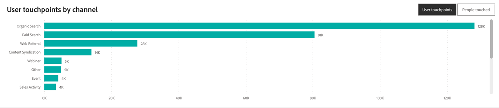

# エンゲージメントダッシュボード {#engagement-dashboard}

エンゲージメントダッシュボードは、ユーザーエンゲージメント指標を細かく追跡します。 タッチポイント、エンゲージしたユーザーの数、および 1 人あたりの平均タッチポイントを示します。 月別、四半期別、年別の表示に時系列の棒グラフを利用し、詳細なチャネル、サブチャネル、キャンペーンインサイトに関する棒グラフを利用できます。 このツールは、エンゲージメントパターンを理解し、エンゲージメント戦略を微調整するのに不可欠です。

ダッシュボードに関する質問の回答：

* 何人の人が婚約しましたか？ エンゲージメントしたユーザーあたりの平均タッチ数はどれくらいですか？
* タッチポイント数は、特定のチャネル/サブチャネル/キャンペーン内でのタッチ済み顧客と比較してどのように異なりますか？
* 特定のチャネルまたはサブチャネルによって存在したタッチポイントはいくつですか？ 時間の経過と共にどのように変化したか。

>[!NOTE]
>
>アカウントおよび商談のエンゲージメント指標は、2024 年上半期にリリースされる予定です。

## ダッシュボードコンポーネント {#dashboard-components}

### KPI タイル {#kpi-tiles}

* タッチポイント：生成された未加工のタッチポイントの合計数です。
   * 購入者タッチポイントおよび購入者アトリビューションタッチポイントは、クレジットの特定のタッチポイントを選択することで作成されるアトリビューションの結果です。 すべてのタッチポイントが BT および BAT として選択されるわけではありません。
* タッチされた人：任意のタッチポイントを持つ人の合計数です。
* 個人別タッチポイント：タッチされた個人別のタッチポイントの平均数。

### タッチポイントと人物が時間の経過と共に接触 {#touchpoints-and-people-touched-over-time}

時系列の棒グラフには、各月、四半期および年のタッチポイント数、タッチされた人数および個人あたりのタッチポイント数が表示されます。

* ドリルダウン機能とアップ機能を利用して、月、四半期、年でデータを分類します。
* バーまたは行の上にマウスポインターを置くと、詳細情報が表示されます。

グラフの回答に関する質問：

* タッチポイントとタッチされたユーザーの数は、時間と共にどのように進化していますか？
* 1 人あたりのタッチポイントを 1 四半期/月から次の四半期に比較すると、どのように異なりますか？

### チャネルがタッチしたタッチポイント/人 {#touchpoints-people-touched-by-channel}

チャネル/サブチャネル/キャンペーンでセグメント化されたタッチポイントまたはタッチされた人を示す棒グラフです。

* ドリルダウンおよびアップ機能を利用して、サブチャネルおよびキャンペーンでデータを分類します。
* 各バーの上にマウスポインターを置くと、タッチポイントまたはタッチされた人が表示されます。

グラフの回答に関する質問：

* 最もエンゲージメントに貢献したのは、どのチャネル/サブチャネル/キャンペーンですか？
* タッチポイント数は、特定のチャネル/サブチャネル/キャンペーン内でのタッチ済み顧客と比較してどのように異なりますか？

## フィルターウィンドウ {#filter-pane}

このダッシュボードには、次の設定とフィルターが備わっています。

* 日付（タッチポイントの日付に基づく）
* チャネル、サブチャネル
* キャンペーン
