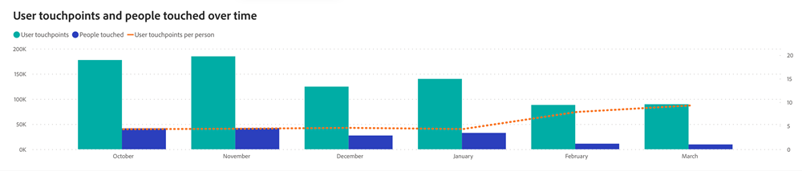
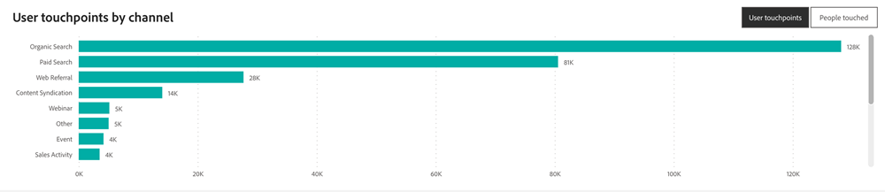

# エンゲージメントダッシュボード {#engagement-dashboard}

エンゲージメントダッシュボードは、ユーザーエンゲージメント指標を注意深く追跡します。 顧客接点、エンゲージメント人数、1人当たりの平均接点が表示されます。 時系列の棒グラフを月次、四半期、年次の表示に使用し、棒グラフを使用してチャネル、サブチャネル、キャンペーンの詳細なインサイトを取得します。 このツールは、エンゲージメントパターンを把握し、エンゲージメント戦略を調整するために不可欠です。

当社では、あらゆる顧客とのやり取りを顧客接点（UT）として追跡しています。これは、「未加工」のデータポイントを収集し、ダッシュボードのエンゲージメント指標の基盤としています。 UTがすべてバイヤータッチポイント（BT）またはバイヤーアトリビューションタッチポイント（BAT）に進化するわけではありません。これらは、特定の顧客インタラクションを収益関連の活動に起因させるために選択された結果です。 抑制ルールはUTやエンゲージメントダッシュボードには影響しません。

* **ユーザータッチポイント**：すべてのエンゲージメントから作成されたタッチポイント。
* **購入者のタッチポイント**: リードと取引先責任者のアトリビューション用に選択されたタッチポイント。 BTは商談にリンクされておらず、関連する売上がありません。
* **購入者アトリビューションのタッチポイント**：商談アトリビューション用に選択されたタッチポイント。 BATは、商談にリンクされているため、売上に影響を与えます。

BTやBATのみを使用してエンゲージメントを測定すると、エンゲージメントは単なるアトリビューションよりも広いため、顧客とのやり取りの真の範囲が過小評価されることになります。

ダッシュボードの質問：

* エンゲージした人は？ エンゲージメントした個人あたりの平均接触数は？
* 特定のチャネル/サブチャネル/キャンペーン内でタッチされたユーザーとタッチポイントの数はどのように比較されますか？
* 特定のチャネルまたはサブチャネルが提供したタッチポイント数はどのくらいでしょうか？ 時間の経過とともにどのように変化したか？

>[!NOTE]
>
>アカウントと商談のエンゲージメント指標は、2024年上半期にリリース予定です。

## ダッシュボードコンポーネント {#dashboard-components}

### KPI タイル {#kpi-tiles}

* タッチポイント：生成された未加工タッチポイントの合計数。
   * 顧客接点とバイヤーアトリビューションの顧客接点は、特定の接点を選択して貢献度を割り当てることで作成されるアトリビューション結果です。 すべてのタッチポイントがBTとBATとして選択されているわけではありません。
* タッチしたユーザー：任意のタッチポイントを持つユーザーの合計数。
* 顧客一人あたりのタッチポイント：タッチされた顧客一人あたりの平均タッチポイント数。

### 時間の経過とともにタッチされた顧客接点と顧客 {#touchpoints-and-people-touched-over-time}

時系列の棒グラフには、月、四半期、年ごとに、1人あたりのタッチポイント数、タッチされた人物およびタッチポイント数が表示されます。

* ドリルダウン機能とアップ機能を使用して、月、四半期、年ごとにデータを分類します。
* バーまたは行にカーソルを合わせると、詳細な情報が表示されます。

グラフの回答に関する質問：

* タッチポイントの数やタッチした個人の数は、時間の経過とともにどのように変化しましたか？
* 1人当たりの顧客接点を、1四半期/月から次の四半期とどのように比較しますか？

### 顧客接点/チャネルごとにタッチした人物 {#touchpoints-people-touched-by-channel}

チャネル/サブチャネル/キャンペーンごとにセグメント化されたタッチポイントまたはタッチされた人物を表示する棒グラフ。

* ドリルダウン機能とアップ機能を使用して、サブチャネルとキャンペーンごとにデータを分類します。
* 各バーにカーソルを合わせると、タッチポイントまたはタッチした人物が表示されます。

グラフの回答に関する質問：

* 最もエンゲージメント率の高いチャネル/サブチャネル/キャンペーンは？
* 特定のチャネル/サブチャネル/キャンペーン内でタッチされたユーザーとタッチポイントの数はどのように比較されますか？

## フィルターパネル {#filter-pane}

このダッシュボードには、次の設定とフィルターが用意されています。

* 日付（タッチポイント日付に基づく）
* チャネル、サブチャネル
* キャンペーン
