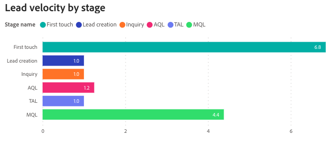

# リード速度ダッシュボード {#lead-velocity-dashboard}

Velocity ダッシュボードは、見込み客がセールスファネルを通じて移動するペースを動的に把握し、マーケターとセールスチームに、様々なチャネルをまたいだコンバージョン時間に関する重要なインサイトを提供します。 このツールは、リードのコンバージョン期間と販売ステージでの進行の効率に関する主な質問に回答するのに非常に役立ち、成長とコンバージョンを加速するためのエンゲージメント戦略を最適化できます。

このダッシュボードに関する質問の回答：

* リードのコンバージョンには平均でどのくらいの時間がかかりますか？
* 各ステージで、リードまたは連絡先が次のステージに進むまで、平均的にどのくらいの時間がかかりますか？ この期間は時間の経過と共にどのように変化しますか。

## ダッシュボードコンポーネント {#dashboard-components}

### ステージ別のリード/連絡先ベロシティ {#lead-contact-velocity-by-stage}

棒グラフには、特定の期間に各販売ステージでリード/連絡先が費やした平均期間が日単位で表示されます。

グラフの回答に関する質問：

リード/連絡先で通常最も長い期間を持つ販売ステージはどれですか？
「ファーストタッチ」ステージの滞在時間と「MQL」ステージの滞在時間を比較するとどのように異なりますか。

### リード/連絡先のベロシティの推移 {#lead-contact-velocity-over-time}

時系列の折れ線グラフには、指定した期間における各販売ステージでのリード/連絡先の平均滞在時間が日単位で表示されます。

* ドリルダウン機能とアップ機能を利用して、月、四半期、年でデータを分類します。
* 行の上にマウスポインターを置くと、詳細情報が表示されます。

グラフの回答に関する質問：

* 観察された月間でのリード/連絡先に関する各ステージでの滞在時間の傾向は何ですか？
* 販売ステージでリード/連絡先が最も速く進んだのは、どの月ですか？

## チャネル別のリード/連絡先ベロシティ {#lead-contact-velocity-by-channel}

棒グラフには、リード/連絡先が各ファネルステージに残る平均期間（日数）が、チャネル別にセグメント化されて表示されます。

行の上にマウスポインターを置くと、詳細情報が表示されます。

グラフの回答に関する質問：

* ファネルステージでのリードの進行が最も速いチャネルはどれですか？
* 「MQL」ステージのリード速度はチャネルごとにどのように異なりますか？

## フィルターウィンドウ {#filter-pane}

このダッシュボードには、次の設定とフィルターが備わっています。

* 日付
   * 基準：移行日
* ステージ
* チャネル
* サブチャネル
* キャンペーン
* セグメント
