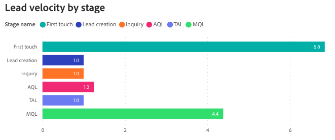
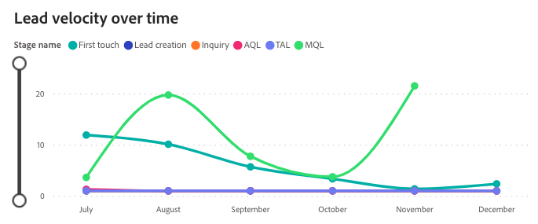
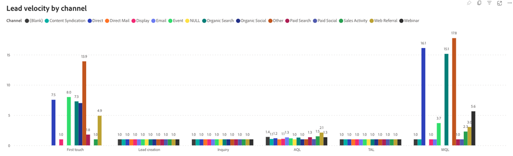

# 商談速度ダッシュボード {#opportunity-velocity-dashboard}

Velocity ダッシュボードでは、見込み客がSales funnel内を移動するペースを動的に把握できるため、マーケターと営業担当者は、様々なチャネルにわたるコンバージョン時間に関する重要なインサイトを得ることができます。 このツールは、機会のライフサイクルと、セールスステージへの誘導の効率性に関する重要な質問に答え、成長とコンバージョンを加速させるためのエンゲージメント戦略を最適化するのに非常に役立ちます。

このダッシュボードに関する質問：

* リードがコンバージョンに至るまでの平均時間はどれくらいか？
* リードやコンタクトは、各ステージの平均で、次のステージに進むまでにどのくらいの時間がかかりますか？ この期間は時間の経過とともにどのように変化しますか？

## ダッシュボードコンポーネント {#dashboard-components}

### KPI タイル {#kpi-tile}

* **成約件数**：最初のステージから成約までの「成約した商談」の平均日数。

### ステージ別の商談速度 {#opportunity-velocity-by-stage}

棒グラフには、特定の期間に各販売ステージで費やした商談の平均期間（日数）が表示されます。

グラフの回答に関する質問：

* 指定した期間に、商談が最も多くの時間を費やした段階は何か？
* 「商談作成」ステージにおける商談の平均期間と「見込み客」ステージおよび「商談選定」ステージとの比較はどうなりますか？

>[!NOTE]
>
>「商談作成」の前のステージでは、最新のタッチポイント日を「移行日」として使用します。

### 商談速度の履歴 {#opportunity-velocity-over-time}

時系列の折れ線グラフには、指定された期間における各販売ステージでの商談支出の平均時間（日数）が表示されます。

* ドリルダウン機能とアップ機能を使用して、月、四半期、年ごとにデータを分類します。
* 行にカーソルを合わせると、詳細な情報が表示されます。

グラフの回答に関する質問：

* 観察された月を通して、各段階で商談に費やした時間の傾向は何ですか？
* 商談がセールスステージを最も早く進んだ月はどれですか？

### チャネル別の商談速度 {#opportunity-velocity-by-channel}

棒グラフには、リード/コンタクトがfunnelの各ステージに残っている平均期間が日数で表示され、チャネル別にセグメント化されています。

* 行にカーソルを合わせると、詳細な情報が表示されます。

グラフの回答に関する質問：

* Funnelステージの最も早い進行を示すチャネルは？
* 「見込み客」ステージにおける商談スピードは、チャネルによって異なりますか？

## フィルターパネル {#filter-pane}

このダッシュボードには、次の設定とフィルターが用意されています。

* 日付
   * 基準：日付の遷移
* ステージ
* チャネル
* サブチャネル
* キャンペーン
* セグメント
