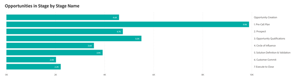
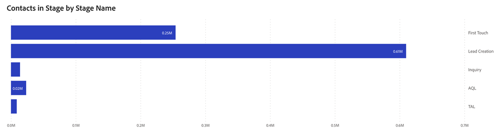

# パスポートダッシュボード {#passport-dashboard}

パスポートダッシュボードでは、リード、コンタクト、商談が、指定した期間内にさまざまなステージを通過する際の動的なビューをマーケターに提供します。 特定の日付をフィルタリングすることで、ユーザーはその日のレコードのスナップショットを取得することもできます。

**掲示板の回答に対する質問：**

* 選択した日に、ターミナル以外の各ステージにどれだけのリード、コンタクト、商談が存在しましたか？
* 特定の期間を通して、それぞれの一時的なステージを通過したリードまたはコンタクトの数を確認します。
   * _例_: リード Aが2023年1月1日のステージ 1にいて、2023年3月31日までにステージ 5に進んだ場合、2023年第1四半期のパスポート分析では、ステージ 1から5のリード Aがカウントされます。
* 特定の時間枠の間に各一時的なステージを通過したユニークな機会はいくつありますか？

## ダッシュボードコンポーネント {#dashboard-components}

### ステージ名によるステージ内の商談 {#opportunities-in-stage-by-stage-name}

* 各段階は、特定の期間内に通過した顧客接点がある商談の数を示します。
   * オポチュニティがそのスパン内の複数のステージを進む場合、通過するあらゆるステージでカウントされます。
* 「クローズド・ウォン」や「クローズド・ロスト」などの終端ステージは除外されます。
* 開始日と終了日の両方が含まれます。

### ステージ名でステージ内のリードまたはコンタクト {#leads-or-contacts-in-stage-by-stage-name}

* 各ステージには、特定の時間枠で通過したリードまたは顧客接点のあるコンタクトの数が表示されます。
   * 「リード」と「連絡先」のどちらを表示するかは、設定/アトリビューション設定/デフォルトダッシュボードオブジェクトで設定された環境設定によって決まります。
   * リードまたはコンタクトがそのスパン内の複数のステージを進む場合、通過するあらゆるステージで数えられます。
* 「クローズド・ウォン」や「クローズド・ロスト」などの終端ステージは除外されます。
* 開始日と終了日の両方が含まれます。

## フィルターパネル {#filter-pane}

このダッシュボードには、次の設定とフィルターが用意されています。

* 日付（移行日に基づく）
* チャネル、サブチャネル
* キャンペーン
* セグメント

>[!MORELIKETHIS]
>
>* [Discover ダッシュボードの基本](/help/marketo-measure-discover-ui/dashboards/discover-dashboard-basics.md){target="_blank"}
>* [&#x200B; ダッシュボードデータの可視化ポリシー](/help/marketo-measure-discover-ui/dashboards/dashboard-data-visibility-policy.md){target="_blank"}
