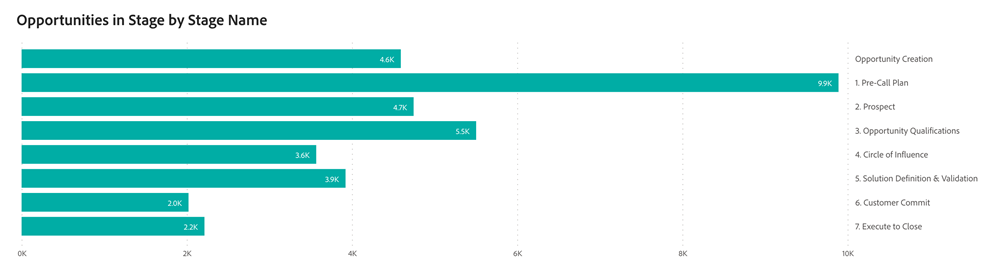

# Passport ダッシュボード {#passport-dashboard}

Passport ダッシュボードを使用すると、マーケターは、指定した期間内に様々なステージに移行するリード、連絡先、商談の動的なビューを提供できます。 特定の日付に対してフィルターを適用すると、その日のレコードのスナップショットを取得することもできます。

取締役会の回答に関する質問：

* 任意の日に各非ターミナルステージに存在したリード、連絡先、商談の数は？
* 指定した期間中に、各一時的なステージを進んだ個別のリードまたは連絡先の数は？
   * _例_：リード A が1/1/2023のステージ 1 にあり、ステージ 5 by 3/31/2023に進んだ場合、2023 年第 1 四半期の Passport 分析では、ステージ 1 ～ 5 のリード A がカウントされます。
* 特定の期間に各一時的なステージを通過したユニークなオポチュニティはいくつですか？

<table style="table-layout:auto"> 
<tbody>
<tr> 
   <th>コンポーネント</th> 
   <th>説明</th>
   <th>日付タイプ</th>
   <th>ドリルスルーフィールド</th>
   <th>フィルター</th>
  </tr>
  <tr>
    <td>商談</td>
    <td><li>各段階は、特定の期間に BAT を通過した商談の数を示します。</li>
<ul style="padding-left: 30px;"><li>商談がその期間内の複数のステージを経て進むと、通過するすべてのステージでカウントされます。</li></ul>
<li>終了段階（「獲得しました」や「損失しました」など）は除外されます。</li>
<li>開始日と終了日は両方とも含まれます。</li>
 </td>
    <td rowspan="2">遷移日</td>
    <td><li>商談 ID</li>
<li>商談名</li>
<li>作成日</li>
<li>クローズ日</li>
<li>クローズ済み (Y/N)</li>
<li>獲得済み (Y/N)</li>
<li>現在のステージ</li>
<li>遷移イン日</li>
<li>遷移アウト日</li></td>
    <td rowspan="2"><li>日付</li>
<li>チャネル</li>
<li>サブチャネル</li>
<li>キャンペーン</li>
<li>セグメント</li></td>
  </tr>
  <tr>
    <td>リード/連絡先</td>
    <td><li>各ステージには、特定の期間内にリードまたは BT を通過した連絡先の数が表示されます。</li>
<ul style="padding-left: 30px;"><li>「リード」と「連絡先」のどちらを表示するかは、設定/属性設定/デフォルトのダッシュボードオブジェクトで設定した環境設定によって決まります。</li></ul>
<li>終了段階（「獲得しました」や「損失しました」など）は除外されます。</li>
<li>開始日と終了日は両方とも含まれます。</li>
 </td>
    <td><li>リード/連絡先 ID</li>
<li>リード/連絡先メール</li>
<li>作成日</li>
<li>現在のステージ</li>
<li>遷移イン日</li>
<li>遷移アウト日</li></td>
  </tr>
</tbody>
</table>

>[!MORELIKETHIS]
>
>[Discover ダッシュボードの基本](/help/marketo-measure-discover-ui/dashboards/discover-dashboard-basics.md){target="_blank"}
