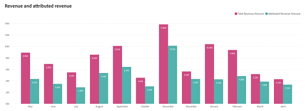
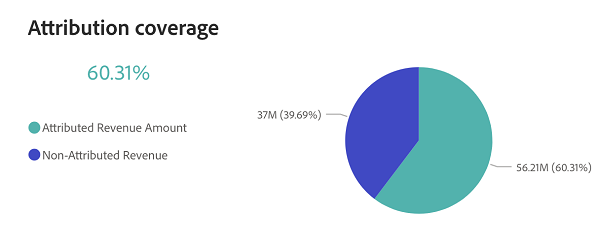

# 収益の概要ダッシュボード {#revenue-overview-dashboard}

収益概要ダッシュボードでは、CRMの総売上に関するインサイトを獲得し、マーケティング戦略の役割を把握できます。 マーケティングが全体的な売上にどのように影響し、成約に貢献するのかを包括的に解説します。

**掲示板の回答に対する質問：**

* 売上の何%がマーケティング活動に起因しているか？
* マーケティング活動が影響を与えた「成約済み」取引の割合は？

## ダッシュボードコンポーネント {#dashboard-components}

### KPI タイル {#kpi-tiles}

* **総収益**: 「クローズ済み」商談からの総収益（顧客接点のない商談を含む）。
* **合計取引件数**：顧客接点のない商談を含む、「成約した獲得案件」の数。
* **属性収益**：顧客接点を持つ「クローズ済み」商談からの総収益。
* **Attributed Deals**：顧客接点を持つ「成約した商談」の数。

### 売上と帰属売上のグラフ {#revenue-and-attributed-revenue-chart}

この時系列の棒グラフは、総売上と属性売上を比較し、マーケティングが全体的な売上に与える影響を明確に示しています。

* ドリルダウン機能とアップ機能を使用して、四半期と年ごとにデータを分類します。
* 棒グラフのセクションにカーソルを合わせると、その詳細情報が表示されます。

**グラフの回答に関する質問：**

* 2022年8月の売上の何%が、マーケティング施策に起因するものですか？
* 前年度の第3四半期の売上が、第4四半期に対して増加した割合は？

### アトリビューションのカバー範囲チャート {#attribution-coverage-chart}

この円グラフは、総売上を帰属済み売上と非帰属済み売上にセグメント化することで、アトリビューションのカバー範囲を明確に可視化し、マーケティング活動が影響を与える売上の正確な割合を明らかにするのに役立ちます。

**グラフの回答に関する質問：**

* 昨年のマーケティング活動に起因する収益カバー率を教えてください。

## フィルターパネル {#filter-pane}

このダッシュボードには、次の設定とフィルターが用意されています。

* 日付（クローズ日に基づく）

>[!MORELIKETHIS]
>
>* [Discover ダッシュボードの基本](/help/marketo-measure-discover-ui/dashboards/discover-dashboard-basics.md){target="_blank"}
>* [&#x200B; ダッシュボードデータの可視化ポリシー](/help/marketo-measure-discover-ui/dashboards/dashboard-data-visibility-policy.md){target="_blank"}
