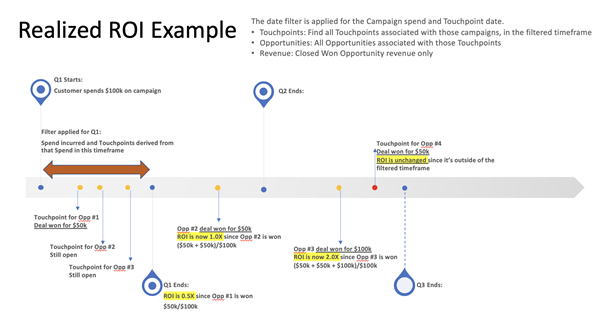
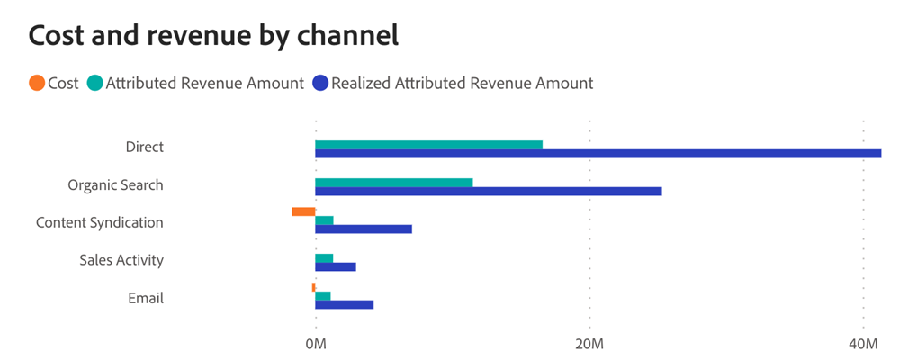
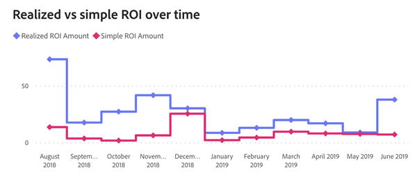
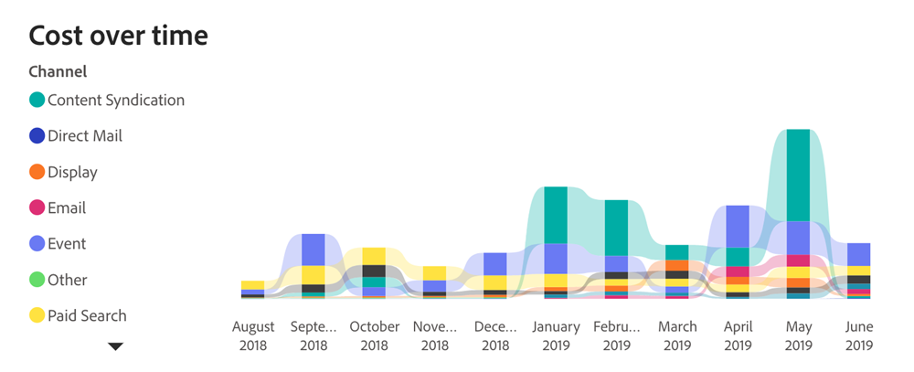
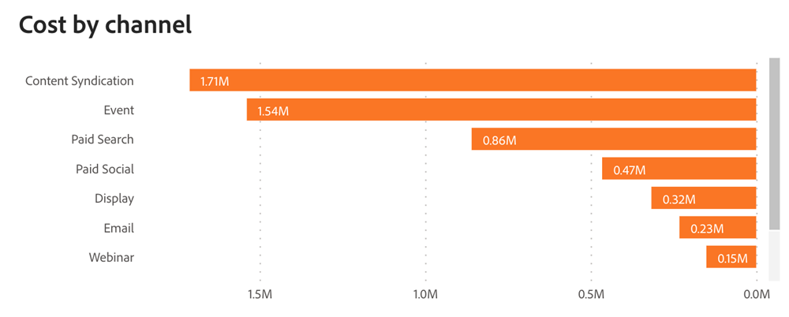

# ROI ダッシュボード {#roi-dashboard}

ROI ダッシュボードでは、チャネル、サブチャネル、キャンペーンをまたいで、投資収益率を詳細に把握できます。 コストと収益のパターンを詳細に分析すると同時に、リード単価、取引、機会などの指標に焦点を当て、マーケティングアトリビューションを包括的に把握できます。

**掲示板の回答**&#x200B;に対する質問

* 各チャネル、サブチャネル、キャンペーンのROIの値はどのようなものでしたか？
* 各チャネル、サブチャネル、キャンペーンにおいて、コストと売上はどのように分配されていましたか？
* 商談あたりのコストとリード獲得単価とは？

## ダッシュボードコンポーネント {#dashboard-components}

### KPI タイル {#kpi-tiles}

* **コスト**：接続されたデータソースと手動でアップロードしたコストの合計。
* **属性収益**：選択したアトリビューションモデルに基づく、フィルターされた期間内にクローズした顧客接点を持つ商談からの収益貢献度の合計。
* **実現済みの属性収益**：選択した属性モデルに基づく、フィルタリングされた日付期間内の顧客接点を持つ商談からの収益貢献度の合計（成約のタイミングに関係なく）。
* **合計新規リード**：生成された新規リードの合計数（タッチ済みリードと未操作リードの両方を含む）。
* **新しいリードあたりのコスト**：新しいリードあたりの平均コストで、総コストを新しいリードの総数で割ったものです。
* **合計新規オポチュニティ**：生成された新規オポチュニティの合計数（タッチ済みオポチュニティと未操作オポチュニティの両方を含む）。
* **新しい商談あたりのコスト**：新しい商談あたりの平均コストで、総費用を新しい商談の総数で割ったものです。
* **合計取引件数**：顧客接点のない商談を含む、「成約した獲得案件」の数。
* **単純ROI**：フィルタリングされた期間のコストで起因する収益を割った値。
* **実現ROI**：実現された帰属収益を、フィルタリングされた期間のコストで割った値。

### チャネル別のコストと収益グラフ {#cost-and-revenue-by-channel-graph}

コストと売上を示す棒グラフ。様々なチャネル、サブチャネル、キャンペーンに対して、その規模を比較できるように設計されています。

* ドリルダウン機能とアップ機能を使用して、サブチャネルとキャンペーンごとにデータを分類します。
* 各バーにカーソルを合わせると、シンプルで実現されたROIが表示されます。

**グラフの回答に関する質問**

* 各チャネル、サブチャネル、キャンペーンのROIの値はどのようなものでしたか？
* 売上に対してコストが異常に高いチャネルや低いチャネルはありますか？

### 単純ROIに対するROIの推移 {#realized-vs-simple-roi-over-time}

実現済みROIと単純ROIの比較を示す時系列折れ線グラフ。時間の経過に伴う進捗を追跡します。

* グラフのセクションにカーソルを合わせると、シンプルで実現されたROIが表示されます。

**グラフの回答に関する質問**

* 実現ROIは、特定の期間における単純ROIとどのように比較されますか？
* Realized ROIの傾向は、同期間の重要なマーケティングイベントとどのように関連していますか？

### 時間経過に伴うコスト グラフ {#cost-over-time-graph}

月/四半期/年ごとの関連チャネル別にセグメント化された総コストを示す積み重ね棒グラフ。

* ドリルダウン機能とアップ機能を使用して、月、四半期、年ごとにデータを分類します。
* バーセグメントまたはバー間のスペースにカーソルを合わせると、詳細な情報が表示されます。

**グラフの回答に関する質問**

* すべてのチャネルの合計コストは、1四半期/月から次の四半期とどのように比較されますか？
* 特定のチャネルのコストは、時間の経過とともにどのように変化しましたか？

### チャネルグラフ別のコスト {#cost-by-channel-graph}

チャネル/サブチャネル/キャンペーンごとにセグメント化されたマーケティング費用を表示する棒グラフ。

* ドリルダウン機能とアップ機能を使用して、チャネル/サブチャネル/キャンペーンごとにデータを分類します。

**グラフの回答に関する質問**

* プライマリチャネル内のどのサブチャネルまたはキャンペーンが最も高い割り当てを持っていますか？
* 他のチャネルと比較して、どのマーケティング手法（チャネル、サブチャネル、キャンペーン）に資金不足があるように思われますか？

### ROI概要テーブル {#roi-summary-table}

個々のチャネルごとにセグメント化された、売上、コスト、ROIに対する貢献度を示す表。

* 各チャネルの横にある「+」アイコンをクリックして、サブチャネルとキャンペーンの分類を表示します。

**列**

* チャネル/サブチャネル/キャンペーン
* コスト
* 起因する収益
* 実現済みの収益属性
* シンプルなROI
* Roiの実現
* 未実現属性のパイプライン収益：フィルタリングされた期間内に作成されたタッチポイント（オープン商談）にリンクされたパイプライン収益。

### マーケティング支出表 {#marketing-spend-table}

詳細な内訳を表示するための、コスト、新しいリード、機会、成約済みの取引を個々のチャネルでセグメント化した表。

* 各チャネルの横にある「+」アイコンをクリックして、サブチャネルとキャンペーンの分類を表示します。

**列**

* チャネル/サブチャネル/キャンペーン
* コスト
* 新規リード
* 新規リード獲得単価
* 新しい商談
* 新規商談あたりのコスト
* 契約
* 契約あたりのコスト

## フィルターパネル {#filter-pane}

このダッシュボードには、次の設定とフィルターが用意されています。

* 日付
   * 元とするセット：
      * 作成日：ニュースリード、新しい商談
      * コスト発生日：コスト
      * 成約日：売上への貢献度（単純ROI）、案件
      * タッチポイント日：実現済みの帰属済み収益からのタッチポイント（実現ROI）
* アトリビューションモデル
* チャネル、サブチャネル
* キャンペーン

>[!MORELIKETHIS]
>
>* [Discover ダッシュボードの基本](/help/marketo-measure-discover-ui/dashboards/discover-dashboard-basics.md){target="_blank"}
>* [&#x200B; ダッシュボードデータの可視化ポリシー](/help/marketo-measure-discover-ui/dashboards/dashboard-data-visibility-policy.md){target="_blank"}

