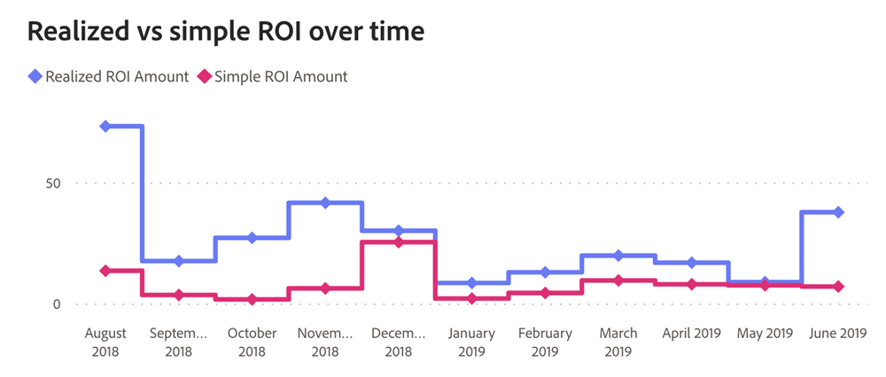
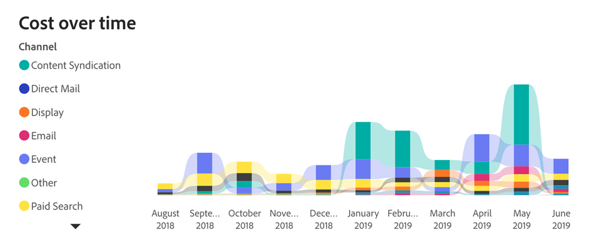

# ROI ダッシュボード {#roi-dashboard}

ROI ダッシュボードは、チャネル、サブチャネル、キャンペーン全体の投資収益率の詳細なビューをマーケターに提供します。 また、コストと売上高のパターンを細かく分類し、リードあたりのコスト、取引、商談などの指標に注目して、マーケティング属性を包括的に把握します。

取締役会の回答に関する質問：

* 各チャネル、サブチャネル、キャンペーンの ROI の値はどれくらいですか？
* コストと売上高は、各チャネル、サブチャネル、キャンペーンにどのように配分されましたか？
* リードあたりのコスト、契約あたりのコスト、オポチュニティあたりのコストはどれくらいでしたか。

<table style="table-layout:auto"> 
<tbody>
 <tr> 
   <th>コンポーネント</th> 
   <th>説明</th>
   <th>日付タイプ</th>
   <th>ドリルスルーフィールド</th>
   <th>フィルター</th>
  </tr>
  <tr>
    <td>コストタイル</td>
    <td>発生した合計コスト</td>
    <td>コスト発生日</td>
    <td><li>キャンペーン ID</li>
<li>キャンペーン名</li>
<li>チャネル</li>
<li>サブチャネル</li>
<li>日付</li>
<li>費用</li></td>
    <td rowspan="15"><li>日付</li>
<li>アトリビューションモデル（設定）</li>
<li>チャネル</li>
<li>サブチャネル</li>
<li>キャンペーン</li></td>
  </tr>
  <tr>
    <td>属性収益タイル</td>
    <td>属性売上高合計</td>
    <td>クローズ日</td>
    <td><li>商談 ID</li>
<li>商談名</li>
<li>商談作成日</li>
<li>商談クローズ日</li>
<li>クローズ済み (Y/N)</li>
<li>獲得済み (Y/N)</li>
<li>アトリビューションモデル</li>
<li>起因する収益</li>
<li>実現済みの売上高</li></td>
  </tr>
  <tr>
    <td>シンプルな ROI タイル</td>
    <td>従来の ROI：収益を特定の期間のコストで割った値です。 
    <li>コスト：フィルターを適用した日付期間に発生したコスト。</li>
    <li>売上高：その期間の「クローズした獲得」商談からの売上高。</li></td>
    <td>クローズ日</td>
    <td>なし</td>
  </tr>
  <tr>
    <td>実現された ROI タイル</td>
    <td>実現した ROI：指定された期間内にキャンペーンによって生成されたタッチポイントの具体的な結果を表します。
    <li>コスト：フィルターを適用した日付期間に発生したコスト。</li>
    <li>売上高：すべての「獲得した獲得」取引からの実現済みの売上高。特に、概要期間内のタッチポイントの影響を受けたものです。</li>
     </td>
    <td>コスト発生日</td>
    <td>なし</td>
  </tr>
  <tr>
    <td>合計新規リードタイル</td>
    <td>指定した期間内に生成された新規リードの合計数（総数）。タッチ済みリードとタッチされていないリードの両方を含みます。</td>
    <td>作成日</td>
    <td rowspan="2">
    <li>リード ID</li>
    <li>リードのメール</li>
    <li>LC 日</li></td>
  </tr>
  <tr>
    <td>新規リードタイルあたりのコスト</td>
    <td>新規リードの合計数（全数）をコストで割った値です。</td>
    <td>作成日</td>
  </tr>
  <tr>
    <td>合計新規商談タイル</td>
    <td>指定した期間内に生成された新規商談の合計数（総数）。タッチ済みリードとタッチされていないリードの両方が含まれます。</td>
    <td>作成日</td>
    <td rowspan="2">
    <li>商談 ID</li>
    <li>商談名</li>
    <li>商談作成日</li>
    <li>商談クローズ日</li>
    <li>クローズ済み (Y/N)</li>
    <li>獲得済み (Y/N)</li>
    <li>現在のステージ</li></td>
  </tr>
  <tr>
    <td>新規商談タイルあたりのコスト</td>
    <td>新規商談の合計数（総数）をコストで割った値です。</td>
    <td>作成日</td>
  </tr>
  <tr>
    <td>合計契約タイル</td>
    <td>関連するタッチポイントのない契約を含む、指定した期間内にクローズした契約の合計数。</td>
    <td>クローズ日</td>
    <td><li>商談 ID</li>
<li>商談名</li>
<li>商談作成日</li>
<li>商談クローズ日</li>
<li>クローズ済み (Y/N)</li>
<li>獲得済み (Y/N)</li>
<li>現在のステージ</li>
<li>通貨</li>
<li>アトリビューションモデル</li>
<li>起因する収益</li>
<li>実現済みの売上高</li></td>
  </tr>
  <tr>
    <td>チャネルグラフ別のコストと売上高</td>
    <td>様々なチャネル、サブチャネル、キャンペーンに対する規模を比較的大きくするための、コストと売上高の両方を示す棒グラフ。
     </td>
    <td>クローズ日</td>
    <td>コスト:
 
<li>キャンペーン ID</li>
<li>キャンペーン名</li>
<li>チャネル</li>
<li>サブチャネル</li>
<li>コスト発生日</li>
<li>通貨</li>
<li>費用</li>

売上高:
 
<li>商談 ID</li>
<li>商談名</li>
<li>商談作成日</li>
<li>商談クローズ日</li>
<li>クローズ済み (Y/N)</li>
<li>獲得済み (Y/N)</li>
<li>起因する収益</li>
<li>アトリビューションモデル</li>
<li>起因する収益</li>
<li>実現済みの売上高</li></td>
  </tr>
  <tr>
    <td>実現とシンプルな ROI の推移</td>
    <td>実現済みとシンプルな ROI の比較を示す時系列の折れ線グラフ。経時的な推移を追跡します。
     </td>
    <td>シンプルな ROI：コスト発生日およびクローズ日
    
実現済み ROI：コスト発生日およびタッチポイント日</td>
    <td>なし</td>
  </tr>
  <tr>
    <td>コスト推移グラフ</td>
    <td>四半期別/月別の合計コストを、個々のチャネル別に分類して詳細な内訳を示す積み重ね棒グラフ。
     </td>
    <td>コスト発生日</td>
    <td rowspan="2"><li>キャンペーン ID</li>
<li>キャンペーン名</li>
<li>チャネル</li>
<li>サブチャネル</li>
<li>コスト発生日</li>
<li>通貨</li>
<li>費用</li></td>
  </tr>
  <tr>
    <td>チャネル別コストグラフ</td>
    <td>チャネル別にセグメント化されたマーケティング費用を示す棒グラフ。
     </td>
    <td>コスト発生日</td>
  </tr>
  <tr>
    <td>ROI 概要テーブル</td>
    <td>詳細な分類に関して、個々のチャネル別にセグメント化された属性の売上高、コスト、ROI を示す表。

<b>列:</b>

<li>チャネル/サブチャネル/キャンペーン</li>
<li>コスト</li>
<li>起因する収益</li>
<li>シンプルな ROI</li>
<li>実現された ROI</li>
<li>未実現パイプライン</li>
<ul style="padding-left: 30px;"><li>特定の期間内にキャンペーンに関連付けられたタッチポイント（オープン商談）からのパイプライン</li></ul></td>
    <td>シンプルな ROI：コスト発生日およびクローズ日
    
実現済み ROI：コスト発生日およびタッチポイント日</td>
    <td>なし</td>
  </tr>
  <tr>
    <td>マーケティング費用表</td>
    <td>詳細な内訳に関して、個々のチャネル別にセグメント化されたコスト、新規リード、商談および契約を表示する表。

<b>列:</b>

<li>チャネル/サブチャネル/キャンペーン</li>
<li>コスト</li>
<li>新規リード</li>
<li>新規リードあたりのコスト</li>
<li>新しい商談</li>
<li>新規商談あたりのコスト</li>
<li>クローズ済みの契約</li>
<li>クローズ済み契約あたりのコスト</li></td>
    <td><li>コスト：発生したコスト</li>
<li>新規リード：作成日</li>
<li>新規商談：作成日</li>
<li>クローズ済契約：クローズ日</li></td>
    <td>なし</td>
  </tr>
</tbody>
</table>

>[!MORELIKETHIS]
>
>[Discover ダッシュボードの基本](/help/marketo-measure-discover-ui/dashboards/discover-dashboard-basics.md){target="_blank"}
