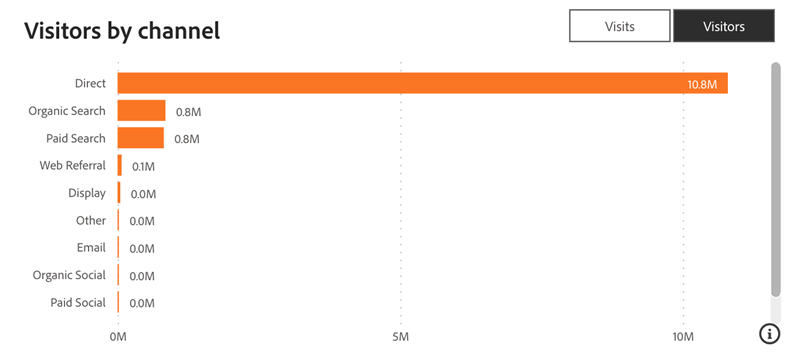

# Web トラフィックダッシュボード {#web-traffic-dashboard}

Web トラフィックダッシュボードは、サイトの訪問者のインタラクションを包括的に表示します。 特定のフォーム URL またはランディングページから、URL ごとの個別訪問者数、全体的な訪問回数、ページビュー数、フォーム送信回数などの指標を詳細に分析します。 月別のトラフィック傾向を監視し、パフォーマンスの高い有料メディアを特定して、最適な売上高生成のために戦略を絞り込むことができます。

このダッシュボードに関する質問の回答：

* 各 URL からの訪問回数/個別訪問者数は何人ですか。
* 各 URL からは、ページビュー数とフォーム送信数はいくつありますか。
* 過去 1 年間の Web トラフィックのトレンドはどのようですか？

## ダッシュボードコンポーネント {#dashboard-components}

**KPI タイル**

<table>
<thead>
  <tr>
    <td>訪問者数</td>
    <td>既知のユーザーと匿名ユーザーを含む外部ページから開始された合計サイト訪問回数（セッション数）。</td>
  </tr>
</thead>
<tbody>
  <tr>
    <td>訪問者</td>
    <td>個別訪問者の合計数。</td>
  </tr>
  <tr>
    <td>ページビュー</td>
    <td>Web サイトページでのビューの合計数。</td>
  </tr>
  <tr>
    <td>フォーム</td>
    <td>linkedIn Lead Gen Formsを含むフォーム送信の合計数です。</td>
  </tr>
  <tr>
    <td>Formsからの個別メール数</td>
    <td>フォーム送信からの一意の電子メールの合計数。</td>
  </tr>
  <tr>
    <td>Formsから作成されたリード</td>
    <td>フォーム送信から作成された新規リードの合計数。</td>
  </tr>
</tbody>
</table>

## Web トラフィックの推移 {#web-traffic-over-time}

ページビュー数、訪問回数、訪問者数、Forms、フォームからの個別電子メール数、フォームからのリード作成数のトレンドを示す時系列の折れ線グラフです。 このグラフを使用して、Web サイトのパフォーマンスとエンゲージメントを時間の経過と共に視覚化し比較します。

* グラフのセクションの上にマウスポインターを置くと、合計訪問回数、個別訪問者数またはフォーム送信数が表示されます。
* 左側のスライダーを使用して特定の値範囲にズームインします。

グラフの回答に関する質問：

* 合計訪問回数のトレンドと、表示された期間の実訪問者数およびフォーム送信数のトレンドを比較するとどのように異なりますか。
* Web サイトで、合計訪問数およびフォーム送信数に対して、実訪問者数が最も多いのは、どの期間でしたか。

## ウェブトラフィック概要テーブル {#web-traffic-summary-table}

ページビュー数、訪問回数、訪問者数、Forms、フォームからの個別電子メール数、URL によるフォームからのリード作成数を示す表。

**列**

* ページタイトル
* ページ URL
* ページビュー
* 訪問者数
* 重複なしの訪問者数
* フォーム送信
* フォームからの電子メールの個別数
* フォームからのリード作成

## リファラーテーブル {#referrer-table}

リファラー別合計訪問回数と個別訪問者数を示す表。

**列**

* リファラー名
* 訪問者数
* 重複なしの訪問者数

## チャネル別訪問回数/訪問者数 {#visits-visitors-by-channel}

チャネル/サブチャネル/キャンペーン別にセグメント化された訪問回数または個別訪問者数を示す棒グラフ。

* ドリルダウンおよびアップ機能を利用して、サブチャネルおよびキャンペーンでデータを分類します。
* 各バーにマウスポインターを置くと、訪問回数または個別訪問者数が表示されます。

グラフの回答に関する質問：

* 訪問回数が最も多いチャネル/サブチャネル/キャンペーン、または個別訪問者数はどれですか？
* 個別訪問者数は、特定のチャネル/サブチャネル/キャンペーン内の合計訪問数と比較してどのように異なりますか。

## フィルターウィンドウ {#filter-pane}

このダッシュボードには、次の設定とフィルターが備わっています。

* 日付（イベント日に基づく）
* チャネル、サブチャネル
* キャンペーン
* URL
