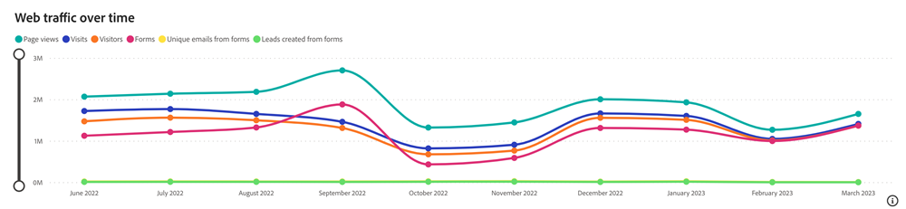
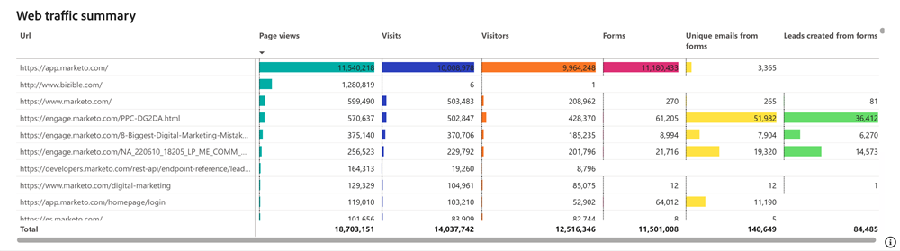
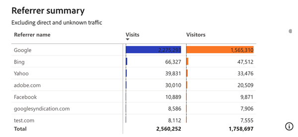
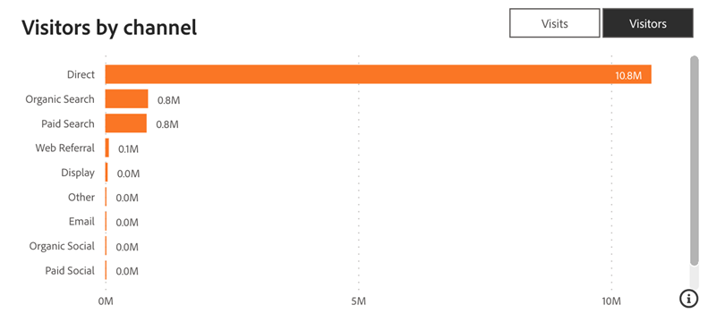

# Web トラフィックダッシュボード {#web-traffic-dashboard}

Web トラフィックダッシュボードでは、サイトの訪問者のインタラクションを包括的に把握できます。 特定のフォーム URLやランディングページからのURLごとのユニーク訪問者数、全体的な訪問数、ページビュー、フォーム送信などの指標を掘り下げます。 月間トラフィック動向を監視し、パフォーマンスの高い有料メディアを特定することで、売上を最適に生み出すために戦略を洗練させることができます。

このダッシュボードに関する質問：

* 各URLの訪問者数/ユニーク訪問者は何人ですか？
* 各URLからどれだけのページビューとフォーム送信がありますか？
* 過去1年間のweb トラフィックの傾向はどのようなものでしたか？

## ダッシュボードコンポーネント {#dashboard-components}

**KPI タイル**

<table>
<thead>
  <tr>
    <td>訪問者数</td>
    <td>既知のユーザーと匿名のユーザーを含む外部ページから開始された合計サイト訪問数（セッション）。</td>
  </tr>
</thead>
<tbody>
  <tr>
    <td>訪問者</td>
    <td>ユニーク訪問者の合計数。</td>
  </tr>
  <tr>
    <td>ページビュー</td>
    <td>web サイトページの合計閲覧数。</td>
  </tr>
  <tr>
    <td>フォーム</td>
    <td>LinkedIn Lead Gen Formsを含む、フォーム送信の合計数。</td>
  </tr>
  <tr>
    <td>Formsからのユニークなメール</td>
    <td>フォーム送信からの一意のメールの合計数。</td>
  </tr>
  <tr>
    <td>Formsから作成されたリード</td>
    <td>フォーム送信から作成された新しいリードの合計数。</td>
  </tr>
</tbody>
</table>

## Web トラフィックの推移 {#web-traffic-over-time}

ページビュー数や訪問数、訪問者数、Forms、フォームのユニーク電子メール、フォームのリード作成のトレンドを示す時系列折れ線グラフ。 このグラフは、web サイトのパフォーマンスとエンゲージメントを視覚化し、比較するために使用します。

* グラフ上のセクションにカーソルを合わせると、合計訪問数、ユニーク訪問者、フォーム送信が表示されます。
* 左側のスライダーを使用して、特定の値の範囲にズームインします。

グラフの回答に関する質問：

* 合計訪問数のトレンドは、表示された期間におけるユニーク訪問者およびフォーム送信とどのように比較されますか？
* Web サイトで、合計訪問数およびフォーム送信数に比べてユニーク訪問者の数が最も多かったのは、どの期間ですか？

## Web トラフィックの概要テーブル {#web-traffic-summary-table}

ページビュー数、訪問数、訪問者数、Forms、フォームからの一意のメール、URL別のフォームからのリード作成を示すテーブル。

**列**

* ページタイトル
* ページ URL
* ページビュー
* 訪問者数
* ユニーク訪問者数
* フォーム送信
* フォームからのユニークなメール
* フォームからのリード作成

## リファラーテーブル {#referrer-table}

リファラー別の合計訪問数とユニーク訪問者を表示するテーブル。

**列**

* リファラー名
* 訪問者数
* ユニーク訪問者数

## チャネル別の訪問/訪問者 {#visits-visitors-by-channel}

チャネル/サブチャネル/キャンペーンごとにセグメント化された「訪問」または「ユニーク訪問者」を表示する棒グラフ。

* ドリルダウン機能とアップ機能を使用して、サブチャネルとキャンペーンごとにデータを分類します。
* 各バーにカーソルを合わせると、訪問者数またはユニーク訪問者数が表示されます。

グラフの回答に関する質問：

* 最も多くの訪問者数またはユニーク訪問者を集めているチャネル/サブチャネル/キャンペーンはどれですか？
* ユニーク訪問者の数は、特定のチャネル/サブチャネル/キャンペーン内の合計訪問数とどのように比較されますか？

## フィルターパネル {#filter-pane}

このダッシュボードには、次の設定とフィルターが用意されています。

* 日付（イベント日に基づく）
* チャネル、サブチャネル
* キャンペーン
* URL
* ページタイトル
