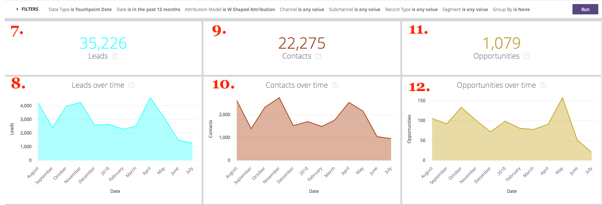
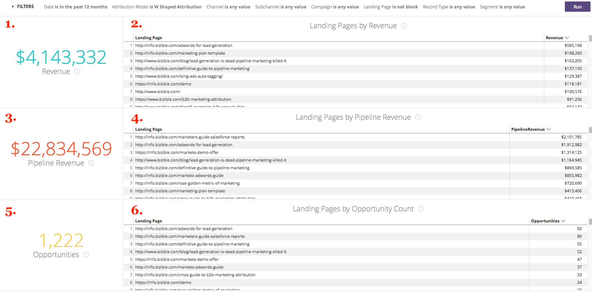

# ドリルスルー {#drill-throughs}

The [!DNL Marketo Measure Discover] エクスペリエンスを使用すると、顧客が最も関心の高いデータセットを詳細に調べることができます。 全体の特定の措置に関して [!DNL Marketo Measure Discover]を使用すると、顧客はタイルをクリックして、その指標の詳細を表示できます。

以下に、ドリルスルーとユーザーがドリルスルーする際に期待するエクスペリエンスを含むダッシュボードとタイルのリストを示します。 ダッシュボードからのグローバルフィルターは、ドリルスルー時に保持されることに注意してください。

## 概要 {#overview}

**売上高**

定義：棒グラフおよび表を使用した月別の合計売上高。 そこから、1 ヶ月を掘り下げたり、週別、日別、または時間別に月を分割したりできます。

**売上高（グラフ）**

定義：棒グラフおよび表を使用した月別の合計売上高。 親タイルは既に棒グラフなので、詳細を表示をドリルすると、1 ヶ月のみ表示されます。

_ドリルダウン：月別の合計売上高を週別または日付別に分類します。_

**費用**

定義：棒グラフおよび表を使用した月別の合計支出額。 そこから、1 ヶ月を掘り下げたり、週別、日別、または時間別に月を分割したりできます。

**契約**

定義：棒グラフおよび表を使用した、月別の契約の合計数。 そこから、1 ヶ月を掘り下げたり、週別、日別、または時間別に月を分割したりできます。

**パイプライン売上高**

定義：棒グラフおよび表を使用した、月別のパイプラインの合計売上高。 そこから、1 ヶ月を掘り下げたり、週別、日別、または時間別に月を分割したりできます。

**ROI の概要**

定義：棒グラフおよび表を使用した、各チャネルの合計売上高または費用を月別に示します。 そこから、1 ヶ月間その行を掘り下げて調べたり、週、日、または時間ごとに 1 ヶ月分割したりできます。

**契約あたりのコスト**

定義：合計支出を契約の総数で割り、クローズした獲得商談の獲得に必要な平均コストを示します。 そこから、1 ヶ月間その行を掘り下げて調べたり、週、日、または時間ごとに 1 ヶ月分割したりできます。

**チャネル — 売上高別**

定義：棒グラフおよび表を使用した、月別の各チャネルからの合計売上高。 そこから、1 ヶ月間その行を掘り下げて調べたり、週、日、または時間ごとに 1 ヶ月分割したりできます。

**売上高別のサブチャネル**

定義：棒グラフおよび表を使用した、各サブチャネルの月別の合計売上高。 そこから、1 ヶ月間その行を掘り下げて調べたり、週、日、または時間ごとに 1 ヶ月分割したりできます。

**キャンペーン — 売上高別**

定義：棒グラフおよび表を使用した、月別の各キャンペーンの合計売上高。 そこから、1 ヶ月間その行を掘り下げて調べたり、週、日、または時間ごとに 1 ヶ月分割したりできます。

**契約の概要**

定義：棒グラフおよび表を使用して、各チャネルから月別の合計支出または契約数を算出します。 そこから、1 ヶ月間その行を掘り下げて調べたり、週、日、または時間ごとに 1 ヶ月分割したりできます。

## 成長 {#growth}

**合計売上高**

定義：棒グラフおよび表を使用した月別の合計売上高。 そこから、1 ヶ月を掘り下げたり、週別、日別、または時間別に月を分割したりできます。

**売上高の推移**

定義：棒グラフおよび表を使用した月別の合計売上高。 親タイルは既にグラフなので、詳細の表示をドリルして表示すると、1 か月のみが表示されます。

_週別または日付別に分類された月別の合計売上高。_

**契約の合計**

定義：棒グラフおよび表を使用した、月別の契約の合計数。 そこから、1 ヶ月を掘り下げたり、週別、日別、または時間別に月を分割したりできます。

**時間の経過に伴う掘り出し物**

定義：棒グラフおよび表を使用した、月別の契約の合計数。 親タイルは既にグラフなので、詳細の表示をドリルして表示すると、1 か月のみが表示されます。

_週別または日付別に分類された、月別の契約の合計数。_

**合計パイプライン売上高**

定義：棒グラフおよび表を使用した、月別のパイプラインの合計売上高。 そこから、1 ヶ月を掘り下げたり、週別、日別、または時間別に月を分割したりできます。

**パイプラインの売上高の推移**

定義：棒グラフおよび表を使用した、月別のパイプラインの合計売上高。 親タイルは既にグラフなので、詳細の表示をドリルして表示すると、1 か月のみが表示されます。

_週別または日付別に分類された、月別の合計パイプライン売上高。_

**リード総数**

定義：棒グラフおよび表を使用した、月別の合計リード数。 そこから、1 ヶ月を掘り下げたり、週別、日別、または時間別に月を分割したりできます。

**リードの推移**

定義：棒グラフおよび表を使用した、月別の合計リード数。 親タイルは既にグラフなので、詳細の表示をドリルして表示すると、1 か月のみが表示されます。

_週別または日付別に分類された月別の合計リード数。_

**連絡先総数**

定義：棒グラフおよび表を使用した、月別の合計連絡先数。 そこから、1 ヶ月を掘り下げたり、週別、日別、または時間別に月を分割したりできます。

**長期間の連絡先**

定義：棒グラフおよび表を使用した、月別の合計連絡先数。 親タイルは既にグラフなので、詳細の表示をドリルして表示すると、1 か月のみが表示されます。

_週別または日付別に分類された月別の合計連絡先数。_

**商談の合計**

定義：棒グラフおよび表を使用した、月別の合計商談数。 そこから、1 ヶ月を掘り下げたり、週別、日別、または時間別に月を分割したりできます。

**長期にわたる商談**

定義：棒グラフおよび表を使用した、月別の合計商談数。 親タイルは既にグラフなので、詳細の表示をドリルして表示すると、1 か月のみが表示されます。

_週別または日付別に分類された月別の合計商談数。_

**実訪問数**

定義：棒グラフおよび表を使用した、月別のページビューの合計数。 そこから、1 ヶ月を掘り下げたり、週別、日別、または時間別に月を分割したりできます。

**ユニーク訪問回数の推移**

定義：特定の期間のトレンドを示す個別訪問の合計数。 「グループ化」フィルターを使用して、「チャネル」、「サブチャネル」、「キャンペーン」、「アカウント」、「広告グループ」、「広告」、「広告主」、「クリエイティブ」、「キーワード」、「配置」、「サイト」別にスタックを変更します。 この機能が無効な場合は、空白で表示されます。

**訪問回数**

定義：棒グラフおよび表を使用した、月別のサイト訪問の合計数。 そこから、1 ヶ月を掘り下げたり、週別、日別、または時間別に月を分割したりできます。

**訪問回数の推移**

定義：特定の期間にわたるトレンドを示す、追跡されたサイト訪問の合計数。 「グループ化」フィルターを使用して、「チャネル」、「サブチャネル」、「キャンペーン」、「アカウント」、「広告グループ」、「広告」、「広告主」、「クリエイティブ」、「キーワード」、「配置」、「サイト」別にスタックを変更します。 この機能が無効な場合は、空白で表示されます。

**Forms**

定義：棒グラフおよび表を使用した月別のフォーム送信の合計数。 そこから、1 ヶ月を掘り下げたり、週別、日別、または時間別に月を分割したりできます。

**Formsの経時的な推移**

定義：特定の期間のトレンドを示す送信済みフォームの合計数です。 「グループ化」フィルターを使用して、「チャネル」、「サブチャネル」、「キャンペーン」、「アカウント」、「広告グループ」、「広告」、「広告主」、「クリエイティブ」、「キーワード」、「配置」、「サイト」別にスタックを変更します。 この機能が無効な場合は、空白で表示されます。

## 費用 {#spend}

**費用**

定義：棒グラフおよび表を使用した月別の合計支出額。 そこから、1 ヶ月を掘り下げたり、週別、日別、または時間別に月を分割したりできます。

**支出（グラフ）**

定義：棒グラフおよび表を使用した月別の合計支出額。 親タイルは既にグラフなので、詳細の表示をドリルして表示すると、1 か月のみが表示されます。

_週、日付、時間別に分類された月別の合計支出。 ～以来、時間は使える。 [!DNL Marketo Measure] は、広告接続からの実際の支出を分単位でダウンロードします。_

**チャネル別支出**

定義：棒グラフおよび表を使用した、各チャネルの月別の合計支出額。 そこから、1 ヶ月間その行を掘り下げて調べたり、週、日、または時間ごとに 1 ヶ月分割したりできます。

**サブチャネル別支出**

定義：棒グラフおよび表を使用した、各サブチャネルの合計支出を月別に示します。 そこから、1 ヶ月間その行を掘り下げて調べたり、週、日、または時間ごとに 1 ヶ月分割したりできます。

**キャンペーン別支出**

定義：棒グラフおよび表を使用した、各キャンペーンの月別の合計支出額。 そこから、1 ヶ月間その行を掘り下げて調べたり、週、日、または時間ごとに 1 ヶ月分割したりできます。

## 販売速度 {#sales-velocity}

**速度（日数）**

定義：最初の匿名タッチから商談のクローズまで、商談が販売サイクルに含まれる平均日数。

**アクティブな商談**

定義：任意のオープン商談からの商談の合計数。クローズ済損失またはクローズ済獲得ではありません。

**契約サイズ**

定義：クローズした獲得商談の平均金額。

**獲得率**

定義：クローズした獲得商談の合計数を、クローズした損失商談とクローズした獲得商談の合計数で割った数。

**チャネル別の商談の速度**

定義：各ステージでの商談のサイクルに含まれる平均日数（マーケティングチャネル別にグループ化され、次のステージに進むのに要する時間の長さを示します）。 ここに表示されるステージは、マイルストーン・ステージ (FT、LC、OC) およびカスタム・ステージです。

**チャネル別リードベロシティ**

定義：リードが連絡先/商談/金額に変換される前のステージごとのリードのサイクルに含まれる平均日数をマーケティングチャネル別にグループ化し、次のステージまでの進行に要する時間の長さを示します。 ここに表示されるステージは、マイルストーンステージ (FT、LC) およびカスタムステージです。

**平均商談速度**

定義：ステージごとのサイクル内の商談の平均日数。次のステージに進むのに要する時間の長さを示します。 ここに表示されるステージは、マイルストーン・ステージ (FT、LC、OC) およびカスタム・ステージです。 この数値は、商談の速度のステージごとの時間をチャネルグラフで反映したものです。

**平均リード速度**

定義：リードが連絡先/商談/金額に変換されるまでの、各ステージのサイクルの平均日数で、次のステージまでの進行に要する時間を示します。 ここに表示されるステージは、マイルストーンステージ (FT、LC) およびカスタムステージです。 この数値は、リードベロシティのステージごとの時間をチャネルグラフで反映したものです。

**時間の経過に伴うオポチュニティの速度**

定義：各ステージでの商談のサイクルが、経時的なトレンドを示す平均日数。

**リードベロシティの推移**

定義：各ステージのサイクルに含まれるリードの平均日数（経時的なトレンド）。

## アカウントベースドマーケティング {#account-based-marketing}

**合計売上高**

定義：棒グラフおよび表を使用した月別の合計売上高。 そこから、1 ヶ月を掘り下げたり、週別、日別、または時間別に月を分割したりできます。

**合計パイプライン売上高**

定義：棒グラフおよび表を使用した、月別のパイプラインの合計売上高。 そこから、1 ヶ月を掘り下げたり、週別、日別、または時間別に月を分割したりできます。

**一致したリード**

定義：あるアカウントに正常に一致したリードの合計数。

**タッチされたアカウント**

定義：任意のタッチポイントを受け取ったアカウントの合計数です。

**タッチされた商談**

定義：商談 ID と対応するアカウント ID のリスト

**タッチ済み連絡先**

定義：連絡先 ID と対応するアカウント ID のリスト

**長期にわたるタッチポイント（グラフ）**

定義：選択した月のタッチポイントのリストです。

_タッチされたタッチポイントの数を週、日付または時刻で分類したもの。_

**時間の経過に伴うアカウントのタッチ（グラフ）**

定義：選択した月のアカウント ID のリスト。

_週、日付、または時刻別に分類されたアカウントの数。_

## Web 分析 {#web-analytics}

**実訪問数**

定義：棒グラフおよび表を使用した、月別のユニークサイト訪問数の合計です。 そこから、1 ヶ月を掘り下げたり、週別、日別、または時間別に月を分割したりできます。

**ユニーク訪問あたりのコスト**

定義：合計支出を個別訪問の合計数で割った値。 そこから、1 ヶ月を掘り下げたり、週別、日別、または時間別に月を分割したりできます。

**ランディングページ別ユニーク訪問数**

定義：各 URL からの個別訪問者数に基づくランディングページのリスト。

**ソース別ユニーク訪問数**

定義：サイトへの個別訪問者のソースに対するビュー。

**ユニーク訪問回数の推移**

定義：追跡された個別訪問の合計数。特定の期間にわたるトレンドを示します。

**訪問回数**

定義：棒グラフおよび表を使用した、月別のサイト訪問の合計数。 そこから、1 ヶ月を掘り下げたり、週別、日別、または時間別に月を分割したりできます。

**訪問あたりのコスト**

定義：合計支出を訪問の合計数で割った値です。

**ランディングページ別訪問回数**

定義：各 URL への訪問数に基づくランディングページのリスト。

**ソース別訪問数**

定義：サイトへの訪問者のソース。 チャネル、サブチャネル、キャンペーン、アカウント、広告グループ、広告、広告主、クリエイティブ、キーワード、プレースメントおよびサイトによって変更できます。

**訪問回数の推移**

定義：追跡された訪問の合計数。特定の期間にわたるトレンドを示します。 そこから、1 ヶ月を掘り下げたり、週別、日別、または時間別に月を分割したりできます。

**ページビュー数**

定義：棒グラフおよび表を使用した、月別のページビューの合計数。 そこから、1 ヶ月を掘り下げたり、週別、日別、または時間別に月を分割したりできます。

**ページビューあたりのコスト**

定義：合計支出を追跡したページビューの合計数で割った値です。

**URL 別のページビュー数**

定義：各 URL からのページビュー数に基づくページ URL のリスト。

**ページビュー数の推移**

定義：棒グラフおよび表を使用した、月別の合計ページビュー数。 親タイルは既にグラフなので、詳細の表示をドリルして表示すると、1 か月のみが表示されます。

_週別、日付別、または時間別に分類された月別の合計ページ表示回数。_

**Forms Over Time**

定義：追跡されたフォームの総数。特定の期間にわたるトレンドを示します。

**Forms**

定義：棒グラフおよび表を使用した月別のフォーム送信の合計数。 そこから、1 ヶ月を掘り下げたり、週別、日別、または時間別に月を分割したりできます。

**フォームあたりのコスト**

定義：合計支出を送信されたフォームの合計で割った値です。

**フォーム送信（フォーム URL 別）**

定義：各 URL で送信された数に基づくフォーム URL のリスト。

**リード — ランディングページ別**

定義：各ランディングページから生成されたリード数に基づく、ランディングページのリスト。

**リード — フォーム URL 別**

定義：各 URL から生成されたリード数に基づくフォーム URL のリスト。

## CMO {#cmo}

**売上高**

定義：棒グラフおよび表を使用した月別の合計売上高。 そこから、1 ヶ月を掘り下げたり、週別、日別、または時間別に月を分割したりできます。

**売上高（グラフ）**

定義：棒グラフおよび表を使用した月別の合計売上高。 親タイルは既に棒グラフなので、詳細を表示をドリルすると、1 ヶ月のみ表示されます。

_週別または日付別に分類された月別の合計売上高。_

**費用**

定義：棒グラフおよび表を使用した月別の合計支出額。 そこから、1 ヶ月を掘り下げたり、週別、日別、または時間別に月を分割したりできます。

**ROI**

定義：合計売上高と合計支出から（アトリビューションモデルに基づいて）計算された投資利益率。

**契約**

定義：棒グラフおよび表を使用した、月別の契約の合計数。 そこから、1 ヶ月を掘り下げたり、週別、日別、または時間別に月を分割したりできます。

**契約あたりのコスト**

定義：合計支出を契約の総数で割り、クローズした獲得商談 1 回の獲得に要する平均コストを示します。

**パイプライン売上高**

定義：棒グラフおよび表を使用した、月別のパイプラインの合計売上高。 そこから、1 ヶ月を掘り下げたり、週別、日別、または時間別に月を分割したりできます。

**契約サイズ**

定義：クローズした獲得商談の平均金額。

**チャネル — 売上高別**

定義：棒グラフおよび表を使用した、月別の各チャネルからの合計売上高。 そこから、1 ヶ月間その行を掘り下げて調べたり、週、日、または時間ごとに 1 ヶ月分割したりできます。

**売上高別のサブチャネル**

定義：棒グラフおよび表を使用した、各サブチャネルの月別の合計売上高。 そこから、1 ヶ月間その行を掘り下げて調べたり、週、日、または時間ごとに 1 ヶ月分割したりできます。

**キャンペーン — 売上高別**

定義：棒グラフおよび表を使用した、月別の各キャンペーンの合計売上高。 そこから、1 ヶ月間その行を掘り下げて調べたり、週、日、または時間ごとに 1 ヶ月分割したりできます。

**ROI の概要**

定義：棒グラフおよび表を使用した、各チャネルの合計売上高または費用を月別に示します。 そこから、1 ヶ月間その行を掘り下げて調べたり、週、日、または時間ごとに 1 ヶ月分割したりできます。

**契約の概要**

定義：棒グラフおよび表を使用して、各チャネルから月別の合計支出または契約数を算出します。 そこから、1 ヶ月間その行を掘り下げて調べたり、週、日、または時間ごとに 1 ヶ月分割したりできます。

## コンテンツマーケティング {#content-marketing}

**合計売上高**

定義：棒グラフおよび表を使用した月別の合計売上高。 そこから、1 ヶ月を掘り下げたり、週別、日別、または時間別に月を分割したりできます。

**売上高別のランディングページ**

定義：棒グラフおよび表を使用した各ランディングページからの合計売上高。 そこから、1 ヶ月間その行を掘り下げて調べたり、週、日、または時間ごとに 1 ヶ月分割したりできます。

**合計パイプライン売上高**

定義：棒グラフおよび表を使用した、月別のパイプラインの合計売上高。 そこから、1 ヶ月を掘り下げたり、週別、日別、または時間別に月を分割したりできます。

**パイプライン売上高別のランディングページ**

定義：棒グラフおよび表を使用した各ランディングページからのパイプラインの合計売上高。 そこから、1 ヶ月間その行を掘り下げて調べたり、週、日、または時間ごとに 1 ヶ月分割したりできます。

**商談の合計**

定義：棒グラフおよび表を使用した、月別の商談の合計数。 そこから、1 ヶ月を掘り下げたり、週別、日別、または時間別に月を分割したりできます。

**商談数別のランディングページ**

定義：棒グラフおよび表を使用した各ランディングページからの商談の合計数。 そこから、1 ヶ月間その行を掘り下げて調べたり、週、日、または時間ごとに 1 ヶ月分割したりできます。

**合計Forms**

定義：棒グラフおよび表を使用した、月別のフォームの合計数。 そこから、1 ヶ月を掘り下げたり、週別、日別、または時間別に月を分割したりできます。

**フォーム送信別上位フォーム URL**

定義：棒グラフおよび表を使用した、各フォーム URL からのフォームの合計数。 そこから、1 ヶ月間その行を掘り下げて調べたり、週、日、または時間ごとに 1 ヶ月分割したりできます。

**チャネル別フォーム URL**

定義：棒グラフおよび表を使用して月別にフォーム URL から送信されたフォームの合計数。 そこから、1 ヶ月間その行を掘り下げて調べたり、週、日、または時間ごとに 1 ヶ月分割したりできます。

**実訪問数**

定義：既知の訪問者と匿名訪問者のすべてにわたってトラッキングされた個別サイト訪問の合計数です。 ドリルインして、月別の個別サイト訪問数を確認します。

**個別訪問別上位のランディングページ**

定義：各ランディングページへの個別訪問数に基づくランディングページのリスト。 ドリルインして、選択した URL への月別の個別訪問数を確認します。

**訪問回数**

定義：既知の訪問者と匿名訪問者のすべてにわたって追跡されたサイト訪問の合計数です。 ドリルインして、月別の追跡サイト訪問数を確認します。

**訪問別の上位のランディングページ**

定義：各ランディングページへの初回訪問数に基づくランディングページのリスト。 ドリルインして、選択した URL への月別訪問数を確認します。

**リード総数**

定義：棒グラフおよび表を使用した、月別のリード総数。 そこから、1 ヶ月を掘り下げたり、週別、日別、または時間別に月を分割したりできます。

**リード数別ランディングページ数**

定義：棒グラフおよび表を使用した各ランディングページからのリードの合計数。 そこから、1 ヶ月間その行を掘り下げて調べたり、週、日、または時間ごとに 1 ヶ月分割したりできます。

## ペイドメディア {#paid-media}

**Impressions**

定義：棒グラフおよび表を使用した、月別のインプレッションの合計数。 そこから、1 ヶ月を掘り下げたり、週別、日別、または時間別に月を分割したりできます。

**CPM**

定義：提供されたインプレッション数からの合計支出を、合計インプレッション数で割った値です。

**クリック**

定義：棒グラフおよび表を使用した、月別のクリック総数。 そこから、1 ヶ月を掘り下げたり、週別、日別、または時間別に月を分割したりできます。

**CPC**

定義：追跡されたクリック数の合計支出をクリック数の合計で割った値です。

**リード**

定義：アトリビューションモデルに基づくリードの合計数。

**CPL**

定義：作成されたリードの合計支出を合計クリック数で割って、CPL 率を示します。

**訪問回数**

定義：棒グラフおよび表を使用した、月別のサイト訪問の合計数。 そこから、1 ヶ月を掘り下げたり、週別、日別、または時間別に月を分割したりできます。

**ページビュー数**

定義：棒グラフおよび表を使用した、月別のページビューの合計数。 そこから、1 ヶ月を掘り下げたり、週別、日別、または時間別に月を分割したりできます。

**キャンペーンサマリ**

定義：各キャンペーンに対してどの程度の売上高/支出/契約/商談に関連付けられたかに基づくキャンペーンのリスト。選択したアトリビューションモデルに基づいて、最も高い順に並べ替えられます。

**広告の概要**

定義：選択したアトリビューションモデルに基づいて、各広告に対してどの程度の売上高/パイプラインの売上高/支出/契約/商談に関連付けられたかに基づく広告のリスト。

**キーワードの概要**

定義：選択したアトリビューションモデルに基づいて、売上高/パイプライン売上高/支出/契約/商談が各キーワードにどの程度関連付けられたかに基づくキーワードのリスト。

**ROI 別キャンペーン**

定義：各キャンペーンの計算された ROI に基づくキャンペーンのリスト（最高の ROI で並べ替え）。 選択したキャンペーンの売上高または月別の支出を表示するには、ドリルインします。

**ROI 別の広告**

定義：各広告の計算された ROI に基づく広告のリスト（最高の ROI で並べ替え）。 ドリルインして、選択した広告の売上高または月別の支出を確認します。

**ROI 別のキーワード**

定義：各キーワードの計算された ROI に基づくキーワードのリスト（最高の ROI で並べ替え）。 ドリルインして、選択したキーワードの売上高または費用を月単位で確認します。
