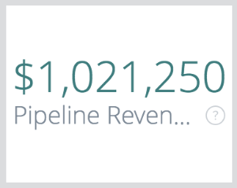

# 概要ボードのタイル {#overview-board-tiles}

概要ボードでは、マーケティングパフォーマンスに関する最も包括的なビューを提供し、マーケティングチームがチーム、予算、売上高を増やす際に適切な意思決定を行うのを支援します。

<table> 
 <colgroup> 
  <col> 
  <col> 
  <col> 
  <col> 
  <col> 
  <col> 
  <col> 
  <col> 
  <col> 
  <col> 
  <col> 
 </colgroup> 
 <tbody> 
  <tr> 
   <td> </td> 
   <td>
<strong>日付タイプ</strong>
</td> 
   <td>
<strong>日付</strong>
</td> 
   <td>
<strong>アトリビューションモデル</strong>
</td> 
   <td>
<strong>指標</strong>
</td> 
   <td>
<strong>ディメンション</strong>
</td> 
   <td>
<strong>チャネル</strong>
</td> 
   <td>
<strong>サブチャネル</strong>
</td> 
   <td>
<strong>キャンペーン</strong>
</td> 
   <td>
<strong>広告アカウント ID</strong>
</td> 
   <td>
<strong>CRM アカウント名</strong>
</td> 
  </tr> 
  <tr> 
   <td>
<strong>売上高</strong>
</td> 
   <td><strong>X</strong></td> 
   <td><strong>X</strong></td> 
   <td><strong>X</strong></td> 
   <td> </td> 
   <td> </td> 
   <td><strong>X</strong></td> 
   <td><strong>X</strong></td> 
   <td><strong>X</strong></td> 
   <td><strong>X</strong></td> 
   <td><strong>X</strong></td> 
  </tr> 
  <tr> 
   <td>
<strong>概要</strong>
</td> 
   <td><strong>X</strong></td> 
   <td><strong>X</strong></td> 
   <td><strong>X</strong></td> 
   <td><strong>X</strong></td> 
   <td><strong>X</strong></td> 
   <td><strong>X</strong></td> 
   <td><strong>X</strong></td> 
   <td><strong>X</strong></td> 
   <td><strong>X</strong></td> 
   <td><strong>X</strong></td> 
  </tr> 
  <tr> 
   <td>
<strong>費用</strong>
</td> 
   <td> </td> 
   <td><strong>X</strong></td> 
   <td> </td> 
   <td> </td> 
   <td> </td> 
   <td><strong>X</strong></td> 
   <td><strong>X</strong></td> 
   <td><strong>X</strong></td> 
   <td><strong>X</strong></td> 
   <td> </td> 
  </tr> 
  <tr> 
   <td>
<strong>ROI</strong>
</td> 
   <td><strong>X</strong></td> 
   <td><strong>X</strong></td> 
   <td><strong>X</strong></td> 
   <td> </td> 
   <td> </td> 
   <td><strong>X</strong></td> 
   <td><strong>X</strong></td> 
   <td><strong>X</strong></td> 
   <td><strong>X</strong></td> 
   <td><strong>X</strong></td> 
  </tr> 
  <tr> 
   <td>
<strong>契約</strong>
</td> 
   <td><strong>X</strong></td> 
   <td><strong>X</strong></td> 
   <td><strong>X</strong></td> 
   <td> </td> 
   <td> </td> 
   <td><strong>X</strong></td> 
   <td><strong>X</strong></td> 
   <td><strong>X</strong></td> 
   <td><strong>X</strong></td> 
   <td><strong>X</strong></td> 
  </tr> 
  <tr> 
   <td>
<strong>契約あたりのコスト</strong>
</td> 
   <td><strong>X</strong></td> 
   <td><strong>X</strong></td> 
   <td><strong>X</strong></td> 
   <td> </td> 
   <td> </td> 
   <td><strong>X</strong></td> 
   <td><strong>X</strong></td> 
   <td><strong>X</strong></td> 
   <td><strong>X</strong></td> 
   <td><strong>X</strong></td> 
  </tr> 
  <tr> 
   <td>
<strong>パイプライン収益</strong>
</td> 
   <td><strong>X</strong></td> 
   <td><strong>X</strong></td> 
   <td><strong>X</strong></td> 
   <td> </td> 
   <td> </td> 
   <td><strong>X</strong></td> 
   <td><strong>X</strong></td> 
   <td><strong>X</strong></td> 
   <td><strong>X</strong></td> 
   <td><strong>X</strong></td> 
  </tr> 
  <tr> 
   <td>
<strong>契約サイズ</strong>
</td> 
   <td><strong>X</strong></td> 
   <td><strong>X</strong></td> 
   <td><strong>X</strong></td> 
   <td> </td> 
   <td> </td> 
   <td><strong>X</strong></td> 
   <td><strong>X</strong></td> 
   <td><strong>X</strong></td> 
   <td><strong>X</strong></td> 
   <td><strong>X</strong></td> 
  </tr> 
  <tr> 
   <td>
<strong>チャネルサマリ</strong>
</td> 
   <td><strong>X</strong></td> 
   <td><strong>X</strong></td> 
   <td><strong>X</strong></td> 
   <td><strong>X</strong></td> 
   <td> </td> 
   <td><strong>X</strong></td> 
   <td><strong>X</strong></td> 
   <td><strong>X</strong></td> 
   <td><strong>X</strong></td> 
   <td><strong>X</strong></td> 
  </tr> 
  <tr> 
   <td>
<strong>サブチャネルサマリ</strong>
</td> 
   <td><strong>X</strong></td> 
   <td><strong>X</strong></td> 
   <td><strong>X</strong></td> 
   <td><strong>X</strong></td> 
   <td> </td> 
   <td><strong>X</strong></td> 
   <td><strong>X</strong></td> 
   <td><strong>X</strong></td> 
   <td><strong>X</strong></td> 
   <td><strong>X</strong></td> 
  </tr> 
  <tr> 
   <td>
<strong>キャンペーン サマリ</strong>
</td> 
   <td><strong>X</strong></td> 
   <td><strong>X</strong></td> 
   <td><strong>X</strong></td> 
   <td><strong>X</strong></td> 
   <td> </td> 
   <td><strong>X</strong></td> 
   <td><strong>X</strong></td> 
   <td><strong>X</strong></td> 
   <td><strong>X</strong></td> 
   <td><strong>X</strong></td> 
  </tr> 
  <tr> 
   <td>
<strong>ROI</strong>
</td> 
   <td><strong>X</strong></td> 
   <td><strong>X</strong></td> 
   <td><strong>X</strong></td> 
   <td> </td> 
   <td><strong>X</strong></td> 
   <td><strong>X</strong></td> 
   <td><strong>X</strong></td> 
   <td><strong>X</strong></td> 
   <td><strong>X</strong></td> 
   <td><strong>X</strong></td> 
  </tr> 
  <tr> 
   <td>
<strong>ROI サマリ</strong>
</td> 
   <td><strong>X</strong></td> 
   <td><strong>X</strong></td> 
   <td><strong>X</strong></td> 
   <td> </td> 
   <td><strong>X</strong></td> 
   <td><strong>X</strong></td> 
   <td><strong>X</strong></td> 
   <td><strong>X</strong></td> 
   <td><strong>X</strong></td> 
   <td><strong>X</strong></td> 
  </tr> 
 </tbody> 
</table>

## 売上高タイル {#revenue-tile}

属性モデルに基づくクローズ済み獲得商談からの合計属性売上高。

 — 商談の詳細：関連する商談 ID、作成日、クローズ日、ISO コード、収益属性を表示します。\
 — 詳細を表示：月別の分類。

## 概要（グラフ）タイル {#overview-chart-tile}

グラフには、各チャネルに関する売上高が時間の経過と共に表示されます。

 — 商談の詳細：関連する商談 ID、作成日、クローズ日、ISO コード、収益属性を表示します。\
 — 貢献している商談 ID の分類を表示します。

* ROI 週別
* ROI データ別
* ROI 時間別
* ROI 分別
* ROI 時間別

## 支出タイル {#spend-tile}

指定した期間の API コストと自己申告コストの両方からの合計支出額。

>[!NOTE]
>
>一ヶ月足らずで穴を掘る時 [!DNL Marketo Measure] は、その月の支出を平均し、その平均を 1 日に割り当てます。

 — 支出の詳細：関連する支出キャンペーンの一意の ID、キャンペーン名、チャネル、サブチャネル、日付、元の通貨、支出の内訳を表示します。   — 詳細を表示：月別の分類。

## ROI タイル {#roi-tile}

（選択したアトリビューションモデルから）合計売上高と合計支出額 ( 売上高タイル÷支出タイル= ROI タイル ) から計算された ROI（投資利益率）。

## 契約タイル {#deals-tile}

合計属性付き契約数を表示します（契約はクローズした獲得商談の数です）。

>[!NOTE]
>
>日付タイプ「タッチポイント日」が選択されている場合、特定のタッチポイントが時間範囲内に含まれない可能性があるので、部分的なカウントが可能です。

 — 商談の詳細：関連する商談 ID、作成日、クローズ日、および属性（カウント）の分類を表示します。   — 詳細を表示：月別の分類。

## 契約あたりのコストタイル {#cost-per-deal-tile}

クローズした獲得商談 1 件の獲得に要する平均コスト。 合計支出を契約の総数で割った値です ( 支出タイル÷契約タイル=契約あたりのコストタイル )。

## パイプライン収益タイル {#pipeline-revenue-tile}

進行中の商談の潜在的な属性収益の合計

>[!NOTE]
>
>売上高は、指定したアトリビューションモデルに反映されます。

 — 商談の詳細：関連する商談 ID、作成日、クローズ日、ISO コード、収益属性を表示します。   — 詳細を表示：月別の分類。

## 契約サイズタイル {#deal-size-tile}

クローズした獲得商談の平均売上高 ( 収益タイル÷取引タイル=取引サイズタイル )。

## チャネル概要タイル {#channel-summary-tile}

選択した指標（売上高、パイプライン売上高、支出、契約、商談、リード、連絡先）に基づくチャネルのリストを表示します。

## サブチャネルの概要タイル {#subchannel-summary-tile}

選択した指標（売上高、パイプライン売上高、支出、契約、商談、リード、連絡先）に基づくサブチャネルのリストを表示します。

## キャンペーンサマリタイル {#campaign-summary-tile}

選択した指標（売上高、パイプライン売上高、支出、契約、商談、リード、連絡先）に基づくキャンペーンのリストを表示します。

## ROI（グラフ）タイル {#roi-chart-tile}

選択したアトリビューションモデルに基づいて選択した指標（チャネル、サブチャネル、キャンペーン、アカウント、adgroup、ad、広告、広告主、クリエイティブ、キーワード、配置、サイト）に属する ROI を表示します。

## ROI の概要タイル {#roi-summary-tile}

選択したアトリビューションモデルに基づいて選択した指標（チャネル、サブチャネル、キャンペーン、アカウント、adgroup、ad、広告、広告主、クリエイティブ、キーワード、配置、サイト）に属する ROI を表示します。

 — 商談の詳細：関連する商談 ID、作成日、クローズ日、および属性（カウント）の分類を表示します。

 — 詳細を表示：月別の分類。
