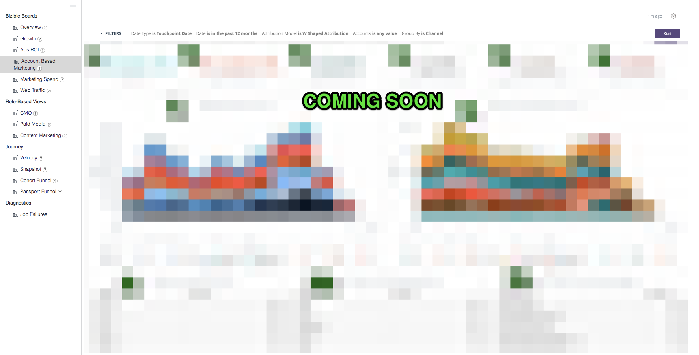

# 定義と百科事典 {#definitions-and-encyclopedia}

以下は、Discover プラットフォームに存在する様々なボードとタイルの概要と、これらのボード内のフィルターの概要です。 各ボードのスクリーンショット内には、いくつかの数のタイルがあり、その定義は以下のボードのセクションにあります。

**[!DNL Marketo Measure]ボード**

概要

成長

広告 ROI

アカウントベースドマーケティング

マーケティング費用

Web トラフィック

**ロールベースビュー**

CMO

ペイドメディア

コンテンツマーケティング

マーケティング業務

**ジャーニー**

速度

スナップショット

パスポートファネル

エンゲージメントパス

## [!DNL Marketo Measure] ボード {#marketo-measure-boards}

### 概要 {#overview}

概要では、売上高、支出、ROI への影響に関してマーケティングチームがどのようにパフォーマンスを発揮しているかをユーザーに大まかに把握できます。

**フィルター**

日付タイプはクローズ日です

日付が過去 12 ヶ月に達しています

アトリビューションモデルは W 字型です

指標は売上高

Dimensionはチャネル

チャネルが__に等しい

サブチャネルが__に等しい

キャンペーンが__と等しい

カテゴリ

**売上高**

`1.` アトリビューションモデルに基づく、クローズした獲得商談からの合計売上高。

「詳細を表示」をクリックし、ビジュアライゼーションおよびテーブルとして表示してデータを掘り下げて調べます。

**概要**

`2.` このグラフは、フィルターメニューの指標ドロップダウンを使用して、売上高/パイプライン売上高/支出/掘り出し物/商談/リード/各チャネルに属する連絡先を時間の経過と共に表示します。

**費用**

`3.` API コストと自己申告コストの両方から記録された支出の合計が、最も高いチャネルレベルでまとめられました。

「詳細を表示」をクリックし、ビジュアライゼーションおよびテーブルとして表示してデータを掘り下げて調べます。

**ROI**

`4.` フィルターメニューのディメンションドロップダウンを使用し、どれだけの ROI が各チャネル/サブチャネル/キャンペーン/アカウント/広告グループ/広告/広告主/クリエイティブ/キーワード/は位置/サイトに起因するかを表示します。属性モデルに基づき、選択した日付範囲全体を対象とします.

**ROI サマリ**

フィルターメニューの「Dimension」ドロップダウンを使用すると、選択した日付範囲全体で、各チャネル/サブチャネル/キャンペーン/アカウント/ AdGroup/広告/広告主/クリエイティブ/キーワード/プレースメント/サイトに属した売上高、支出、ROI がどれくらい表示されます。

**契約**

`5.` アトリビューションモデル数に基づく、クローズした獲得商談の合計数。 日付タイプ「タッチポイント日」が選択されている場合、この日付タイプを使用してオポチュニティ内の一部のタッチポイントを除外できるので、部分的なカウントが可能です。

「詳細を表示」をクリックし、ビジュアライゼーションおよびテーブルとして表示してデータを掘り下げて調べます。

**契約あたりのコスト**

`6.` 合計支出を契約の総数で割り、クローズした獲得商談を 1 回獲得するのに要する平均コストを示します。

**パイプライン収益**

`7.` 任意のオープン商談からの潜在的な収益の合計。クローズ済損失またはクローズ済獲得ではありません。 売上高は、選択したアトリビューションモデルに基づいています。

「詳細を表示」をクリックし、ビジュアライゼーションおよびテーブルとして表示してデータを掘り下げて調べます。

**契約サイズ**

`8.` クローズした獲得商談の平均金額。

**チャネルサマリ**

`9`.フィルターメニューの指標ドロップダウンを使用すると、各チャネルにどれくらいの売上高/パイプライン売上高/費用/商談/リード/連絡先が属したかに基づくチャネルのリストが、選択したアトリビューションモデルに基づいて最も高い順に表示されます。

**サブチャネルサマリ**

`10.` フィルターメニューの指標ドロップダウンを使用すると、売上高/パイプライン売上高/支出/商談/リード/連絡先が各サブチャネルにどれだけ関連付けられたかに基づくサブチャネルのリストが表示されます。

**キャンペーン サマリ**

`11.` フィルターメニューの指標ドロップダウンを使用すると、売上高/パイプライン売上高/支出/商談/リード/連絡先が各キャンペーンにどの程度関連付けられたかに基づくキャンペーンのリストです。選択したアトリビューションモデルに基づき最も高い順に並べ替えます。

### 成長 {#growth}

成長により、マーケターは、リードから連絡先、収益機会まで、ボード全体で生み出した内容を確認できます。 すべてのパイプラインと、そのパフォーマンスの推移を簡単に把握できます。

**フィルター**

日付タイプはタッチポイント日です

日付が過去 12 ヶ月に達しています

アトリビューションモデルは W 字型です

なしでグループ化

チャネルが__に等しい

サブチャネルが__に等しい

キャンペーンが__と等しい

カテゴリ

**売上高**

`1.` アトリビューションモデルに基づく、クローズした獲得商談からの合計売上高。

「詳細を表示」をクリックし、ビジュアライゼーションおよびテーブルとして表示してデータを掘り下げて調べます。

**売上高の推移**

`2.` 特定の期間におけるトレンドを示すアトリビューションモデルに基づく、クローズした獲得商談からの合計売上高。 「グループ化の条件」フィルターを使用して、チャネル、サブチャネル、キャンペーン、アカウント、広告グループ、広告、広告主、クリエイティブ、キーワード、配置、サイト別にスタックを変更します。

ドリルインして、より小さい日付ディメンションのデータを表示します。

**契約**

`3.` アトリビューションモデル数に基づく、クローズした獲得商談の合計数。

「詳細を表示」をクリックし、ビジュアライゼーションおよびテーブルとして表示してデータを掘り下げて調べます。

**時間の経過に伴う掘り出し物**

`4.` 特定の期間におけるトレンドを示すアトリビューションモデルに基づく、クローズした獲得商談の合計数。 「グループ化の条件」フィルターを使用して、チャネル、サブチャネル、キャンペーン、アカウント、広告グループ、広告、広告主、クリエイティブ、キーワード、配置、サイト別にスタックを変更します。

ドリルインして、より小さい日付ディメンションのデータを表示します。

**パイプライン収益**

`5.` 任意のオープン商談からの潜在的な収益の合計。クローズ済損失またはクローズ済獲得ではありません。 売上高は、選択したアトリビューションモデルに基づいています。

「詳細を表示」をクリックし、ビジュアライゼーションおよびテーブルとして表示してデータを掘り下げて調べます。

**パイプラインの売上高の推移**

`6.` 特定の期間におけるトレンドを示すアトリビューションモデルに基づく、オープン商談からの潜在的な売上高の合計です。 「グループ化の条件」フィルターを使用して、チャネル、サブチャネル、キャンペーン、アカウント、広告グループ、広告、広告主、クリエイティブ、キーワード、配置、サイト別にスタックを変更します。

ドリルインして、より小さい日付ディメンションのデータを表示します。

**リード**

`7.` 属性モデルに基づくリードの合計数。 日付タイプ「タッチポイント日」が選択されている場合、この日付タイプを使用してリードレコード内の一部のタッチポイントを除外できるので、部分的なカウントが可能です。 U 字型を超えるアトリビューションモデルが適用される場合、U 字型は W 字型、W 字型、カスタムモデルに使用されます。

「詳細を表示」をクリックし、ビジュアライゼーションおよびテーブルとして表示してデータを掘り下げて調べます。

**リードの推移**

`8.` 特定の期間におけるトレンドを示すアトリビューションモデルに基づく、リードの合計数。 「グループ化の条件」フィルターを使用して、チャネル、サブチャネル、キャンペーン、アカウント、広告グループ、広告、広告主、クリエイティブ、キーワード、配置、サイト別にスタックを変更します。

ドリルインして、より小さい日付ディメンションのデータを表示します。

**取引先責任者**

`9.` 属性モデルに基づく連絡先の合計数。 日付タイプ「タッチポイント日」が選択されている場合、この日付タイプを使用して連絡先レコード内の一部のタッチポイントを除外できるので、部分的なカウントが可能です。 U 字型を超えるアトリビューションモデルが適用される場合、U 字型は W 字型、W 字型、カスタムモデルに使用されます。

「詳細を表示」をクリックし、ビジュアライゼーションおよびテーブルとして表示してデータを掘り下げて調べます。

**長期間の連絡先**

`10.` 特定の期間におけるトレンドを示すアトリビューションモデルに基づく、連絡先の合計数。 「グループ化の条件」フィルターを使用して、チャネル、サブチャネル、キャンペーン、アカウント、広告グループ、広告、広告主、クリエイティブ、キーワード、配置、サイト別にスタックを変更します。

ドリルインして、より小さい日付ディメンションのデータを表示します。

**商談**

`11.` アトリビューションモデルに基づく商談の合計数。 日付タイプ「タッチポイント日」が選択されている場合、この日付タイプを使用して商談レコード内の一部のタッチポイントを除外できるので、部分的なカウントが可能です。

「詳細を表示」をクリックし、ビジュアライゼーションおよびテーブルとして表示してデータを掘り下げて調べます。

**長期にわたる商談**

`12.` 特定の期間におけるトレンドを示すアトリビューションモデルに基づく、商談の合計数。 「グループ化の条件」フィルターを使用して、チャネル、サブチャネル、キャンペーン、アカウント、広告グループ、広告、広告主、クリエイティブ、キーワード、配置、サイト別にスタックを変更します。

ドリルインして、より小さい日付ディメンションのデータを表示します。

**訪問者数**

`13.` 既知の訪問者と匿名訪問者の全体で追跡されたサイト訪問の合計数です。

「詳細を表示」をクリックし、ビジュアライゼーションおよびテーブルとして表示してデータを掘り下げて調べます。

（この機能が無効な場合は、0 と表示されます）。

**訪問回数の推移**

`14.` 特定の期間にわたるトレンドを示す、追跡されたサイト訪問の合計数。 「グループ化の条件」フィルターを使用して、チャネル、サブチャネル、キャンペーン、アカウント、広告グループ、広告、広告主、クリエイティブ、キーワード、配置、サイト別にスタックを変更します。

ドリルインして、より小さい日付ディメンションのデータを表示します。

（この機能が無効な場合は、空の状態で表示されます）。

**ユニーク訪問数**

`15.` 既知の訪問者と匿名訪問者の全体で追跡された個別サイト訪問の合計数です。

「詳細を表示」をクリックし、ビジュアライゼーションおよびテーブルとして表示してデータを掘り下げて調べます。

（この機能が無効な場合は、0 と表示されます）。

**ユニーク訪問回数の推移**

`16.` 特定の期間にわたるトレンドを示す、追跡された個別サイト訪問の合計数。 「グループ化の条件」フィルターを使用して、チャネル、サブチャネル、キャンペーン、アカウント、広告グループ、広告、広告主、クリエイティブ、キーワード、配置、サイト別にスタックを変更します。

ドリルインして、より小さい日付ディメンションのデータを表示します。

（この機能が無効な場合は、空の状態で表示されます）。

**フォーム**

`17.` 既知の訪問者と匿名の訪問者全体で送信されたフォームの合計数です。

「詳細を表示」をクリックし、ビジュアライゼーションおよびテーブルとして表示してデータを掘り下げて調べます。

（この機能が無効な場合は、0 と表示されます）。

**Formsの経時的な推移**

`18.` 特定の期間のトレンドを示す送信済みフォームの合計数です。 「グループ化の条件」フィルターを使用して、チャネル、サブチャネル、キャンペーン、アカウント、広告グループ、広告、広告主、クリエイティブ、キーワード、配置、サイト別にスタックを変更します。

ドリルインして、より小さい日付ディメンションのデータを表示します。

（この機能が無効な場合は、空の状態で表示されます）。

### 広告 ROI {#ads-roi}

広告の ROI は、有料メディア管理者にマーケティング活動を見てもらい、キャンペーンの効果を見てキーワードの効果を知ることができます。

**フィルター**

日付タイプはクローズ日です

日付が過去 12 ヶ月に達しています

アトリビューションモデルは W 字型です

チャネルが__に等しい

サブチャネルが__に等しい

キャンペーンが__と等しい

カテゴリ

**キャンペーン ROI サマリ**

`1.` 各キャンペーンに関連する売上高、支出、ROI に基づくキャンペーンのリスト。選択したアトリビューションモデルに基づく最も高い売上高で並べ替えられます。

**クリエイティブ ROI サマリ**

`2.` 各クリエイティブに関連する売上高、支出、ROI に基づくクリエイティブのリスト。選択したアトリビューションモデルに基づく最も高い売上高で並べ替えられます。

**キーワード ROI サマリ**

`3.` 各キーワードに属する売上高、支出、ROI に基づくキーワードのリスト。選択したアトリビューションモデルに基づく最高売上高で並べ替えられます。

### アカウントベースドマーケティング {#account-based-marketing}

アカウントベースドマーケティングは、ABM を使用して、ターゲットアカウントに対する取り組みと、マーケティングから得たエンゲージメントの量を追跡する機能を企業に提供します。

**フィルター**

日付タイプはタッチポイント日です

日付が過去 12 ヶ月に達しています

アトリビューションモデルは W 字型のアトリビューションです

Group By Is Channel

アカウントは__

**売上高**

アトリビューションモデルに基づく、クローズした獲得商談からの合計売上高。

「詳細を表示」をクリックし、ビジュアライゼーションおよびテーブルとして表示してデータを掘り下げて調べます。

**パイプライン収益**

任意のオープン商談からの潜在的な収益の合計。クローズ済損失またはクローズ済獲得ではありません。 売上高は、選択したアトリビューションモデルに基づいています。

**アカウントごとの平均タッチ数**

各 CRM アカウントから生成されたタッチポイントの平均数（アカウント ID 別）。

**マッチしたリード**

次を使用してアカウントに正常に照合されたリードの合計数 [!DNL Marketo Measure] Web サイト、会社名、電子メールドメインの一致アルゴリズムを使用する、アカウント間のリード機能。

**エンゲージ済みアカウント**

任意のタッチポイントを受け取ったアカウントの合計数です。 ターゲットアカウントリストを使用する場合、これはターゲットアカウントリストのアカウントのサブセットです。

**エンゲージした商談**

任意のタッチポイントを受け取ったオポチュニティの合計数。 ターゲットの顧客リストを使用する場合、これはそのターゲットの顧客リストからの商談のサブセットになります。

**エンゲージした個人**

任意のタッチポイントを受け取った個人（リードおよび E メールアドレス別の連絡先）の合計数です。 ターゲットアカウントリストを使用する場合、これはターゲットアカウントリストの個人のサブセットになります。

**Touchpoints の推移**

指定した期間に記録されたタッチポイントの合計数です。 ターゲットアカウントリストを使用する場合、これはターゲットアカウントリストのアカウントのサブセットです。

**時間の経過に伴うアカウントのタッチ（グラフ）**

指定された期間に 1 ヶ月あたりに任意のタッチポイントを受け取ったアカウントの合計数。チャネル、サブチャネル、キャンペーン、アカウント、広告グループ、広告、広告主、クリエイティブ、キーワード、プレースメントまたはサイトで結果をグループ化できます。 ターゲットアカウントリストを使用する場合、これはターゲットアカウントリストのアカウントのサブセットです。

**Touchpoint 数別のアカウント**

アカウント ID およびアカウント名別に、各アカウントからのタッチポイントの合計数です。

**Touchpoint数**

各ディメンションに関連付けられるタッチポイントの数。グループ別フィルターでディメンションを変更できます（なし/チャネル/サブチャネル/キャンペーン/アカウント/広告主/広告/クリエイティブ/広告グループ/キーワード/プレースメント/サイト）。

### マーケティング費用 {#marketing-spend}

マーケティング費用は、ある期間に費やした金額をマーケターに示し、月別およびチャネル別に支出を追跡できます。

**フィルター**

日付タイプはタッチポイント日です

日付が過去 12 ヶ月に達しています

アトリビューションモデル

Group By がチャネルと等しい

チャネルが__に等しい

サブチャネルが__に等しい

キャンペーンが__と等しい

**売上高**

アトリビューションモデルに基づく、クローズした獲得商談からの合計売上高。

「詳細を表示」をクリックし、ビジュアライゼーションおよびテーブルとして表示してデータを掘り下げて調べます。

**費用**

API コストと自己申告コストの両方から記録された支出の合計が、最も高いチャネルレベルでまとめられました。

「詳細を表示」をクリックし、ビジュアライゼーションおよびテーブルとして表示してデータを掘り下げて調べます。

**ROI**

総収益（選択したアトリビューションモデル）と総支出から計算した ROI（投資利益率）.

**支出（グラフ）**

特定の期間にわたるトレンドを示す記録済み支出の合計金額。 「グループ化の条件」フィルターを使用して、「なし」、「チャネル」、「サブチャネル」、「キャンペーン」、「アカウント」、「広告グループ」、「広告」、「広告主」、「クリエイティブ」、「キーワード」、「配置」、「サイト」でスタックを変更します。

支出はすべてのレベルで記録されるわけではないので、合計が「Group By」の各選択と等しくない可能性があります。 例えば、すべてのキャンペーンの合計がすべてのサブチャネルの合計と等しくなりません。

**支出+ ROI**

右の Y 軸に、ROI と共に 1 ヶ月のマーケティング費用の額を表示します。

**チャネル別の支出**

各チャネルについて報告された量に基づくチャネルのリスト（最も高い支出で並べ替え）。

**サブチャネル別の支出**

各サブチャネルに対して報告されたサブチャネルのリスト（最も高い支出で並べ替え）。

**キャンペーン別の支出**

各キャンペーンについてレポートされたキャンペーンの量を、最も高い支出で並べ替えたリスト。 キャンペーンは、ページビュー数の utm_campaign 値を含むキャンペーンの完全なリストで構成されます。

### Web トラフィック {#web-traffic}

Web トラフィックビューを使用すると、マーケターは、既知のサイト訪問者と匿名のサイト訪問者の両方からのトラフィックを測定し、Web サイト上のアクティビティを追跡できます。

**フィルター**

日付タイプはタッチポイント日です

日付が過去 12 ヶ月に達しています

アトリビューションモデルは W 字型のアトリビューションです

URL が__に等しい

グループ化の基準：なし

指標は訪問回数

チャネルが__に等しい

サブチャネルが__に等しい

キャンペーンが__と等しい

**ユニーク訪問数**

既知の訪問者と匿名訪問者の全体で追跡された個別サイト訪問の合計数です。

「詳細を表示」をクリックし、ビジュアライゼーションおよびテーブルとして表示してデータを掘り下げて調べます。

**訪問者数**

既知の訪問者と匿名訪問者の全体で追跡されたサイト訪問の合計数です。

「詳細を表示」をクリックし、ビジュアライゼーションおよびテーブルとして表示してデータを掘り下げて調べます。

**ユニーク訪問あたりのコスト**

合計支出を個別訪問の合計数で割って、個別訪問率あたりのコストを提供します。

**訪問あたりのコスト**

合計支出を訪問の合計数で割って、訪問あたりのコスト率を提供します。

**ユニーク訪問あたりの売上高**

既知の訪問者と匿名訪問者による、個別サイト訪問あたりのクローズ済み売上高の計算平均。

**訪問あたりの売上高**

既知の訪問者と匿名訪問者による、サイト訪問あたりのクローズ済み売上高の計算平均。

**ページビュー**

既知の訪問者と匿名訪問者の間で追跡されたページビューの合計数です。

「詳細を表示」をクリックし、ビジュアライゼーションおよびテーブルとして表示してデータを掘り下げて調べます。

**フォーム**

既知の訪問者と匿名の訪問者全体で送信されたフォームの合計数です。

「詳細を表示」をクリックし、ビジュアライゼーションおよびテーブルとして表示してデータを掘り下げて調べます。

**概要**

このグラフは、フィルターメニューの指標ドロップダウンを使用して、各ディメンションに属する売上高/パイプライン売上高/支出/掘り下げ/商談/リード/連絡先/クリック数/インプレッション/訪問回数/個別訪問/ページビュー/フォームを時間の経過と共に表示します。 Dimensionは、「なし」から「チャネル/サブチャネル/キャンペーン/アカウント/広告主/広告/クリエイティブ/広告グループ/キーワード/プレースメント/サイト」に変更できます。

**ウェブトラフィックサマリ**

URL 別に、各ページにクレジットされたページビュー数、訪問回数、個別訪問回数およびフォーム送信数を表示します。

**参照元サマリ**

各参照 URL からのページ訪問回数と個別訪問回数。

**ソース別ユニーク訪問数**

フィルターメニューの「グループ化」ドロップダウンを使用して、サイトへの実訪問者数のソースを表示します。 「グループ化の基準」を「チャネル」、「サブチャネル」、「キャンペーン」、「アカウント」、「広告グループ」、「広告」、「広告主」、「クリエイティブ」、「キーワード」、「プレースメント」、「サイト」に変更します。

**ソース別の訪問数**

フィルターメニューの「グループ化」ドロップダウンを使用して、サイトの訪問者のソースを表示します。 「グループ化の基準」を「チャネル」、「サブチャネル」、「キャンペーン」、「アカウント」、「広告グループ」、「広告」、「広告主」、「クリエイティブ」、「キーワード」、「プレースメント」、「サイト」に変更します。

**ランディングページ別のリード**

各ランディングページから生成されたリード数に基づくランディングページのリスト。最も多いリード数で並べ替えられています。

**フォーム URL 別のリード**

各 URL から生成されたリード数に基づくフォーム URL のリスト。最も多いリード数で並べ替えられています。

## ロールベースビュー {#role-based-views}

### CMO {#cmo}

CMO ビューでは、CMO が売上高、支出、ROI に対する影響に関してマーケティングチームがどのようにパフォーマンスを発揮しているかを大まかに見ることができます。

**フィルター**

日付タイプはクローズ日です

日付が過去 12 ヶ月に達しています

アトリビューションモデルは W 字型です

チャネルが__に等しい

サブチャネルが__に等しい

キャンペーンが__と等しい

指標は売上高

カテゴリ

**売上高**

`1.` アトリビューションモデルに基づく、クローズした獲得商談からの合計売上高。

「詳細を表示」をクリックし、ビジュアライゼーションおよびテーブルとして表示してデータを掘り下げて調べます。

**概要**

`2.` このグラフは、フィルターメニューの指標ドロップダウンを使用して、売上高/パイプライン売上高/支出/掘り出し物/商談/リード/各チャネルに属する連絡先を時間の経過と共に表示します。

**費用**

`3.` API コストと自己申告コストの両方から記録された支出の合計が、最も高いチャネルレベルでまとめられました。

「詳細を表示」をクリックし、ビジュアライゼーションおよびテーブルとして表示してデータを掘り下げて調べます。

**ROI**

`4.` 総収益（選択したアトリビューションモデル）と総支出から計算した ROI（投資利益率）.

**契約**

`5.` アトリビューションモデル数に基づく、クローズした獲得商談の合計数。 日付タイプ「タッチポイント日」が選択されている場合、この日付タイプを使用してオポチュニティ内の一部のタッチポイントを除外できるので、部分的なカウントが可能です。

「詳細を表示」をクリックし、ビジュアライゼーションおよびテーブルとして表示してデータを掘り下げて調べます。

**契約あたりのコスト**

`6.` 合計支出を契約の総数で割り、クローズした獲得商談を 1 回獲得するのに要する平均コストを示します。

**パイプライン収益**

`7.` 任意のオープン商談からの潜在的な収益の合計。クローズ済損失またはクローズ済獲得ではありません。 売上高は、選択したアトリビューションモデルに基づいています。

「詳細を表示」をクリックし、ビジュアライゼーションおよびテーブルとして表示してデータを掘り下げて調べます。

**契約サイズ**

`8.` クローズした獲得商談の平均金額。

**チャネルサマリ**

`9.` フィルターメニューの指標ドロップダウンを使用すると、各チャネルにどれくらいの売上高/パイプライン売上高/費用/商談/リード/連絡先が属したかに基づくチャネルのリストが、選択したアトリビューションモデルに基づいて最も高い順に表示されます。

**サブチャネルサマリ**

`10.` フィルターメニューの指標ドロップダウンを使用すると、売上高/パイプライン売上高/支出/商談/リード/連絡先が各サブチャネルにどれだけ関連付けられたかに基づくサブチャネルのリストが表示されます。

**キャンペーン サマリ**

`11.` フィルターメニューの指標ドロップダウンを使用すると、売上高/パイプライン売上高/支出/商談/リード/連絡先が各キャンペーンにどの程度関連付けられたかに基づくキャンペーンのリストです。選択したアトリビューションモデルに基づき最も高い順に並べ替えます。

### ペイドメディア {#paid-media}

有料メディアダッシュボードは、有料メディアマネージャー（または類似）に、有料メディアパフォーマンスのプレビューを提供します。 関連するチャネルで提供された量や、取り組みから生み出された需要を確認できます。 すべての指標は、有料メディア統合から取得されます。

**フィルター**

日付タイプはタッチポイント日です

日付が過去 12 ヶ月に達しています

アトリビューションモデルは W 字型です

指標は売上高

Dimensionはチャネル

チャネルが__に等しい

サブチャネルが__に等しい

キャンペーンが__と等しい

カテゴリ

**売上高**

`1.` アトリビューションモデルに基づく、クローズした獲得商談からの合計売上高。

「詳細を表示」をクリックし、ビジュアライゼーションおよびテーブルとして表示してデータを掘り下げて調べます。

**費用**

`2.` API コストと自己申告コストの両方から記録された支出の合計が、最も高いチャネルレベルでまとめられました。

「詳細を表示」をクリックし、ビジュアライゼーションおよびテーブルとして表示してデータを掘り下げて調べます。

**ROI**

`3.` 総収益（選択したアトリビューションモデル）と総支出から計算した ROI（投資利益率）.

**パイプライン収益**

`4.` 任意のオープン商談からの潜在的な収益の合計。クローズ済損失またはクローズ済獲得ではありません。 売上高は、選択したアトリビューションモデルに基づいています。

「詳細を表示」をクリックし、ビジュアライゼーションおよびテーブルとして表示してデータを掘り下げて調べます。

**概要**

`5.` フィルターメニューの指標ドロップダウンを使用すると、売上高/パイプライン売上高/支出/掘り出し物/商談/リード/連絡先/訪問回数/個別訪問回数/インプレッション/クリック数/フォームの推移が表示されます。

**インプレッション**

`6.` 接続されているすべての広告アカウントから提供されたインプレッションの合計数。

「詳細を表示」をクリックし、ビジュアライゼーションおよびテーブルとして表示してデータを掘り下げて調べます。

**CPM**

`7.` 提供されたインプレッション数からの合計支出を合計インプレッション数（1,000 で割る）で割り、CPM 率を示します。

**クリック**

`8.` 接続されているすべての広告アカウントから追跡されたクリック総数。

「詳細を表示」をクリックし、ビジュアライゼーションおよびテーブルとして表示してデータを掘り下げて調べます。

**CPC**

`9.` 追跡したクリック数の合計支出を合計クリック数で割り、CPC 率を示します。

**リード**

`10.` CRM で作成されたリードの合計数。

**リードあたりのコスト**

`11.` 作成されたリードの合計支出を合計クリック数で割って、CPL 率を示します。

**訪問者数**

`12.` 既知の訪問者と匿名訪問者の全体で追跡されたサイト訪問の合計数です。

「詳細を表示」をクリックし、ビジュアライゼーションおよびテーブルとして表示してデータを掘り下げて調べます。

**ユニーク訪問数**

`13.` 既知の訪問者と匿名訪問者の全体で追跡された個別サイト訪問の合計数です。

「詳細を表示」をクリックし、ビジュアライゼーションおよびテーブルとして表示してデータを掘り下げて調べます。

**ウェブトラフィックサマリ**

フィルターメニューのディメンションピッカーを使用して、チャネル、サブチャネル、キャンペーン、アカウント、広告グループ、広告、広告主、クリエイティブ、キーワード、配置、サイトを切り替え、それぞれに与えられたページビュー数、訪問数、個別訪問数を表示します。

**リードパイプラインサマリ**

フィルターメニューのディメンションピッカーを使用して、選択したアトリビューションモデルに基づいて、チャネル、サブチャネル、キャンペーン、アカウント、広告グループ、広告、広告主、クリエイティブ、キーワード、配置、サイトおよび各リードに属する連絡先の数を表示します。

**商談パイプラインサマリ**

フィルターメニューのディメンションピッカーを使用して、選択したアトリビューションモデルに基づいて、チャネル、サブチャネル、キャンペーン、アカウント、広告グループ、広告、広告主、クリエイティブ、キーワード、配置、サイトと各商談に関連する売上高を表示します。

### コンテンツマーケティング {#content-marketing}

コンテンツマーケティングダッシュボードを使用すると、コンテンツマーケターは、発生した訪問数からクローズした売上高まで、マーケティングコンテンツの効果を確認できます。 すべてのコンテンツで表示するか、特定のコンテンツまたはページに絞り込みます。

フィルター

日付タイプはタッチポイント日です

日付が過去 12 ヶ月に達しています

アトリビューションモデルは W 字型です

ランディングページが次と等しい__

チャネルが__に等しい

サブチャネルが__に等しい

キャンペーンが__と等しい

カテゴリ

**合計収益**

`1.` アトリビューションモデルに基づく、デジタルソースからのクローズした獲得商談の合計売上高です。

「詳細を表示」をクリックし、ビジュアライゼーションおよびテーブルとして表示してデータを掘り下げて調べます。

**収益別のランディングページ**

`2.` 各ランディングページに対してどの程度の売上高が関連付けられたかに基づくランディングページのリスト。選択したアトリビューションモデルに基づく最高の売上高で並べ替えられます。

**総パイプライン収益**

`3.` デジタルソースからのオープン商談からの総収益。つまり、クローズ済み損失またはクローズ済み獲得ではありません。 売上高は、選択したアトリビューションモデルに基づいています。

「詳細を表示」をクリックし、ビジュアライゼーションおよびテーブルとして表示してデータを掘り下げて調べます。

**パイプライン収益別のランディングページ**

`4.` 各ランディングページに対してどの程度のパイプラインの売上高が関連付けられたかに基づくランディングページのリスト。選択したアトリビューションモデルに基づく最も高いパイプラインの売上高で並べ替えられます。

**総商談数**

`5.` アトリビューションモデルに基づく、デジタルソースからの商談の合計数。

「詳細を表示」をクリックし、ビジュアライゼーションおよびテーブルとして表示してデータを掘り下げて調べます。

**商談数別のランディングページ**

`6.` 各ランディングページに属するオポチュニティの数に基づくランディングページのリスト。選択したアトリビューションモデルに基づく商談の最大数で並べ替えられます。

**フォーム**

`7.` トラッキングされるすべてのページで送信されたフォームの合計数です。

**フォーム送信別の上位フォーム URL**

`8.` 各 URL で送信されたフォームの数に基づくフォーム URL のリスト。ページで送信されたフォームの最も多い数で並べ替えられます。

**チャネル別のフォーム URL**

`9.` 訪問を促すチャネル別にグループ化された上位 10 件のフォーム URL。

「詳細を表示」をクリックし、ビジュアライゼーションおよびテーブルとして表示してデータを掘り下げて調べます。

**ユニーク訪問数**

`10.` 既知の訪問者と匿名訪問者の全体で追跡された個別サイト訪問の合計数です。

ドリルインして、月別の個別サイト訪問数を確認します。

**ユニーク訪問数によるトップランディングページ**

`11.` 各ランディングページへの個別訪問数に基づくランディングページのリスト。最も多くの個別訪問数を持つページで並べ替えられます。

ドリルインして、選択した URL への月別の個別訪問数を確認します。

**訪問者数**

`12.` 既知の訪問者と匿名訪問者の全体で追跡されたサイト訪問の合計数です。

**訪問数によるトップランディングページ**

`13.` 各ランディングページへの初回訪問回数に基づくランディングページのリスト。最も多くの訪問回数を持つページで並べ替えられます。

**リード**

`14.` 属性モデルに基づくリードの合計数。 日付タイプ「タッチポイント日」が選択されている場合、この日付タイプを使用してリードレコード内の一部のタッチポイントを除外できるので、部分的なカウントが可能です。 U 字型を超えるアトリビューションモデルが適用される場合、U 字型は W 字型、W 字型、カスタムモデルに使用されます。

「詳細を表示」をクリックし、ビジュアライゼーションおよびテーブルとして表示してデータを掘り下げて調べます。

**リード数別のランディングページ**

`15.` 各 URL から作成されたリード数に基づくページ URL のリスト。最もリード数の多いページで並べ替えられています。

### マーケティング業務 {#marketing-ops}

検証と診断 [!DNL Marketo Measure] 個々のタッチポイントを完全に可視化したデータ。

**フィルター**

アカウント ID

アカウント名

商談 ID

リードまたは取引先責任者の ID

リードまたは取引先責任者のメール

キャンペーン ID

獲得した商談 (Y/N)

商談作成日

商談のクローズ日

Touchpoint 日

アトリビューションモデル

**ドリルダウン**

商談の詳細

取引先責任者の詳細

リード詳細

属性タッチポイントの詳細

Touchpoint の詳細

**アカウント**

`1.` タッチポイントを持つすべてのアカウントのリスト。 各アカウントの情報には、エンゲージメントレーティング、オポチュニティ数、連絡先数、リード数、アトリビューションタッチポイント数およびタッチポイント数が含まれます。

集計された数値をクリックして、ベース・データの詳細をドリルダウンします。

**商談**

`2.` 属性タッチポイントを持つすべてのオポチュニティのリスト。 各オポチュニティの情報には、オポチュニティの量、連絡先の数、アトリビューションタッチポイントの数が含まれます。

集計された数値をクリックして、ベース・データの詳細をドリルダウンします。

**取引先責任者**

`3.` タッチポイントを持つすべての連絡先のリスト。 各連絡先の情報には、属性タッチポイント数とタッチポイント数が含まれます

集計された数値をクリックして、ベース・データの詳細をドリルダウンします。

**リード**

`4.` タッチポイントを持つすべてのリードのリスト。 各リードの情報には、タッチポイントの数が含まれます。

集計された数値をクリックして、ベース・データの詳細をドリルダウンします。

**キャンペーン**

`5.` タッチポイントを持つすべてのキャンペーンのリスト。 各キャンペーンの情報には、キャンペーンの費用、属性の金額、属性のタッチポイント数およびタッチポイント数が含まれます。

集計された数値をクリックして、ベース・データの詳細をドリルダウンします。

**マーケティング業務に関する FAQ**

**Q:「アカウント ID」と「アカウント名」の両方のフィルターがあるのはなぜですか。**

回答：アカウント ID は一意ですが、アカウント名は一意である必要はありません。 例えば、企業内の各ビジネスユニットに対して複数の異なるアカウントを作成したとします。 アカウント名の使用はより直感的ですが、特定のアカウントに対してフィルタリングをおこなう場合は、アカウント ID を使用することができます。

**Q：アカウント ID でフィルターした場合、すべてのテーブルはフィルターされますか。**

A：はい。ボード内のすべてのタイルにフィルターが適用されます。 例えば、「Microsoft」のアカウントフィルターを適用した場合、「商談」タイルには、Microsoftに関連する商談のみが表示されます。

**Q:「エンゲージメント評価」列とは何ですか。**

回答：エンゲージメント評価は、 [!DNL Marketo Measure] 予測アカウントエンゲージメントスコア ( [!DNL Marketo Measure] 第 2 層。 これがない場合、このフィールドは null と表示されます。

**Q：テーブルの並べ替え方法を変更できますか？**

A：はい。任意の列ヘッダーをクリックすると、テーブルが並べ替えられます。 同じヘッダーを再度クリックすると、テーブルの並べ替え方法が逆になります。

**Q：データを書き出すことはできますか。**

A：はい。タイルタイトル（「アカウント」など）にカーソルを合わせたら、右上隅の縦並びの 3 ドットをクリックします。 これにより、TXT、CSV、XLS、JSON、HTML、Markdown の各形式で、そのタイルのデータをダウンロードできます。

**Q: 500 行を超えるデータを表示できますか。**

A：タイルの表示は一度に 500 行に制限されていますが、データをエクスポートし、「すべての結果」を選択して、500 行を超える表示を確認することができます。

## ジャーニー {#journey}

### 販売速度 {#sales-velocity}

マーケターとセールスは、セールスベロシティを通じて、見込み客がファネル内をどれだけ速く移動しているかを確認し、どのチャネルがより速い（または遅い）コンバージョン時間を持っているかを判断できます。

**フィルター**

日付が過去 12 ヶ月に達しています

獲得ははい

ステージが__と等しい

チャネルが__に等しい

サブチャネルが__に等しい

**速度（日数）**

`1.` 最初の匿名タッチから商談のクローズまで、商談が販売サイクルに入った平均日数。

**アクティブな商談**

`2.` 任意のオープン商談からの商談の合計数。クローズ済損失またはクローズ済獲得ではありません。

**平均契約サイズ**

`3.` クローズした獲得商談の平均金額。

**獲得率**

`4.` クローズした獲得商談の合計数を、クローズした損失商談とクローズした獲得商談の合計数で割り、獲得率の割合を示します。

**チャネル別の商談の速度**

`5.` 各ステージのサイクルに含まれる商談の平均日数。マーケティングチャネルごとにグループ化され、次のステージに進むのに要する時間の長さを示します。 ここに表示されるステージは、マイルストーン・ステージ (FT、LC、OC) およびカスタム・ステージです。

**チャネル別リード速度**

`6.` リードが連絡先/商談/アカウントに変換されるまでのステージごとのサイクルにかかった平均日数。マーケティングチャネルごとにグループ化され、次のステージまでの進行に要する時間の長さが示されます。 ここに表示されるステージは、マイルストーンステージ (FT、LC) およびカスタムステージです。

**平均商談速度**

`7.` ステージごとのサイクルに含まれる商談の平均日数。次のステージに進むのに要する時間の長さを示します。 ここに表示されるステージは、マイルストーン・ステージ (FT、LC、OC) およびカスタム・ステージです。 この数値は、上記のチャネル別商談速度グラフのステージごとの時間を反映しています。

**平均リード速度**

`8.` リードが連絡先/商談/アカウントに変換されるまでのステージごとのサイクルにかかった平均日数。次のステージに進むのに要する時間の長さが示されます。 ここに表示されるステージは、マイルストーンステージ (FT、LC) およびカスタムステージです。 この数値は、上記の「チャネル別リードベロシティ」グラフのステージごとの時間を反映したものです。

**時間の経過に伴うオポチュニティの速度**

`9.` 経時的なトレンドを示す、ステージごとのサイクルに含まれる商談の平均日数。

**リードベロシティの推移**

`10.` 長期的なトレンドを示す、ステージごとのリードのサイクルに含まれる平均日数。

### スナップショット {#snapshot}

スナップショットを使用すると、マーケターは、任意の時点でのパイプライン全体を把握できます。 フィルターに 1 つの日付が追加され、その日のパイプラインの状態がどのように表示されたかが示されます。

フィルター

日付は2018-01-01です

リードまたは取引先責任者

**リード/取引先責任者スナップショット**

`1.` 選択した日付の各ステージに存在したリードまたは連絡先レコードの数。

**リード/連絡先スナップショット（表）**

`2.` 選択した日付の各ステージに存在したリードまたは連絡先レコードの数。

**商談スナップショット**

`3.` 選択した日付の各ステージにあった商談レコードの数。

**商談のスナップショット（表）**

`4.` 選択した日付の各ステージにあった商談レコードの数。

### パスポート {#passport}

パスポートは、 [!DNL Marketo Measure] ROI ダッシュボード。各ステージには、各ステージのレコード数と、各ステージを通過したレコードの合計が表示されます。

**フィルター**

日付タイプはタッチポイント日です

日付が過去 12 ヶ月に達しています

アトリビューションモデルは W 字型です

チャネルが__に等しい

サブチャネルが__に等しい

キャンペーンが__と等しい

カテゴリ

**リード/連絡先パスポート**

`1.` &amp; `2.` 各ステージには、各リードステータスまたは連絡先ステージのレコード数と、各ステージを通過したレコードの合計数が表示されます。

**商談パスポート**

`3.` 各ステージには、各商談ステージのレコード数と、各ステージを通過したレコードの合計が表示されます。

### エンゲージメントパス {#engagement-path}

リード、連絡先、商談、およびアカウントがファーストタッチからクローズにどのように関わっているかを理解します。

**フィルター**

アカウント名/ID

リード ID/メール

連絡先 ID/メール

アトリビューションモデル

イベントタイプ

Buyer Attribution Touchpoint の位置

Buyer Attribution Touchpoint の位置

Touchpoint 日

User Touchpointメール

マーケティングタッチタイプ

チャネル

中

ウェブソース

人物との最初のインタラクション (Y/N)

起因する収益

**イベントジャーニー**

関連するタッチポイントの詳細と属性の売上高を持つすべてのイベントのリスト。

「イベントタイプ」をクリックしてドリルダウンし、イベントの詳細を表示します。

**エンゲージメントパスに関する FAQ**

**Q:1 人のユーザーのジャーニーを表示するにはどうすればよいですか？**

A: 「リード ID/メール」または「連絡先 ID/メール」フィルターを使用して、フィルターを「次を含む」に設定します [電子メールアドレス]」をクリックし、「実行」をクリックします。

**Q:「アトリビューションモデル」フィルターは何に影響しますか。**

回答：アトリビューションモデルのフィルターは、「属性売上高」列に影響を与えます

**質問：「マーケティングタッチタイプ」フィルターとは何ですか。**

A: 「マーケティングタッチタイプ」はエンゲージメントのタイプで、Web 訪問、Web フォーム、Web チャット、電子メール、電話、左メッセージ、CRM（オフラインチャネルのキャンペーンメンバーシップなど）を含めることができます

**Q：ジャーニーからすべての Web セッションを除外するには、どうすればよいですか。**

A: 「マーケティングタッチタイプ」フィルターを使用して、フィルターを「Web 訪問を含まない」または「次を含む」に設定します [Web 訪問を除くすべてのタッチタイプ]をクリックし、「実行」をクリックします。

**Q：データを書き出すことはできますか。**

A：はい。「イベントのジャーニー」テーブルにカーソルを合わせたら、右上隅の縦並びの 3 つのドットをクリックします。 これにより、TXT、CSV、XLS、JSON、HTML、Markdown の各形式でデータをダウンロードできます。

**Q：テーブルの並べ替え方法を変更できますか？**

A：はい。任意の列ヘッダーをクリックすると、テーブルが並べ替えられます。 同じヘッダーを再度クリックすると、テーブルの並べ替え方法が逆になります。 デフォルトでは、テーブルはタッチポイント日付が最も古い順に並べ替えられます。

**Q: 500 行を超えるデータを表示できますか。**

A：タイルの表示は一度に 500 行に制限されていますが、データをエクスポートし、「すべての結果」を選択して、500 行を超える表示を確認することができます。
