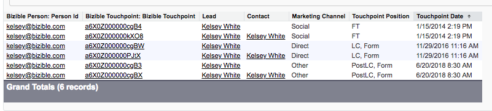

# レコードと[!DNL Marketo Measure]を複製 {#duplicate-records-and-marketo-measure}

>[!NOTE]
>
>ドキュメント内に「[!DNL Marketo Measure]」を指定する手順が記載されている場合がありますが、CRM には引き続き「Bizible」と表示されます。 アドビは現在更新に取り組んでおり、ブランディングの変更はまもなく CRM に反映される予定です。

[!DNL Marketo Measure]は、CRM内の関連するリードまたは取引先責任者にデータを照合する際に、一意のIDとして電子メールアドレスを使用します。 [!DNL Marketo Measure]さんが同じ電子メールアドレスを持つ複数のリードまたは取引先責任者を見つけると、すべてのレコードに同じデータが表示されます。 この影響は、[!DNL Marketo Measure]のリードまたは取引先責任者に関するレポートを作成する際に発生し、誤ってBuyer Touchpointsを持つユニークなユーザーの数を増やす可能性があります。

これは[!DNL Marketo Measure] レポートでどのように表示されますか？

_レポートの例：[!DNL Marketo Measure]購入者のタッチポイントを持つ人物。_

kelsey@adobe.comの[!DNL Marketo Measure]人IDを確認すると、そのメールアドレスに存在するリードと連絡先の両方があることがわかります。 このレポートでは、2つのファーストタッチ、2つのリード作成タッチ、2つのPostLC インタラクションが報告されています。 これらの重複したレコードは、タッチポイントの日付とタッチポイント情報を共有し、同じ人物であっても2人の異なる人物であるという結論に至る可能性があります。

**レコメンデーション**

* レポートの効果を最大化するには、CRM内の重複排除ツールを使用して、純新規の一意のレコードのみを作成することをお勧めします。 これは、MA ツールまたはCRM内にインストールされた個別のソフトウェアを使用して実行できます。 [!DNL Marketo Measure]はレコードを自動的に重複排除せず、このサービスをアドビのソフトウェアを通じて提供しません。
* 別の方法として、重複を特定する際に、レコードを手動で結合する方法があります。 このプロセスは時間がかかり、面倒な場合もありますが、正確なレポートを出力することは、時間のかかる投資に見合うものです。
