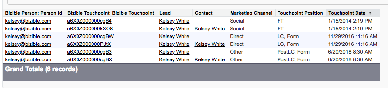

# レコードの複製および [!DNL Marketo Measure] {#duplicate-records-and-marketo-measure}

>[!NOTE]
>
>&quot;[!DNL Marketo Measure]」 （アドビのドキュメント内）。ただし、CRM には「Bizible」が表示されます。 アドビは現在、その更新をおこなっており、ブランディングの変更が CRM に反映される予定です。

[!DNL Marketo Measure] は、データを CRM の関連するリードまたは連絡先に照合する際に、電子メールアドレスを一意の識別子として利用します。 条件 [!DNL Marketo Measure] は、同じメールアドレスを持つ複数のリードまたは連絡先を検索します。すべてのレコードに同じデータが表示されます。 この影響は、 [!DNL Marketo Measure] とは、購入者タッチポイントを持つ個別訪問者の数を誤って水増しする可能性があります。

これはでどのように表示されますか。 [!DNL Marketo Measure] 報告？

_サンプルレポート： [!DNL Marketo Measure] 購入者タッチポイントを持つ担当者。_

は、 [!DNL Marketo Measure] kelsey@adobe.comの担当者 ID。この電子メールアドレスにはリードと連絡先の両方が存在します。 このレポートには、最初のタッチが 2 回、リード作成タッチが 2 回、PostLC インタラクションが 2 回レポートされています。 これらの重複レコードは、同じタッチポイント日付とタッチポイント情報を共有し、同じ人物であるにもかかわらず 2 人の異なるユーザーであると結論付ける可能性があります。

**レコメンデーション**

* レポートでの収益を最大化するために、CRM 内の重複排除ツールを活用して、新しい一意のレコードのみを確実に作成することをお勧めします。 これは、マーケティングオートメーションツールまたは CRM 内にインストールされた別のソフトウェアを使用して実行できます。 [!DNL Marketo Measure] は自動的にデデュープレコードを実行せず、アドビのソフトウェアを通じてこのサービスを提供しません。
* 重複を識別する際に、レコードを手動で結合する方法もあります。 このプロセスには時間がかかり、面倒な作業が必要になる場合がありますが、正確なレポート作成の結果は、時間に対する投資に値します。
