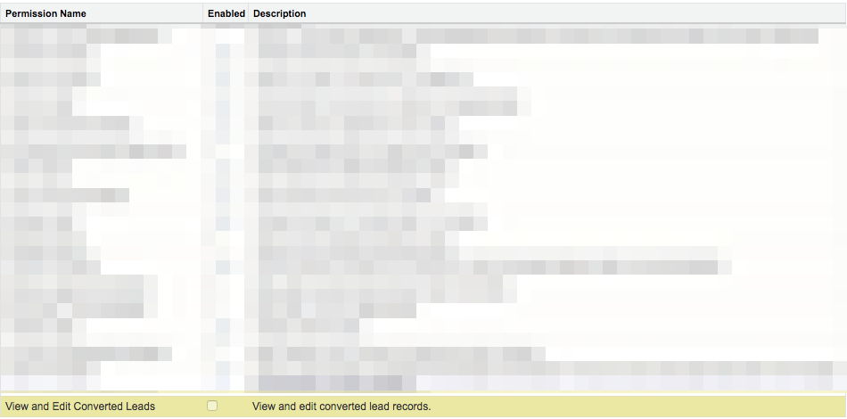

# コンバート済みリードの編集権限の有効化 {#enabling-the-permission-to-edit-converted-leads}

で変換済みリードレコードを編集する権限を有効にする方法を説明します。 [!DNL Salesforce]. [!DNL Marketo Measure] には、Salesforce の様々なオブジェクトにデータをプッシュする機能があります。 リードにプッシュする際、場合によっては、コンバージョン済みのリードレコードに再プッシュする必要が生じる可能性があります。 これらのレコードにデータをプッシュするには、接続しているユーザーがプロファイルレベルで変換済みリードを表示および編集する権限を持っている必要があります。

1. に移動します。 [!UICONTROL 設定] をクリックし、 [!UICONTROL ユーザーを管理] グループ化を使用して、プロファイルを選択します。

   

1. 接続しているユーザーのプロファイルを選択します。

1. 変換済みリードの表示と編集の権限を検索します。

   

1. 変換されたリードの表示と編集の権限を有効にするには、チェックボックスをオンにします。

   

これで完了です。
