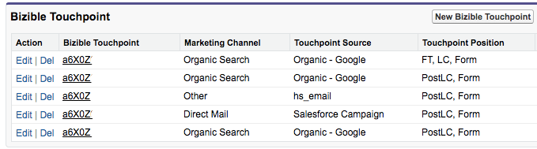
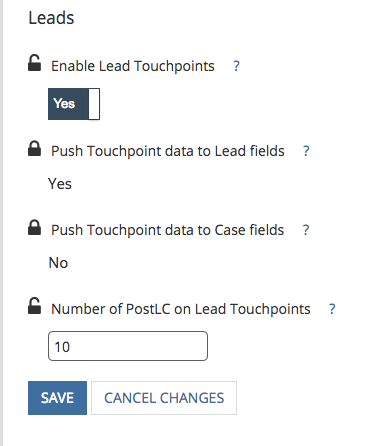
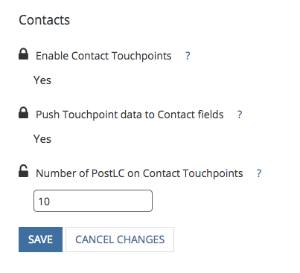

# PostLC Touchpoints とリードエンゲージメント {#postlc-touchpoints-and-lead-engagement}

リード後の作成（PostLC）タッチポイント [!DNL Marketo Measure]、マルチタッチ属性モデル（W字型など）を使用しているお客様が利用できます。 リードまたは連絡先が web サイトに戻り、引き続きフォームの入力を行うと、これらのフォーム送信は PostLC タッチポイントとして登録されます。 これらのタッチポイントを使用すると、リードを促しているコンテンツを確認し、最初のコンバージョンの後も長い間リードがサイトに関与し続けることができます。 PostLC タッチポイントは、オポチュニティ内のすべての仲介タッチポイントとアトリビューションクレジットを共有します。10% アトリビューションクレジットは仲介タッチポイントに割り当てられ、すべてのタッチ間で均等に配分されます。

[!DNL SFDC] に表示される PostLC タッチポイントの数を調整できます。 通常は、最大 5 つの PostLC タッチポイントをプッシュすることをお勧めします。各タッチポイントの使用 [!DNL SFDC] は 1 KB です。

>[!NOTE]
>PostLC タッチポイントの設定を調整する方法については、この記事の最後に記載されている手順を参照してください。

PostLC タッチポイントは動的です。 リードまたは連絡先が PostLC フォームを送信し続ける [!DNL Marketo Measure]、は CRM の PostLC タッチポイントを更新して、最新のフォーム送信を表示します。 特に、5 つの PostLC タッチポイントの制限を設定した場合、[!DNL Marketo Measure] は常に 5 つの _最新の_ タッチポイントを CRM にプッシュします。  この例では、このアカウントは、PostLC 制限を 4 つのタッチポイントに設定しています。 このリードは、既に CRM で使用できる PostLC タッチポイントの最大数に達しています。 前回の PostLC タッチは 2018 年 2 月 6 日（PT）でした。 このユーザーが翌日に別のフォームに入力した場合、[!DNL Marketo Measure] は最初の PostLC タッチポイントを 2017 年 11 月 9 日から削除し、最新のタッチポイントを 2018 年 2 月 7 日から追加します。

>[!NOTE]
>[!DNL Marketo Measure] は、リードまたは連絡先の PostLC タッチポイントのみを更新し、商談の PostLC 属性タッチポイントは更新しません。 連絡先に関連するすべての PostLC タッチポイントがオポチュニティに含まれます。

## PostLC タッチポイント設定の変更方法 {#how-to-change-postlc-touchpoint-settings}

リードまたは連絡先の PostLC タッチポイント設定を調整するには、次の手順に従います。

**リード**

1. [!DNL Marketo Measure] アカウント（[experience.adobe.com/marketo-measure](https://experience.adobe.com/marketo-measure?lang=ja){target="_blank"}）にログインし、[!UICONTROL &#x200B; 設定 &#x200B;] に移動します。

1. CRM で「**[!UICONTROL リード]**」を選択します。

1. リードにプッシュする postLC タッチポイントの数を入力し、「**[!UICONTROL 保存]**」をクリックします。

   

**取引先責任者**

1. [!DNL Marketo Measure] アカウント（[experience.adobe.com/marketo-measure](https://experience.adobe.com/marketo-measure?lang=ja){target="_blank"}）にログインし、[!UICONTROL &#x200B; 設定 &#x200B;] に移動します。

1. CRM で、「**[!UICONTROL 連絡先]**」を選択します。

1. 連絡先にプッシュする postLC タッチポイントの数を入力し、「**[!UICONTROL 保存]**」をクリックします。

   
