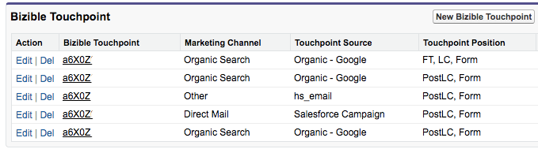
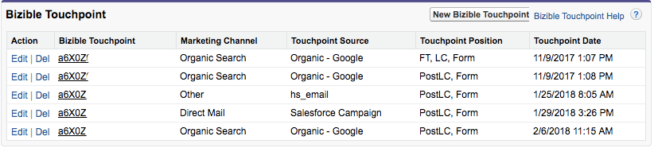
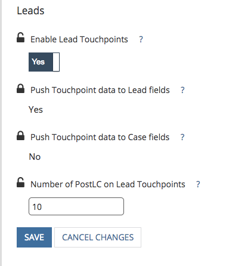
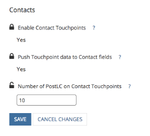

# PostLC Touchpoints とリードエンゲージメント {#postlc-touchpoints-and-lead-engagement}

[!DNL Marketo Measure]件のリード後の作成（PostLC）の顧客接点は、マルチタッチアトリビューションモデル（W-Shape以上）を使用しているお客様が利用できます。 リードまたはコンタクトがweb サイトに戻ってフォームに入力し続けると、これらのフォーム送信はPostLC タッチポイントとして登録されます。 これらのタッチポイントを利用すれば、どのようなコンテンツがリードをサイトに導き、最初のコンバージョンから長い間エンゲージメントし続けるのかを確認できます。 PostLCのタッチポイントは、商談のすべての中間接点とアトリビューションクレジットを共有します。10%のアトリビューションクレジットは、中間接点に割り当てられ、すべての顧客接点に均等に配分されます。

[!DNL SFDC]に表示されるPostLC タッチポイントの数を調整できます。 通常は、最大5つのPostLC タッチポイントをプッシュすることをお勧めします。各タッチポイントは、[!DNL SFDC]で1 KBを占めます。

>[!NOTE]
>
>PostLC タッチポイントの設定を調整する方法については、この記事の最後を参照してください。

PostLCのタッチポイントは動的です。 リードまたは連絡先がPostLC フォームを送信し続けると、[!DNL Marketo Measure]はCRMのPostLC タッチポイントを更新して、最新のフォーム送信を表示します。 具体的には、5つのPostLC タッチポイントの制限を設定した場合、[!DNL Marketo Measure]は常に5つの&#x200B;_最新_ タッチポイントをCRMにプッシュします。  この例では、このアカウントはPostLC制限を4つのタッチポイントに設定しています。 このリードは、CRMに含めることができるPostLC タッチポイントの最大数に既に達しています。 最後のPostLC タッチは2018年2月6日でした。 このユーザーが次の日に別のフォームに入力する場合、[!DNL Marketo Measure]は2017年11月9日から最初のPostLC タッチポイントを削除し、2018年2月7日から最新のタッチポイントを追加します。

>[!NOTE]
>
>[!DNL Marketo Measure]は、リードまたは取引先責任者のPostLC タッチポイントのみを更新し、商談のPostLC アトリビューション タッチポイントは更新しません。 連絡先に関連するすべてのPostLC タッチポイントが商談に含まれます。

## PostLC タッチポイント設定の変更方法 {#how-to-change-postlc-touchpoint-settings}

リードまたは連絡先のPostLC タッチポイント設定を調整するには、次の手順に従います。

**リード**

1. [experience.adobe.com/marketo-measure](https://experience.adobe.com/marketo-measure?lang=ja){target="_blank"}で[!DNL Marketo Measure] アカウントにログインし、[!UICONTROL 設定]に移動します。

1. CRMで、「**[!UICONTROL リード]**」を選択します。

1. リードにプッシュするPostLC タッチポイントの数を入力し、**[!UICONTROL 保存]**&#x200B;をクリックします。

   

**取引先責任者**

1. [experience.adobe.com/marketo-measure](https://experience.adobe.com/marketo-measure?lang=ja){target="_blank"}で[!DNL Marketo Measure] アカウントにログインし、[!UICONTROL 設定]に移動します。

1. CRMで、「**[!UICONTROL 連絡先]**」を選択します。

1. 連絡先にプッシュするPostLC タッチポイントの数を入力し、**[!UICONTROL 保存]**&#x200B;をクリックします。

   
