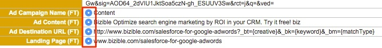

# リードのマージのベストプラクティス {#best-practices-for-merging-leads}

[!DNL Salesforce]でリードを結合する場合は、データが失われないように常に注意することが最善です。

参考までに、[!DNL Salesforce] サポートから[&#x200B; リードを統合する方法](https://help.salesforce.com/s/articleView?id=leads_merge.htm&language=en_US&type=5)の内訳を次に示します。

[!DNL Marketo Measure]が入るのは、結合されたレコードに入力するフィールドを選択する時です。 マスターレコードを選択する際に、新しいレコードに引き継ぐために[!DNL Marketo Measure] フィールドが選択されていることを確認します。

[!DNL Marketo Measure] データを含むレコードが複数ある場合は、最初に作成されたリードに対して、マスターレコードが選択されたフィールドを持っていることを確認します。 追加の[!DNL Marketo Measure] データがインサイトセクション内に存在します。 また、トラッキング対象のリードのメールアドレスが保持されるメールアドレスであることを確認してください。これにより、新しいアトリビューションデータを使用してリードを継続的に更新できます。

そこから、リードを自由に結合し、[!DNL Marketo Measure]個のデータを新しいレコードに転送します。

ご不明な点がございましたら、お気軽にAdobeのアカウントチーム（担当のアカウントマネージャー）または[Marketo サポート &#x200B;](https://nation.marketo.com/t5/support/ct-p/Support){target="_blank"}までお問い合わせください。

までお問い合わせください
