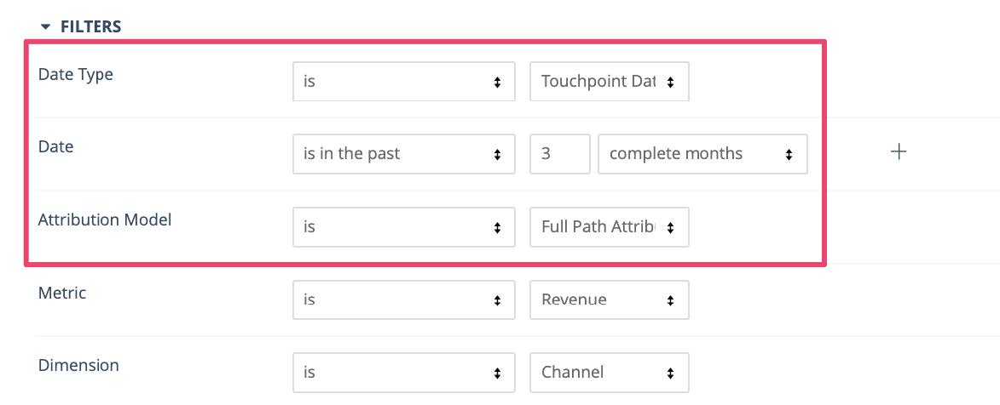
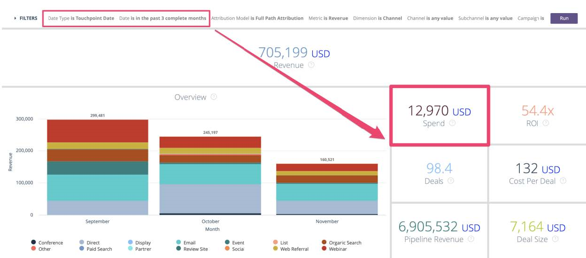
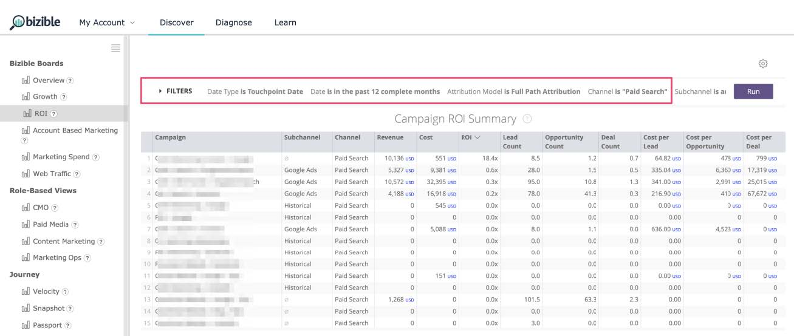
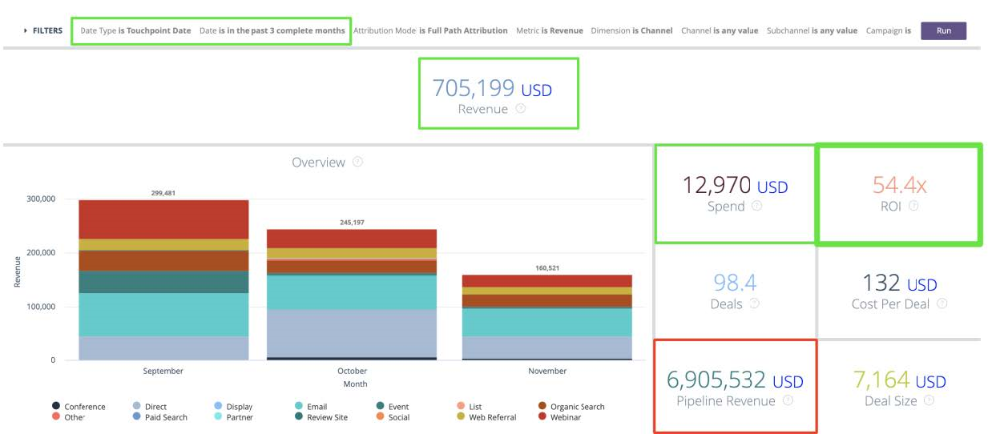

# [!DNL Marketo Measure] レポートガイド {#marketo-measure-reporting-guide}

>[!NOTE]
>
>ドキュメント内に「[!DNL Marketo Measure]」を指定する手順が記載されている場合がありますが、CRM には引き続き「Bizible」と表示されます。 アドビは現在更新に取り組んでおり、ブランディングの変更はまもなく CRM に反映される予定です。

[!DNL Marketo Measure] レポートを作成する前に、[!DNL Marketo Measure] アカウント設定がレビューおよび設定されていることを確認して、レポート内のデータが正確であること、およびビジネスの詳細が反映されていることを確認することが最も重要です。 さらに、レポートプロジェクトは、構造化されたプロセスに従うことで最も効果を発揮します。 [Perkuto](https://perkuto.com/)の[!DNL Marketo Measure]人のパワーユーザー、支持者およびパートナーであるJustin Norrisは、[&#x200B; レポートにアプローチする方法 [!DNL Marketo Measure]](https://perkuto.com/blog/turning-attribution-data-into-actionable-insights/)を巧みにまとめました。

**目標を設定**:「最初に尋ねる質問は、『なぜ測定するのか』です。 [Forrester Research](https://go.forrester.com/)のLori Wizdo氏は、[Marketoのウェビナー](https://www.marketo.com/webinars/beyond-revenue-performance-real-kpis-of-b2b-marketing/)で、この点を簡潔にまとめました。 「私たちは、意思決定やマーケティングの価値を証明または検証したり、より良い（プロセス改善）を実現するために測定します。 優れた測定から得られるインサイトは、マーケティング計画プロセスに役立つインサイトをもたらします。

そのため、始める前に、目標、回答しようとしている質問、解決しようとしている課題を明確にすることが重要です。 どのようなストーリーを伝えたいのか？ その結果、どのような意思決定がなされるのか。 これらの基本的な考え方が不十分であることが多く、関係者全員にフラストレーションが生じます。」

**レポートデザイン**:「次に、レポートをデザインし、レポートに含まれる特定のディメンション、指標、データセットを決定する必要があります。 一般的な体験としては、ビジネスユーザーが求めているものを正確に提供することが挙げられます。ビジネスユーザーは、ニーズが満たされていないと感じるだけです。 これは、ビジネスユーザーが実際に探しているinsightが、リクエストしたレポートに必ずしも含まれているわけではないからです。 優れたアナリスト（またはアナリストの帽子をかぶっているMOPSの人物）は、明確な質問をしたり、一般的な定義を確立したり（「それで、本当にリードとはどういう意味ですか？」）、最終的なレポートのビジュアルをスケッチして整合を確認したりします。 その後で初めて、堅牢な要件が用意されているので、レポートを作成します。」

**レポート ビルド**:「ビルドに行くと、障害や行き詰まりを見つけることがよくあります。 例えば、必要なデータポイントがない、またはオブジェクトが必要な方法でリンクしない、といった問題が発生する場合があります。 これらの問題を解決するには、レポートの「マシン」で「内部」で何が起こっているかを理解することも重要だと思います。 この流暢さにより、レポートリクエストをすばやくサイズ調整し、達成可能かどうかを評価することができます（そうでない場合は、より簡単にクリエイティブソリューションを考案できます）。」

[!DNL Marketo Measure] アトリビューションレポートマシンの動作をより深く理解するために、「内部」を見てみましょう。

## Buyer Touchpointオブジェクト（CRM） {#buyer-touchpoint-objects-crm}

最も上位のレベルでは、2つの異なるBuyer Touchpoint オブジェクトに基づく2つのレポート カテゴリがあります。これらのカテゴリは、レポートする[!DNL Marketo Measure] データのタイプを決定します。対象となるデータは、_個の_&#x200B;に関連するデータ、または&#x200B;_商談_&#x200B;に関連するデータです。

1. **購入者のタッチポイント** （BT） / 個人/合計エンゲージメント

   * _個の個人_ （リード、取引先責任者、[!DNL Marketo Measure]人）に関連する「funnelのトップ」指標およびレポートに一般的に使用されます
   * BTは、各人物の完全なタッチポイント履歴が含まれているため、**人物**&#x200B;に関連するすべてのマーケティングインタラクションを把握するために使用されます。 これらの顧客接点は、匿名のファーストタッチ、リード作成タッチ、後続のフォーム送信または同期する顧客接点のためにCRMで作成されます
オフラインのキャンペーンやアクティビティ。

1. **バイヤーアトリビューションタッチポイント** （BAT）/商談/アカウントレベル/収益

   * _商談_&#x200B;に関連する「funnelの中間および/または下部」（MOFUおよびBOFU）指標とレポートに一般的に使用されます。
   * BATは、**商談**&#x200B;に接続されたすべてのユーザーの関連するタッチポイントを表します（設定に応じて、商談の連絡先ロールまたは共有アカウント IDを使用します）。 人物のみに関係するBATとは異なり、BATは&#x200B;**収益**&#x200B;にも関連付けることができます。 このように、BATを使用して、商談に関する質問（商談の開封数、成約数、パイプラインの価値と収益の獲得数など）に答えます。

>[!NOTE]
>
>BATはBTから生まれる。 基本的に、BTを介して個人レベルでトラッキングが始まります。 アカウントで商談が作成されると、同じアカウントの取引先責任者からのすべてのBTが参照され、商談に関連するBATを作成する資格があります。そのため、「人物」指標に関する質問（BT レポート）、「商談」指標に関連する質問（BAT レポート）に応じて、いずれかの質問を使用します

サポート記事：[購入者のタッチポイントと購入者のアトリビューションのタッチポイントの違い](/help/configuration-and-setup/difference-between-buyer-touchpoints-and-buyer-attribution-touchpoints.md)

## Buyer Touchpoint（BT） {#buyer-touchpoint-bt}

Buyer Touchpoint（BT）は、顧客がマーケティング資料に対して抱くあらゆるマーケティングインタラクションを追跡するために使用されるオブジェクトです。 各個人（リード/コンタクト/[!DNL Marketo Measure]人）のジャーニーは、関連するBTで表されます。 [!DNL Marketo Measure]では、個人のジャーニーは次の要素で構成されます。

1. この人物は最初に私たちのブランドとどのようにやり取りしましたか？ （ファーストタッチまたは&#x200B;_FT_）
1. この人物は、どのようにコンバージョンし、既知となり、リードとなったのか？ （リード作成または&#x200B;_LC_）
1. リードになってから、他にどのようにブランドやマーケティング資料に接しましたか？ （_PostLC_）

バイヤータッチポイントは、商談に関連する指標ではなく、リード/コンタクトの生成や獲得の指標など、_人_&#x200B;に関する質問（「人物」はCRM内のリードまたは取引先責任者で表される）に回答するために使用されます。 例：

* 最も多くのリードを獲得しているチャネルは？
* 新しいリードを創出するために多かれ少なかれコストがかかるチャネルは？
* リード/コンタクトはどのようなコンテンツにエンゲージするのか？
* 特定のタイトル、役割、ペルソナのマーケティングストーリーとは何ですか？
* MQLやその他のリード/コンタクトのステータスを促進するチャネルは？

主に、企業は「リード/コンタクトはどこから来ているのか？」を把握する必要があります。 従来、これは1次元の値（例えば、リードSource）で回答されていました。 しかし、先#1と#2で説明したように、リードは、リードになる過程で複数の顧客接点を持つ可能性があります。 Adobe Buyer Touchpointを使用すれば、insightでリードの生成方法を表す最も重要な2つのインタラクション、すなわち「ファーストタッチ」と「リード作成」タッチを把握できます。 バイヤータッチポイントも&#x200B;_多次元_&#x200B;です。つまり、大量のマーケティングデータを保持し、主にその人物の出身地（マーケティングチャネル）、その人物がエンゲージした内容（コンテンツ）を示します。

ピープルベースの指標に最適なinsightを提供する[&#x200B; アトリビューションモデル &#x200B;](/help/attribution-models.md)は次のとおりです。

* **ファーストタッチ** - リードのファーストタッチ （FT）に対する100%のアトリビューションクレジット
* **リード作成** - リードのリード作成タッチ （LC）に対する100%のアトリビューションクレジット
* **U字型** - マルチタッチアプローチ、FTに40%、LCに40%

<table>
 <tbody>
  <tr>
   <td>&lt;img alt="bizible guide 1" src="assets/bizible-guide-1.png"</td>
   <td>U字型モデルは、リードがリードになった経緯を要約した顧客接点に貢献度を割り当てるように設計されています。 これらのリードからの後続のタッチポイントは、追加のエンゲージメント（LC後）を理解するために報告することもできますが、<strong> リード作成ジャーニー</strong>の一部ではないため、FT、LC、U字型モデルではアトリビューションクレジットを取得できません。

&#42;最も一般的なU字型アトリビューションでは、FTとLCの間に50/50の均等な分割が反映されます。 リードがファーストタッチと同じセッションでコンバージョンした場合、1つのタッチポイントがFTとLCの両方のタッチポイント位置を表します。 そのため、アトリビューションは100%単一の顧客接点に割り当てられます。</td>
</tr>
 </tbody>
</table>

これらのモデルでは、funnelとの初期段階のインタラクションと、エンゲージメントの最上位に重点を置いています。 U字型アトリビューションモデルは、FTとLCの両方の顧客接点を考慮するため、リードに影響を与えたタッチに貢献度を割り当てることができます。 ただし、リードジャーニーの特定の部分をより詳細に把握したい場合は、ファーストタッチモデルとリード作成タッチモデルからさらに多くのinsightを得ることができます。

## Buyer Touchpoint（BT）を使用したおすすめのレポート {#recommended-reports-using-the-buyer-touchpoint-bt}

1. **購入者のタッチポイントを持つリード**

**1.1 | マーケティングチャネル別の新しいリード**

リードのBuyer Touchpointデータを「マーケティングチャネル」フィールドで集計すると、新規リードの獲得に影響を与えているチャネルや戦術を示す上位レベルのビューが表示されます。 このレポートを「日付タイプ」 = 「作成日」で構造化すると、「純新規リード」（CRMでリードが作成された場合）のコホートがレポートに確立されます。

<table>
 <tbody>
  <tr>
   <td>質問</td>
   <td>どのようなマーケティングチャネルがリードの獲得に影響を与えていますか？</td>
  </tr>
  <tr>
   <td>レポートのタイプ</td>
   <td>リードとバイヤーの接点（CRM） 
   指標：リード （[!DNL Marketo Measure]件の発見）</td>
  </tr>
  <tr>
   <td>日付フィールド/日付タイプ</td>
   <td>リード作成日（CRM）/作成日（もっと知る）</td>
  </tr>
  <tr>
   <td>日付範囲</td>
   <td><i>目的の日付範囲を選択</i></td>
  </tr>
  <tr>
   <td>グループ/Dimension</td>
   <td>マーケティングチャネル</td>
  </tr>
  <tr>
   <td>最適なモデル</td>
   <td>ファーストタッチ、リード創出、<strong>U字型</strong> 
   * CRM レポートの「カウント」フィールドの合計（カウント – ファーストタッチ、カウント – リード作成、カウント - U字型）</td>
  </tr>
 </tbody>
</table>

>[!TIP]
>
>「顧客接点を持つリード」レポートタイプの場合は、最初に「[!DNL Marketo Measure] 101 | チャネル別リード」というタイトルの事前定義済みレポートをカスタマイズします。 このレポートは、すぐに利用でき、上記の表に記載されているように事前に構築された優れたサンドボックスであり、より特定のレポートのニーズに合わせてすばやくカスタマイズできます。

**1.2 | キャンペーン別の新しいリード （または詳細なインサイト）**

「マーケティングチャネル別の新規リード」レポート（1.1）で要約されたデータに対して、insightをより詳細に把握するには、キャンペーンレベルでさらに概要を追加します。 これにより、「マーケティングチャネル」が新しいリードを創出している理由だけでなく、具体的に、そのチャネル内のどのキャンペーンが最も効果的かを把握できます。

<table>
 <tbody>
  <tr>
   <td>質問</td>
   <td>どの<i> キャンペーン </i>がリードの作成に影響を与えていますか？</td>
  </tr>
  <tr>
   <td>レポートのタイプ</td>
   <td>リードとバイヤーの接点（CRM） 
   指標：リード （[!DNL Marketo Measure]件の発見）</td>
  </tr>
  <tr>
   <td>日付フィールド/日付タイプ</td>
   <td>リード作成日（CRM）/作成日（もっと知る）</td>
  </tr>
  <tr>
   <td>日付範囲</td>
   <td><i>目的の日付範囲を選択</i></td>
  </tr>
  <tr>
   <td>グループ/Dimension</td>
   <td>広告キャンペーン名（CRM）</td>
  </tr>
  <tr>
   <td>最適なモデル</td>
   <td>ファーストタッチ、リード創出、<strong>U字型</strong> 
   * CRM レポートの「カウント」フィールドの合計（カウント – ファーストタッチ、カウント – リード作成、カウント - U字型）</td>
  </tr>
 </tbody>
</table>

>[!TIP]
>
>Insight オブジェクトの他の使用可能なフィールドとレポートをまとめることで、さらに詳細なBuyer Touchpointを取得します。 これは、CRM （グループ化）またはディメンション（発見）を追加して設定します。 チャネル（お客様の役職を代表する場合があります）によっては、insightの獲得を検討しているキャンペーンレベルを超える詳細が追加されている場合があります。 例えば、次の表の「有料検索」をドリルダウンしてみましょう…

<table>
 <tbody>
  <tr>
   <td>質問</td>
   <td>どの<i> キーワード </i>がリードの作成に影響を与えていますか？</td>
  </tr>
  <tr>
   <td>レポートのタイプ</td>
   <td>リードとバイヤーの接点（CRM） 
   指標：リード （[!DNL Marketo Measure]件の発見）</td>
  </tr>
  <tr>
   <td>フィルター</td>
   <td>マーケティングチャネル =有料検索</td>
  </tr>
  <tr>
   <td>日付フィールド/日付タイプ</td>
   <td>リード作成日（CRM）/作成日（もっと知る）</td>
  </tr>
  <tr>
   <td>日付範囲</td>
   <td><i>目的の日付範囲を選択</i></td>
  </tr>
  <tr>
   <td>グループ/Dimension</td>
   <td>キーワードテキスト（CRM）/キーワード（もっと知る）</td>
  </tr>
  <tr>
   <td>最適なモデル</td>
   <td>ファーストタッチ、リード創出、<strong>U字型</strong> 
   * CRM レポートの「カウント」フィールドの合計（カウント – ファーストタッチ、カウント – リード作成、カウント - U字型）</td>
  </tr>
 </tbody>
</table>

精度はチャネルによって異なります。 推奨されるアプローチは、「チャンネル Xについてもっと詳しく理解したいですか？」と自問することです。 検索連動型検索マネージャーは、次のような追加のディメンションにも関心を持っている可能性があります。

* 広告キャンペーン名
* 広告コンテンツ
* 広告グループ

ただし、イベントマネージャーは、特定のイベントや、どの種類のイベントが最も多くのリードに影響を与えたかに関心を持つ可能性があります。

* Ad Campaign Name / Salesforce Campaign = specific Event
* Medium = Campaign &#39;Type&#39;

**リマインダー**：上記または下のレポートのバリエーションに、追加のフィルターを追加する必要がある場合があります。 フィルターは、企業固有のもので、マーケティング部門やセールス部門がアドバイスできるものです。 レポートがクリーンで正確であることを保証するために、あらゆるレポートに同じフィルターを適用することは珍しくありません。 一般的な例としては、次のようなものがあります。

* テストの内部レコード（通常はメールアドレス）をフィルタリング
* 事業部門に固有の可能性のある「レコードタイプ」に基づくフィルタリング

**1.3 | コンテンツ別の新しいリード （CRM レポートのみ）**

<table>
 <tbody>
  <tr>
   <td>質問</td>
   <td>どの<i> コンテンツ </i>がリードの作成に影響を与えていますか？</td>
  </tr>
  <tr>
   <td>レポートのタイプ</td>
   <td>リードとバイヤーの接点（CRM）</td>
  </tr>
  <tr>
   <td>日付フィールド</td>
   <td>リード作成日</td>
  </tr>
  <tr>
   <td>日付範囲</td>
   <td><i>目的の日付範囲を選択</i></td>
  </tr>
  <tr>
   <td>グループ/Dimension</td>
   <td>ランディングページ 
   フォーム URL</td>
  </tr>
  <tr>
   <td>最適なモデル</td>
   <td>ファーストタッチ、リード創出、<strong>U字型</strong> </td>
  </tr>
 </tbody>
</table>

**リマインダー**: デジタルコンテンツ/アセットに関するレポート用の2つの主要フィールドは「ランディングページ」と「フォーム URL」です。 リードが「ランディングページ」（_ただし_）と同じページでコンバージョン（フォームの送信）した場合、これらの2つの値は同じである可能性がありますが、これらの値が異なる場合があります。 例えば、リードがFacebookのリンクをクリックすると、そのリンクをクリックしてweb サイトのページに移動します（これは「ランディングページ」の値になります）。 その後、リードはそのページから離れて、サイトでセッションを続行し、別のページ（フォーム URL）でフォームを送信します。 これは、リードがどこから来たのか（マーケティングチャネル）、どのコンテンツがサイトに来たのか（ランディングページ）、どのコンテンツがダウンロードされたのか（フォーム URL）を表す単一のタッチポイントで要約されます。 また、「フォーム URL」は、「お問い合わせ」や「デモ依頼」フォームなど、ダウンロード可能なコンテンツに関連付けられていない他のフォームをレポートするための必須フィールドです。

その他のフィルターを使用して、insightを特定の「コンテンツ」に取り込む

* フィルター条件：「ランディングページ」に含まれる内容（例）:
   * /blog
   * /電子ブック
   * /webinar

* OR: &#39;Form URL&#39; CONTAINS （例）
   * /contact
   * /demo

「コンテンツ」ベースのレポートは、funnelのいずれかの部分に関するレポートを作成する際に大きな価値をもたらしますが、funnelの上部で最も一般的に使用され、リードの初期エンゲージメントに追加のinsightを提供します。 「オーガニック検索」が初期エンゲージメント（FT）を促す上で最も強力なチャネルである傾向があることを考慮すると、「キャンペーン」レベルのデータはそれほど多くありません。

「コンテンツ」ベースのレポートは、insightをより上位レベルのマーケティングチャネル（オーガニック検索）内でリードを促進しているものを把握するのに最適です。

**1.4 |特定の日付範囲における合計リードエンゲージメント**

<table>
 <tbody>
  <tr>
   <td>質問</td>
   <td>過去（週/月/四半期）に最も<i>合計リードエンゲージメント </i>が多かったマーケティングチャネルは何ですか？</td>
  </tr>
  <tr>
   <td>レポートのタイプ</td>
   <td>リードとバイヤーの接点（CRM） 
   指標：リード （[!DNL Marketo Measure]件の発見）</td>
  </tr>
  <tr>
   <td>日付フィールド/日付タイプ</td>
   <td>Touchpoint の日付</td>
  </tr>
  <tr>
   <td>日付範囲</td>
   <td><i>目的の日付範囲を選択</i></td>
  </tr>
  <tr>
   <td>グループ/Dimension</td>
   <td>マーケティングチャネル（詳細）</td>
  </tr>
  <tr>
   <td>最適なモデル*</td>
   <td>* このレポートは、アトリビューションモデルでリードがどこから来たのかを測定することよりも、リード作成タッチ後のタッチポイントを含む、<i>合計顧客接点の数（エンゲージメントの量） </i>について詳しく説明しています。 顧客接点の合計記録数は、どのチャネルが最も多くのリードエンゲージメントを獲得したかを反映します。</td>
  </tr>
 </tbody>
</table>

**リマインダー**: 「タッチポイント日」に関するレポートをベースにすることは、特定の日付範囲におけるマーケティングパフォーマンスを把握する最も効果的な方法です。 「タッチポイント日」は、アトリビューションがチャネル、キャンペーン、コンテンツに関連しているだけでなく、タッチポイントがいつ発生したかを示すようにレポートを構造化します。 これは、特定の時点でマーケティングエンゲージメントが起こっていることを把握する上で最も効果的な方法であり、同時に投資したマーケティング費用と比較して、マーケティングの影響を測定する推奨される方法でもあります。 マーケティング費用やROI分析を行う場合はお勧めします（5.1を参照）。

**2. バイヤー接点を持つ適格リードのマーケティング**

最も一般的なレポートのひとつは、新しいリードやリードレベルのエンゲージメントだけでなく、より具体的には「MQL （マーケティングクオリファイドリード）」に焦点を当てています。 MQLに関するレポートは、アクセスできる[!DNL Marketo Measure]の機能と機能に応じて、いくつかのアプローチがあります。

**2.1 | チャネル別のマーケティング適格リード （マルチタッチ）**

マーケティングがMQLに与える影響を測定するこのアプローチは、基本的に「マーケティングチャネルによる新しいリード」（1.1）レポートの続きですが、測定されるリードはより具体的にはMQLであるという追加の基準があります。 U字型アトリビューションモデルは、MQLになる可能性が&#x200B;_高い_ リードを生み出しているマーケティングチャネルとコンテンツを特定するためにここでお勧めします。

<table>
 <tbody>
  <tr>
   <td>質問</td>
   <td><i>MQL</i>になる新しいリードの生成に最適なマーケティングチャネルはどれですか？</td>
  </tr>
  <tr>
   <td>レポートのタイプ</td>
   <td>リードとバイヤーの接点（CRM） 
   指標：リード （[!DNL Marketo Measure]件の発見）</td>
  </tr>
  <tr>
   <td>フィルター</td>
   <td>MQL = true* 
   *<i>MQLの定義は、組織ごとに異なる場合があります。 他のMQL ベースのレポートと同じフィールドを使用して、[!DNL Marketo Measure] レポートがMQL用にフィルタリングされていることを確認します。 [!DNL Marketo Measure] DiscoverのMQLに関するレポートを作成する場合と同じ方法で、セグメントフィルターを作成する必要があります。</i></td>
  </tr>
  <tr>
   <td>日付フィールド/日付タイプ</td>
   <td>MQL日（または同等の日） / 作成日（[!DNL Marketo Measure]見つける）   <i> リード作成日は、CRMで「MQL日」がオプションでない場合は、CRM レポートでも使用できます。 どの日付フィールドを使用しているかは、コホートされたデータセットを定義することに留意することが重要です。</i></td>
  </tr>
  <tr>
   <td>日付範囲</td>
   <td><i>目的の日付範囲を選択</i></td>
  </tr>
  <tr>
   <td>グループ/Dimension</td>
   <td>マーケティングチャネル</td>
  </tr>
  <tr>
   <td>最適なモデル</td>
   <td>ファーストタッチ、リード創出、<strong>U字型</strong> 
   CRM レポートの「カウント」フィールドの合計（カウント – ファーストタッチ、カウント – リード作成、カウント - U字型）</td>
  </tr>
 </tbody>
</table>

**2.2 | チャネル別マーケティングクオリファイドリード （シングルタッチ、CRMのみ）**

マーケティングがMQLに与える影響を測定するこのアプローチでは、リードがMQLに至る前のラストタッチが&#x200B;_単一のタッチポイント_&#x200B;であったかを特定することに重点を置いています。

>[!NOTE]
>
>このレポートを実行するには、トラッキング目的のMQL ステージを定義するために「リードステータス」値「MQL」が必要です（Funnel ステージ）。 「リードステータス」フィールドでMQLが追跡されない場合、[!DNL Marketo Measure] アカウント設定でカスタム「MQL」ステージを構築するには、カスタムステージを使用したカスタムアトリビューションモデル機能が必要です。

<table>
 <tbody>
  <tr>
   <td>質問</td>
   <td>リードをMQL ステータスに導くのに最も効果的なマーケティングチャネルは何ですか？</td>
  </tr>
  <tr>
   <td>レポートのタイプ</td>
   <td>リードとバイヤーの接点（CRM） 
   <i>このレポートは、CRM レポート内でのみ使用できます。 [!DNL Marketo Measure] Discover</i>の特定の「タッチポイント位置」値に対してフィルタリングできません</td>
  </tr>
  <tr>
   <td>フィルター</td>
   <td><strong>タッチポイントの位置に「MQL」が含まれる</strong></td>
  </tr>
  <tr>
   <td>日付フィールド/日付タイプ</td>
   <td>MQL日（または同等）</td>
  </tr>
  <tr>
   <td>日付範囲</td>
   <td><i>目的の日付範囲を選択</i></td>
  </tr>
  <tr>
   <td>グループ/Dimension</td>
   <td>マーケティングチャネル</td>
  </tr>
  <tr>
   <td>最適なモデル</td>
   <td><i>このレポートは1つのタッチポイントでフィルタリングされるため、リードレベルのアトリビューションモデルはあまり関連性がありません。 「リードエンゲージメントレポート」（1.4）と同様に、ここではタッチポイントレコードの数を使用して、どのチャネルが最も効果的かを把握します（各リードには1つのMQL タッチポイントしかありません）。</i></td>
  </tr>
 </tbody>
</table>

>[!TIP]
>
>その他のグループ化やディメンションを探索して、insightをさらにMQLに取り込みます。 他の「顧客接点を伴うリード」レポートでも述べたように、Buyer Touchpointはマーケティングチャネルだけでなく、より詳細な情報を提供します。 また、「コンテンツ」ベースのレポートを上記のいずれかのMQL レポートと組み合わせることで、どのコンテンツがMQLに最も影響を与えているかをより詳細に把握できます。

**3. [!DNL MARKETO MEASURE] 購入者のタッチポイントを持つユーザー**

Salesforceには、人物に関連する指標をレポートする際に非常に便利な3番目のカスタム [!DNL Marketo Measure] オブジェクトがあります：**人物[!DNL Marketo Measure] （BP）**。 BPは、同じレポートでリードと連絡先の両方の情報を表す方法に関する従来の問題を解決します。 「人物」に関連するすべてのBTを統合します（[!DNL Marketo Measure]人のIDはメールアドレスです）。 リードまたはコンタクトとして存在する場合でも、BPはブリッジオブジェクトとして機能し、リードとコンタクトにまたがるレポートを作成するのに役立ちます。人に関するより洗練されたレポートを作成するのに非常に便利です。

[!DNL Marketo Measure]人は、タッチポイントオブジェクトの1つであるBuyer Touchpoint（BT）にのみ関係します。 つまり、商談や収益関連の指標には使用できません。 「[!DNL Marketo Measure] ユーザーと購入者のタッチポイント」レポートの種類は、BTがリードとコンタクトに具体的に関連しているかどうかにかかわらず、すべてのBTを表示するため、_合計エンゲージメント_&#x200B;を理解するのに最適です。 例えば、Salesforce Campaignを使用してイベントをトラッキングしている場合、CRM Campaign内にリードまたは連絡先として存在するキャンペーンメンバーが存在する可能性があります。 [!DNL Marketo Measure]はキャンペーンメンバーのタッチポイントを作成しますが、[!DNL Marketo Measure]人が存在しない場合、標準的なSalesforce レポートでは、イベントから取得した&#x200B;_total_&#x200B;のタッチポイント数を把握するために2つの個別のレポートが必要になります。1つは「購入者のタッチポイントを使用したリード」で、もう1つは「購入者のタッチポイントを使用したコンタクト」です。 その他の[!DNL Marketo Measure]人に基づくレポートのユースケースをいくつか以下に示します。

**3.1 [!DNL Marketo Measure] 「電子ブック」または「ホワイトペーパー」をダウンロードしたユーザー（合計ダウンロード数）**

このレポートは、リードレベルの「コンテンツ」ベースのレポートと同じです。 ただし、コンテンツの各部分に対する貢献可能なリードの数を測定するのではなく、[!DNL Marketo Measure]人のレポートを使用すると、アセットがゲーテッド化されている場合の合計&#x200B;_ダウンロード数_&#x200B;を把握するのに役立ちます（タッチポイントの合計数は、ダウンロード/フォーム送信の合計数を表します）。

<table>
 <tbody>
  <tr>
   <td>質問</td>
   <td>特定のアセットをダウンロードしたオーディエンス数は？</td>
  </tr>
  <tr>
   <td>レポートのタイプ</td>
   <td>[!DNL Marketo Measure] 人物と購入者のタッチポイント（CRM）</td>
  </tr>
  <tr>
   <td>フィルター</td>
   <td>'Form URL' CONTAINS （例：） 
   <li>/電子ブック</li>
   <li>/ホワイトペーパー</li>
   <i>上記のフィルター値は例のみです。 実際の値は、各組織のURL構造に基づきます。</i></td>
  </tr>
  <tr>
   <td>日付フィールド/日付タイプ</td>
   <td>タッチポイント日付<i> （アセットがダウンロードされた日付） </i></td>
  </tr>
  <tr>
   <td>日付範囲</td>
   <td><i>目的の日付範囲を選択</i></td>
  </tr>
  <tr>
   <td>グループ/Dimension</td>
   <td>フォーム/URL</td>
  </tr>
  <tr>
   <td>最適なモデル</td>
   <td>このレポートでは、アトリビューションモデルでリードや取引先責任者がどこから来たのかを測定するのではなく、リード作成タッチ後のタッチポイントを含む、<i>合計顧客接点の数（エンゲージメントの量） </i>について詳しく説明します。 このレポートでは、合計エンゲージメント数<i>を把握しようとしています</i>。 タッチポイントのレコード総数は、最もダウンロードされたアセットを反映します。</td>
  </tr>
 </tbody>
</table>

>[!TIP]
>
>「0&rbrace;人のリード」レポートタイプの場合は、最初に「**[!DNL Marketo Measure]101 | チャネル別リード/取引先責任者**」というタイトルの事前定義済みレポートをカスタマイズします。 [!DNL Marketo Measure]このレポートは、すぐに利用でき、[!DNL Marketo Measure]人ベースの素晴らしいサンドボックスです。 あらかじめ構築されており、より特定のレポートのニーズに合わせて迅速にカスタマイズすることができます。

>[!TIP]
>
>このレポートを使用すると、例に示すように、コンテンツのダウンロードだけでなく、insight オブジェクトから任意のマーケティングディメンションの合計エンゲージメントをBuyer Touchpointで取得できます。 代わりに、「マーケティングチャネル」や「広告キャンペーン名」などのディメンションでレポートをグループ化またはフィルタリングして、データベースのリードと取引先責任者の両方のエンゲージメントの合計を最もよく把握できます。 レポート内のフィルターまたはグループを、タッチポイントオブジェクトの他のフィールドで表される他のディメンションで0に変更します。

**3.2 [!DNL Marketo Measure] イベントに登録した人物（CRMのみ）**

_このレポートは、[!DNL Marketo Measure]がデジタルで追跡できるweb サイトで登録フォームがホストされている場合にのみ適用されます。_

<table>
 <tbody>
  <tr>
   <td>質問</td>
   <td>イベント登録を促進しているマーケティングチャネルは何か？</td>
  </tr>
  <tr>
   <td>レポートのタイプ</td>
   <td>[!DNL Marketo Measure] 人物と購入者のタッチポイント（CRM）</td>
  </tr>
  <tr>
   <td>フィルター</td>
   <td>'Form URL' CONTAINS （例：） 
   <li>/event</li>
   <i>上記のフィルター値は例のみです。 実際の値は、各組織のURL構造に基づきます。</i></td>
  </tr>
  <tr>
   <td>日付フィールド/日付タイプ</td>
   <td>タッチポイント日付<i> （登録フォームの送信時） </i></td>
  </tr>
  <tr>
   <td>日付範囲</td>
   <td><i>目的の日付範囲を選択</i></td>
  </tr>
  <tr>
   <td>グループ/Dimension</td>
   <td>フォーム/URL 
   マーケティングチャネル</td>
  </tr>
  <tr>
   <td>最適なモデル</td>
   <td>このレポートは、アトリビューションモデルでリードまたは連絡先がどこから来たのかを測定することよりも、リード作成タッチ後のタッチポイントを含む、<i>合計タッチポイント数（登録数） </i>について詳しく説明します。 このレポートでは、insightでイベント登録を促進している要因を把握しようと考えています。 「マーケティングチャネル」あたりのタッチポイントの合計記録数は、どのチャネルが最も多くの登録を獲得したかを反映します。</td>
  </tr>
 </tbody>
</table>

このレポートの重要なポイントは、Buyer Touchpointのデータがマーケティングチャネルデータも提供することです。 イベントに登録したユーザーの数に関して既にinsightを使用している場合もありますが、このレポートでは、insightを使用して、イベントに登録するためにユーザーをweb サイトに誘導しているデジタルマーケティングチャネル、ソース、および/またはキャンペーンについても確認します。

>[!TIP]
>
>Adobe insightをウェビナーの登録情報やオンデマンドのウェビナーのダウンロード（ゲーテッドアセットの場合）に組み込む場合も、同様のアプローチを採用できます。 唯一の違いは、これらのフォームがweb サイトの一意のページでホストされている場合、「フォーム URL」のフィルター値です。 しかし、目標は同じです。 「どのマーケティングチャネルが最も多くの登録/オンデマンドウェビナーのダウンロードを促進しているか」という質問に対する回答です。

**3.3 [!DNL Marketo Measure]購入者のタッチポイントを持つ人物（タッチポイント検証）**

[!DNL Marketo Measure]人が1つのレポート内のすべてのタッチポイントについてレポートを作成できるようにすることを考慮すると、データの検証を検討する際に使用する理想的なレポートタイプです。 「マーケティングチャネル」の設定で問題が発生した場合など、どのタッチポイントを見落とさないようにしたいと考えています（「マーケティングチャネル」の設定について詳しくは、以下のサポート記事を参照）。

* [オンラインカスタムチャネル設定](/help/channel-tracking-and-setup/online-custom-channel-setup.md)
* [オフラインカスタムチャネル設定](/help/channel-tracking-and-setup/offline-custom-channel-setup.md)

基本的に、タッチポイントデータは[!DNL Marketo Measure]によって追跡されたものを反映し、UTM パラメーター値、参照ページ、キャンペーンタイプなどに基づいて設定が入力と一致することを確認するために監査できます。 タッチポイントデータが設定と一致しない場合は、何らかの調整が必要になる可能性があります。 「マーケティングチャネル」の設定以外でも、タッチポイントデータを確認して、[抑制](/help/channel-tracking-and-setup/touchpoint-removal-and-touchpoint-suppression.md)または[&#x200B; セグメント化](/help/channel-tracking-and-setup/custom-segmentation.md)する必要があるタッチポイントを判断できます。 可能であれば、各月または四半期の終わりに、&#39;[!DNL Marketo Measure] Person and Buyer Touchpoints&#39; レポート内のタッチポイントデータを監査することをお勧めします。 これにより、アトリビューションが可能な限り正確なものになります。 すぐに使用できる「[!DNL Marketo Measure] 101 | チャネル別リード/取引先責任者」レポートを利用することをお勧めします。 次のフィールドは、構成の最も重要な部分を確認するために、まだ含まれていない場合に含めます。

* **マーケティングチャネル** - パス = マーケティングチャネル。サブチャネル （[!DNL Marketo Measure]で設定された値）
* **タッチポイント Source** = utm_source
* **Medium** = utm_medium （オンライン タッチポイント）またはCRM キャンペーンの種類（オフライン タッチポイント）
* **リファラーページ** （「オンラインチャネル」設定を使用）
* **ランディングページ - Raw** （「オンラインチャネル」設定を使用）は、設定の「タッチポイント設定」タブのタッチポイント抑制に対する一般的な入力でもあります）
* **フォーム URL** （設定の「タッチポイント設定」タブのタッチポイント抑制の一般的な入力）

**BUYER ATTRIBUTION TOUCHPOINT （BAT）**

バイヤーアトリビューションタッチポイント（BAT）は、オポチュニティに接続されたすべてのコンタクトの関連タッチポイントを表します（設定に応じて、オポチュニティのコンタクトロールを使用するか、共有アカウント IDを使用します）。 BT （主に人とつながっている）とは異なり、BATは収益に関連させることができます。 このように、BATを使用して、商談に関する質問に回答します。主に&#x200B;_商談/パイプライン収益_&#x200B;を開き、獲得した&#x200B;_商談/案件/収益_&#x200B;を閉じます。 BATは、連絡先と同じアカウントでオポチュニティが作成されるとすぐに、連絡先のBT レコードを介して作成されます（BTはBATに変換されません。 BT データは、単に参照してレコードを作成します（次に商談に関連するBAT）。

「Buyer Attribution Touchpointのおかげで、funnelを通じて、マーケティングの影響をより詳細に測定できるようになりました。 _測定するfunnelの深さは、様々なマルチタッチアトリビューションモデルで表すことができます_。

BATの主な関係が商談と関連していることを考慮すると、次のような質問に答えるために使用されます。

* 最も商談に影響を与えたマーケティング施策はどれか？
* 各マーケティングチャネルにどの程度の新しいパイプライン売上を関連付けることができますか？
* 前四半期のROIが最も高かったキャンペーンは？

商談ベースの指標に最適なinsightを提供する[&#x200B; アトリビューションモデル &#x200B;](/help/attribution-models.md)は次のとおりです。

**W字型** - &#39;_パイプラインモデル_&#39;。 W字型モデルには、3つのマイルストーンタッチポイントが含まれています。 このモデルでは、FT、LC および OC タッチポイントにそれぞれアトリビューションクレジットの 30％が割り当てられます。 残りの10%は、3つのマイルストーンの顧客接点の間で発生した中間接点にも同様に起因します。

<table>
 <tbody>
  <tr>
   <td>&lt;img alt="bizible guide 2" src="assets/bizible-guide-2.png"</td>
   <td>このモデルは、通常、新しいパイプライン収益の生成と同義の、新しい商談のジャーニーを基本的にまとめます。

   

   新しい商談や生成された新しいパイプラインに対するマーケティングの影響を測定する場合は、W字型モデルを使用することをお勧めします。</td>
  </tr>
 </tbody>
</table>

**フルパス** - &#39;_クローズしたモデル_&#39;。 このモデルには、FT、LC、OC、Closedの4つのマイルストーン接点が含まれます。 各タスクには商談クレジットの22.5%が割り当てられ、残りの10%は中間接点に均等に配分されます。

<table>
 <tbody>
  <tr>
   <td>&lt;img alt="bizible guide 3" src="assets/bizible-guide-3.png"</td>
   <td>このモデルは基本的に、成約済み獲得取引のジャーニーを要約したもので、これは一般的に、成約済み獲得収益/予約と同義です。

   

   契約成立や成約成立の売上に対するマーケティングの影響を測定する場合は、フルパスモデルが推奨されます。</td>
  </tr>
 </tbody>
</table>

このモデルは基本的に、成約済み獲得取引のジャーニーを要約したもので、これは一般的に、成約済み獲得収益/予約と同義です。

契約成立や成約成立の売上に対するマーケティングの影響を測定する場合は、フルパスモデルが推奨されます。

**カスタム** - [!DNL Marketo Measure]には、ユーザーがモデルに含めるタッチポイントまたはカスタムステージを選択できるカスタムアトリビューションモデルも用意されています。 さらに、利用者は、これらの顧客接点やステージに起因するアトリビューションクレジットの割合を制御することができます。 カスタムモデルの設定に応じて、商談とパイプラインの測定、または取引と成約済み収益の測定に最も適切に使用できます。 レポートで使用する際は、この点に注意してください。

>[!NOTE]
>
>カスタムアトリビューションモデルは、一部のお客様では利用できない追加機能です。 この機能をアカウントに追加する方法について詳しくは、Adobe アカウントチーム（アカウントマネージャー）にお問い合わせください。

一般的に、マーケターは「自分の商談はどこから来ているのか」を知る必要があります。 リードレベルのレポートと同様に、この質問にも従来は1次元の値（例：Campaign Sourceのプライマリ）を使用して回答していました。 しかし、1つのコンタクトから1つのタッチポイントを取得するよりも、商談の開発に多くの要素を割り当てることが分かっています。 通常、様々なチャネルと複数の関係者が関与する複数の顧客接点が、商談の創出に影響を与えます。 [!DNL Marketo Measure]を使用すると、アカウントからすべてのタッチポイントを表示して、商談の出所を最もよく把握できます。 ただし、その後も、商談が作成され、商談がクローズされるまでに発生したタッチポイントを引き続き表示できます。 これにより、マルチタッチアプローチを通じて、商談の流入元を把握するだけでなく、商談の成約に貢献した要因を把握し、最終的に成約した売上を把握できます。 これにより、「成約に影響を与えるマーケティングの影響は？」、「成約につながる売上につながるマーケティング要因は何か？」など、insightにさまざまな疑問を投げかけることができます。 最終的には「どのマーケティング活動が最も高いROIを達成しているか」です。

## BUYER ATTRIBUTION TOUCHPOINT（BAT）を使用したおすすめのレポート {#recommended-reports-using-the-buyer-attribution-touchpoint}

**4.1 | マーケティングチャネル別の新しい商談**

「マーケティングチャネル」フィールドでBuyer Attribution Touchpointのオポチュニティデータを集計すると、どのチャネル/戦術が新しいオポチュニティの制作に影響を与えているかを示す最上位レベルのビューになります。 「日付タイプ」 = 「商談作成日」を中心にこのレポートを構造化すると、商談が実際にCRMで作成された日付にもとづいてレポートを要約できます。 タッチポイントは、以前のタッチポイントの場合もありますが、定義された日付範囲内で作成された商談に関連し、商談に影響を与えていると認識された場合に、アトリビューションのクレジットを受け取ります。

<table>
 <tbody>
  <tr>
   <td>質問</td>
   <td>どの<i> マーケティングチャネル </i>が制作の機会に影響を与えていますか？</td>
  </tr>
  <tr>
   <td>レポートのタイプ</td>
   <td>CRM （機会を伴うバイヤーアトリビューションの接点） 
   指標：商談（[!DNL Marketo Measure]件の発見）</td>
  </tr>
  <tr>
   <td>フィルター</td>
   <td>
   <li>商談ステージ* <i> （レポートに制限する特定の商談に応じてオプションです。 まだ「オープン」商談のみに関連付けられているBATについてのみレポートできます（例：） </i></li>
   <li>商談タイプ （<i>all</i>件ではなく、「新規ビジネス」など、特定の商談に絞り込むことがよくあります）</li> 
   *「商談タイプ」のセグメントフィルターは、[!DNL Marketo Measure]の「もっと知る」で使用する必要があります</td>
  </tr>
  <tr>
   <td>日付フィールド/日付タイプ</td>
   <td>商談作成日（CRM）/作成日（もっと知る）</td>
  </tr>
  <tr>
   <td>日付範囲</td>
   <td><i>目的の日付範囲を選択</i></td>
  </tr>
  <tr>
   <td>グループ/Dimension</td>
   <td>マーケティングチャネル</td>
  </tr>
  <tr>
   <td>最適なモデル</td>
   <td><strong>W字型</strong> 
   CRM レポートの「W字型」フィールドの合計（カウント - W字型、収益 – W字型）</td>
  </tr>
 </tbody>
</table>

>[!TIP]
>
>「Buyer Attribution Touchpoints with Opportunities」レポートタイプの場合は、最初に「[!DNL Marketo Measure] 101 | Opportunities by Channel」というタイトルの事前定義済みレポートをカスタマイズします。 このレポートは、すぐに利用でき、上記の表に記載されているように事前に構築された優れたサンドボックスであり、より具体的なレポートのニーズに合わせて迅速にカスタマイズできます（レポートでは、フルパスモデルをそのまま使用するので、レポートをカスタマイズして、他のアトリビューションモデル（この場合はW字型モデル）を含めてください）。

>[!TIP]
>
>上記の報告書は、通貨がどの程度帰属すべきかを理解する際にも使用されます。 BATを使用して商談レベルでレポートを作成する場合、要約する主な指標は、通貨（商談の金額）と商談レコード自体の2つです。 上の例では、より具体的に、オープンな機会と新しいパイプライン売上を測定しています。

>[!TIP]
>
>Insight オブジェクトの他の使用可能なフィールドとレポートをまとめることで、さらに詳細なBuyer Attribution Touchpointを取得します。 これは、バイヤータッチポイント（1.2）を利用して、リードレベルで実施したのと同じ方法です。 そのためには、CRM （グループ化）またはディメンション（発見）を追加します。 チャネル（役職を代表する可能性がある）によっては、より多くのinsightを獲得するために、キャンペーンレベルを超えた詳細が必要になる場合があります。 次に、「有料検索」について詳しく説明します。

<table>
 <tbody>
  <tr>
   <td>質問</td>
   <td>有料検索の広告から最も収益を生み出している<i> キーワード </i>はどれですか？
</td>
  </tr>
  <tr>
   <td>レポートのタイプ</td>
   <td>CRM （機会を伴うバイヤーアトリビューションの接点） 
   指標：商談（[!DNL Marketo Measure]件の発見）</td>
  </tr>
  <tr>
   <td>フィルター</td>
   <td>
   <li>マーケティングチャネル =有料検索</li>
   <li>商談ステージ* <i> （レポートに制限する特定の商談に応じてオプションです。 この例は、パイプラインの売上に基づいています。これは、[!DNL Marketo Measure]で「オープン」商談が潜在的な売上/オープンパイプラインを表すように定義されています） </i></li>
   <li>商談タイプ （<i>all</i>件ではなく、「新規ビジネス」など、特定の商談に絞り込むことがよくあります）</li> 
   *「商談タイプ」のセグメントフィルターは、[!DNL Marketo Measure]の「もっと知る」で使用する必要があります</td>
  </tr>
  <tr>
   <td>日付フィールド/日付タイプ</td>
   <td>商談作成日</td>
  </tr>
  <tr>
   <td>日付範囲</td>
   <td><i>目的の日付範囲を選択</i></td>
  </tr>
  <tr>
   <td>グループ/Dimension</td>
   <td>キーワードテキスト（CRM） 
   キーワード（もっと知る）</td>
  </tr>
  <tr>
   <td>最適なモデル</td>
   <td><strong>W字型</strong> 
   CRM レポートの「W字型」フィールドの合計（カウント - W字型、収益 – W字型）</td>
  </tr>
 </tbody>
</table>

**4.2 | マーケティングチャネル別のお得な情報**

このレポートは、基本的に最初のBuyer Attribution Touchpointの例（4.1）と同じですが、指標がオープン商談から成約案件に変更されました。 指標は、使用するアトリビューションモデルを判断するための指標である必要があります。 成約件数とその関連BATを確認していることを考えると、バイヤーズジャーニー全体（案件）を表すモデルを使用する必要があります。 これにより、バイヤーズジャーニーにおけるマーケティング上のタッチトラックに、次のような貢献度を割り当てます。

<table>
 <tbody>
  <tr>
   <td>質問</td>
   <td>成約に影響を与えている<i> マーケティングチャネル </i>は何ですか？</td>
  </tr>
  <tr>
   <td>レポートのタイプ</td>
   <td>CRM （機会を伴うバイヤーアトリビューションの接点） 
   指標：お得な情報（[!DNL Marketo Measure] Discover）</td>
  </tr>
  <tr>
   <td>フィルター</td>
   <td>
   <li>商談ステージ （<i> クローズされた獲得商談のみがレポートに含まれる必要があります</i>） OR,</li>
   <li>獲得した商談= True</li>
   <li>商談タイプ（すべての商談ではなく「新しいビジネス」など、特定の商談を絞り込むことがよくあります） 
   </td>
  </tr>
  <tr>
   <td>日付フィールド/日付タイプ</td>
   <td>商談クローズ日</td>
  </tr>
  <tr>
   <td>日付範囲</td>
   <td><i>目的の日付範囲を選択</i></td>
  </tr>
  <tr>
   <td>グループ/Dimension</td>
   <td>マーケティングチャネル</td>
  </tr>
  <tr>
   <td>最適なモデル</td>
   <td><strong> フルパス </strong> 
   CRM レポートの「フルパス」フィールドの合計（カウント – フルパス、収益 – フルパス）</td>
  </tr>
 </tbody>
</table>

**リマインダー**: BAT ベースのレポートに含める特定の商談をフィルタリングすることを覚えておくことが重要です。特に、「オープン商談とパイプライン収益」対「取引とクローズした獲得収益」の場合は、フィルタリングを行う必要があります。 これは通常、「商談ステージ」フィルターを介して行われます（「商談獲得」 = true/false フィルターも非常に便利です）。

**5. ROI （[!DNL Marketo Measure]件の検索のみ）**

[!DNL Marketo Measure]もっと知るダッシュボードは、[!DNL Marketo Measure]属性データを使用して、マーケティングパフォーマンスの概要を提供します。 これらの集約ダッシュボードは、CRM レポートでは利用できない主要なマーケティング費用とROI データを提供します。 この事前構築済みの環境では、マーケティングパフォーマンスをROI データと連携させて表示できるため、マーケティングに関して実行可能な意思決定をおこなうことができます。

>[!TIP]
>
>ROI、支出またはコストに関する質問がある場合は、[!DNL Marketo Measure] Discoverがレポートに最適です。

[!DNL Marketo Measure] Discover ダッシュボードは、Buyer TouchpointおよびBuyer Attribution Touchpoints データと主要なCRM データで構成されています。 [!DNL Marketo Measure] DiscoverのCRM レポートとレポートの主な違いは、「もっと知る」のタッチポイントデータが「集約」された形で表示され、ディメンション別（マーケティングチャネル、キャンペーンなど）にまとめられることです。 個別のタッチポイントレコードの要約とは対照的に。[!DNL Marketo Measure] 「Discover」は、リード、商談、取引に最も大きな影響を与えている取り組みや、その要因となる売上を大まかに把握するために使用されます。 様々なアトリビューションモデルを使用して計算された収益が得られたら（クローズした獲得収益/予約のアトリビューションにはフルパスをお勧めします）、同じディメンション（マーケティングチャネル、サブチャネル、またはキャンペーン）でどれだけの支出があったかを測定できます。 これにより、**ROI**&#x200B;が得られます。

>[!TIP]
>
>「もっと知る」でレポートする際に覚えておくべき最も重要なことの1つは、フィルタリングに使用するデータタイプです。 日付の種類によって、様々なタイルで使用されているデータセット [!DNL Marketo Measure]が決まります。

* **タッチポイント日**：指定された期間に「タッチポイント日」を持つ関連データを表示します
* **作成日**：指定された期間に「作成日」を持つ関連データを表示します
* **クローズ日**：指定された期間に「クローズ日」を持つ関連データを表示します

[!DNL Marketo Measure] DiscoverのROIに関するレポートを作成する場合は、「日付タイプ」 = 「タッチポイント日付」を使用することをお勧めします。 投資された各ドルのリターンを決定するためには、収益が投資が行われた日付に起因することを確認する必要があります。 「日付タイプ」 = 「タッチポイント日」を指定すると、レポートは、商談が作成された日付（作成日）またはクローズされた日付（クローズ日）ではなく、この方法で構造化されます。 ここでは、デジタルマーケティング戦略の構成要素を詳しく説明します。

以下に強調表示されているフィルターは、[!DNL Marketo Measure]のROIに焦点を当てたレポートにとって非常に重要です（おそらく、「概要」、「CMO」、「ROI」の各ボードでこれらのフィルターを設定します）。

**5.1 | 「概要」ボードのROI**

「日付」の範囲は、アトリビューションを受け取るタッチポイントのコホート（タッチポイント日別）を設定するだけでなく、「支出」タイルまたは列が表す範囲も定義します。
[!DNL Marketo Measure]は、「日付」の範囲を見て、合計またはマーケティングチャネル、サブチャネル、またはキャンペーンのレベルでどれだけの費用がかかったかを判断します。以下を参照してください。

上のスクリーンショットは、過去3か月間のマーケティング費用データを示しています。 この例では、すべてのチャネルで12,970 ドルが費やされました。 この数値は、[!DNL Marketo Measure]が接続されている広告アカウント （Google AdWords、Bing Ads、Facebook Ads、LinkedIn、DoubleClick）との統合から取得したマーケティング費用データと、アカウント内にアップロードされたか、CRMのCampaign レコードから自動的に取得された追加のマーケティング費用で構成されます。 また、同じ日付範囲（緑のボックス）で発生したタッチポイントに起因する契約成立の「収益」の割合も示します。 次のようにROIを計算します。同じ日付範囲の投資から得られたタッチポイントに起因する売上：

のマーケティング支出データを示しています

**リマインダー**: [!DNL Marketo Measure]は、「収益」を成約済みの収益または予約として定義し、「パイプライン収益」を&#x200B;_オープン/オープンな商談からの潜在的な収益_&#x200B;として定義します。

上記のROI レポートからのもうひとつの重要なポイントは、赤いボックスで表されている「パイプライン売上」です。 つまり、過去3 ヶ月間に投資した12,970 ドルから、現在、クローズド・ウォン「収益」の705,199 ドルをアトリビューションしていますが、同じ投資から作成された顧客接点に対するオープンで潜在的な収益（「パイプライン収益」）の6,905,532 ドルもアトリビューションしています。 私たちが期待するのは、「パイプライン収益」の一部が時間の経過とともにクローズし、「収益」の数を供給することで、ROIの数が時間の経過とともに増加することです。 過去3か月間に多く費やす時間を取り戻すことができないため、「支出」の数は固定されています。 これは、ROI レポート内で「日付タイプ」の「タッチポイント日」を使用する重要性です。これは、投資額（**I**）を定義し、投資から取得した同じタッチポイントに起因する（**R**）収益の金額が確実に関連付けられます（支出された金額ごとに、どのくらいの金額が行われましたか？）。

>[!TIP]
>
>マーケティングデータが完全かつ正確であることがわかっているマーケティングチャネル、サブチャネル、キャンペーンでフィルタリングできます。 上記の例は、あらゆるマーケティングチャネルに適用されますが、一部のチャネルで関連するマーケティング費用データがアップロードされていない場合、ROI レポートが不正確になる可能性があります。 以下の例を参照してください。今回は、「有料検索」のマーケティングチャネル内のキャンペーンに焦点を当てた「ROI」ボードで、統合を介して非常に詳細なマーケティング支出データを持つチャネルです。

