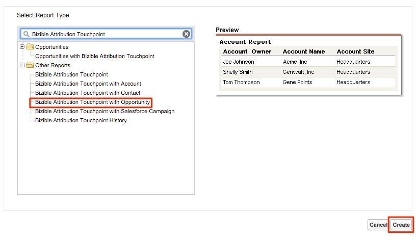

# マーケティングチャネルによるクローズ済み失注商談 {#closed-lost-opportunities-by-marketing-channel}

このレポートは、商談ステージに依存する場合がありますが、クローズ済みでない商談に貢献したマーケティングチャネルのうち、どのマーケティングチャネルが役立ったかを明らかにします。

1. Salesforceの「**[!UICONTROL レポート]**」タブをクリックし、「**[!UICONTROL 新しいレポート]**」を選択します。

   

1. 「Bizible 属性」のタイプを簡易検索し、**[!UICONTROL 商談を含む Bizible 属性タッチポイント]** レポートタイプを選択して、「**[!UICONTROL 作成]**」を選択します。

   

1. レポートの先頭から「[!UICONTROL &#x200B; すべての Bizible 属性タッチポイント &#x200B;]」を表示し、レポートしたい期間に従って日付フィールドを調整します。 この例では、「すべての時間」を表示しています。 さらに、レポートの形式を表形式から概要に変更します。

   

   

1. 次に、レポートにフィールドを追加します。 左側のクイック検索で、「マーケティングチャネル」と入力し、レポートの概要グループに追加します。

   

1. 次に、Closed Lost Opps のみを見るためのフィルターを追加します。 左側のクイック検索で、「ステージ」フィールドを検索し、フィルター領域にドラッグします。

   

1. そこから虫眼鏡を選択して、「Closed Lost」の機会に利用するステージを選択します。 ここでは、標準の「Closed Lost」の命名を使用します。

   

1. さあ、レポートを実行してみなさい。

   これは、マーケティングチャネル別に要約された商談レポートで、チャネルをまたいでクローズ済みの失注を測定します。 このレポートを使用すると、パフォーマンスが低い可能性のあるチャネルを把握できます。 レポートしたいフィルターやフィールドに自由に追加できます。

>[!MORELIKETHIS]
>[[!DNL Marketo Measure]  チュートリアル：その他のSFDC レポート &#x200B;](https://experienceleague.adobe.com/en/docs/marketo-measure-learn/tutorials/onboarding/marketo-measure-102/addtional-salesforce-reports)
