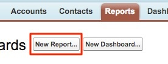
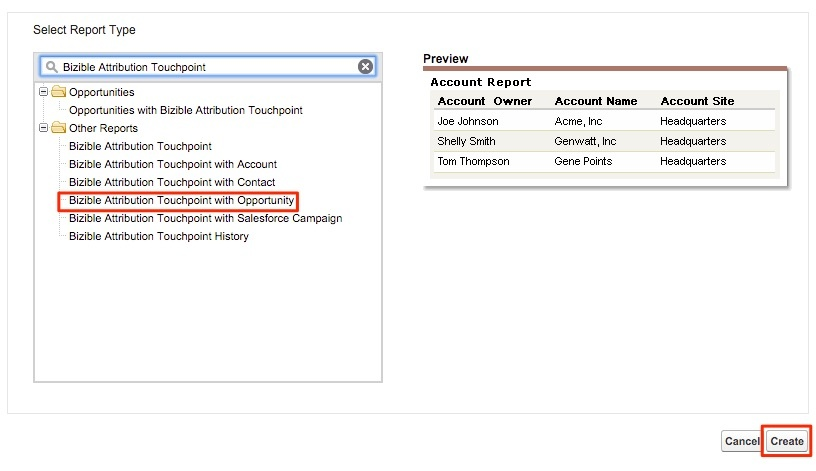
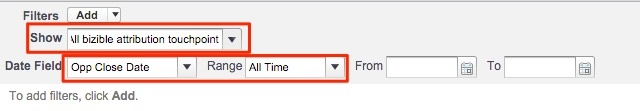
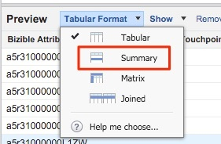
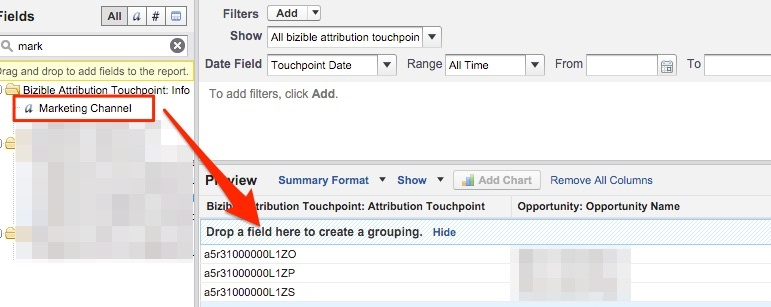
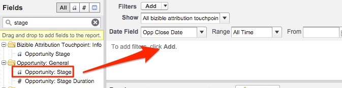
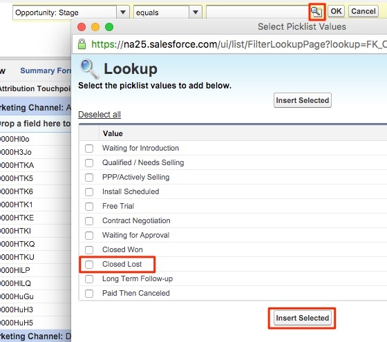

# マーケティングチャネルによるクローズ済み失注商談 {#closed-lost-opportunities-by-marketing-channel}

本レポートでは、商談のステージに応じて異なる場合もありますが、成約に至っていない商談に貢献したマーケティングチャネルを明らかにします。

1. Salesforceの「**[!UICONTROL レポート]**」タブをクリックし、**[!UICONTROL 新規レポート]**&#x200B;を選択します。

   

1. 「Bizible Attribution」のクイック検索タイプで、商談&#x200B;**レポートタイプの** Bizible Attribution Touchpointを選択し、**[!UICONTROL 作成]**&#x200B;を選択します。

   

1. レポートの先頭から、「[!UICONTROL すべてのBizible アトリビューションタッチポイント &#x200B;]」を表示し、レポートを作成する期間に応じて日付フィールドを調整します。 この例では、すべての時間を考慮します。 さらに、レポート形式を「表形式」から「要約」に変更します。

   

   

1. 次に、レポートにフィールドを追加します。 左側のクイック検索で、「マーケティングチャネル」と入力し、レポートの概要グループに追加します。

   

1. 次に、フィルターを追加して、閉じたロストオプスのみを確認します。 左側のクイック検索で、「ステージ」フィールドを検索し、フィルター領域にドラッグします。

   

1. そこから拡大鏡を選択して、「クローズドロスト」の機会に使用するステージを選択します。 ここでは、標準的な「クローズド・ロスト」という命名を使用します。

   

1. では、レポートを実行しましょう！

   これは、マーケティングチャネルがまとめた、チャネルをまたいでクローズした商談機会を測定する商談報告書です。 このレポートにより、どのチャネルがパフォーマンスが低いのかを把握できます。 レポートしたいフィルターやフィールドを自由に追加できます。

>[!MORELIKETHIS]
>
>[[!DNL Marketo Measure]  チュートリアル：その他のSFDC レポート &#x200B;](https://experienceleague.adobe.com/ja/docs/marketo-measure-learn/tutorials/onboarding/marketo-measure-102/addtional-salesforce-reports)
