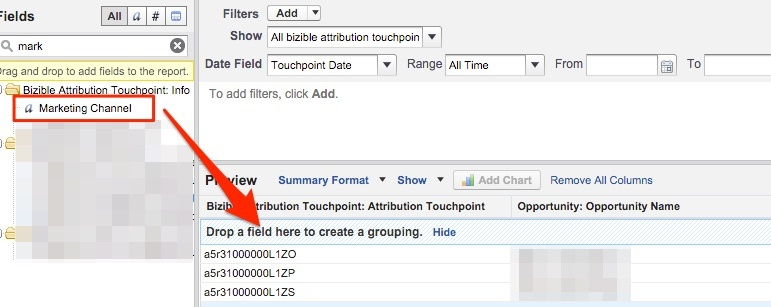

# マーケティングチャネルによるクローズ済み失注商談 {#closed-lost-opportunities-by-marketing-channel}

このレポートは商談ステージに依存する場合がありますが、このレポートは、クローズされていない商談に貢献したマーケティングチャネルを示します。

1. クリック **[!UICONTROL レポート]** 「 」タブをクリックし、「 」を選択します。 **[!UICONTROL 新しいレポート]**.

   

1. 「Bizible 属性」でのクイック検索タイプで、 **[!UICONTROL 商談を含む Bizible 属性タッチポイント]** レポートのタイプを選択し、「 **[!UICONTROL 作成]**.

   

1. レポートの上部から、「[!UICONTROL すべての Bizible 属性タッチポイント]」をクリックし、レポート対象の期間に応じて日付フィールドを調整します。 この例では、「All Time」を表示しています。 また、レポートの形式を表形式から概要に変更します。

   

   

1. 次に、レポートにフィールドを追加します。 左側のクイックフィンドで「マーケティングチャネル」と入力し、レポートのサマリグループに追加します。

   

1. 次に、閉じられた損失商談のみを見るためのフィルターを追加します。 左側のクイック検索で「Stage」フィールドを検索し、フィルター領域にドラッグします。

   

1. ここから虫眼鏡を選択して、「閉じられた失われた」商談のために使用するステージを選択します。 ここでは、標準の「Closed Lost」命名を使用します。

   

1. さあ、先に進んでレポートを実行してください。

   これは、チャネル全体でクローズ済みの損失商談を測定するマーケティングチャネル別に要約された商談レポートです。 このレポートを使用すると、パフォーマンスの低いチャネルを把握できます。 レポートを作成するフィルターやフィールドを自由に追加できます。

>[!MORELIKETHIS]
>
>[[!DNL Marketo Measure] Tutorials：その他の SFDC レポート](https://experienceleague.adobe.com/en/docs/marketo-measure-learn/tutorials/onboarding/marketo-measure-102/addtional-salesforce-reports)
