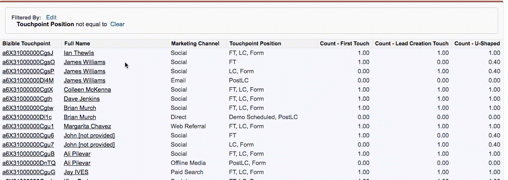

# マイレポートの重複レコード {#duplicate-records-in-my-report}

>[!NOTE]
>
>ドキュメントに「[!DNL Marketo Measure]」を指定する手順が表示される場合がありますが、CRMには「[!DNL Bizible]」が表示されます。 アドビは現在更新に取り組んでおり、ブランディングの変更はまもなく CRM に反映される予定です。

[!DNL Salesforce]の[!DNL Marketo Measure] レポートに取り組むと、レポートに「重複する」レコードが見つかる場合があります。 [!DNL Marketo Measure]のすぐに使用できるレポートを確認する際に、この感覚が生じる可能性があります。

Buyer Touchpoints オブジェクトまたはBuyer Attribution Touchpoint オブジェクトを使用してレポートを作成する場合は、リード、取引先責任者、商談の数をレポートするのではなく、それらの標準オブジェクト（リード、取引先責任者、商談）に関連付けられたBuyer TouchpointまたはBuyer Attribution Touchpointの数をレポートすることを理解することが重要です。

次のレポートを例にとってみましょう。

これは、**購入者のタッチポイントを持つ連絡先** レポートです。 つまり、個々のコンタクトに関連する顧客接点の数を確認しています。

ご覧のとおり、レポートにはジェームズ・ウィリアムズの連絡先が3人いるようなので、「重複する」と考えているかもしれません。

ただし、このレポートには、Jamesに関連するタッチポイントの数が表示されています。 レポート内では、Jamesが個別のFT （ファーストタッチ）、個別のLC、フォーム（リード作成タッチ）、およびPostLC タッチポイント（LC タッチポイントの後に行われるフォーム送信）を持っていることがわかります。

「連絡先の数」を理解したい場合は、「カウント – ファーストタッチ」、「カウントリード作成タッチ」、「カウント U字型」のフィールドを使用して、マーケティングインタラクションが発生した連絡先の数を把握できます。

>[!MORELIKETHIS]
>
>[[!DNL Marketo Measure]  チュートリアル：Stock SFDC レポート &#x200B;](https://experienceleague.adobe.com/ja/docs/marketo-measure-learn/tutorials/onboarding/marketo-measure-102/stock-salesforce-reports){target="_blank"}
