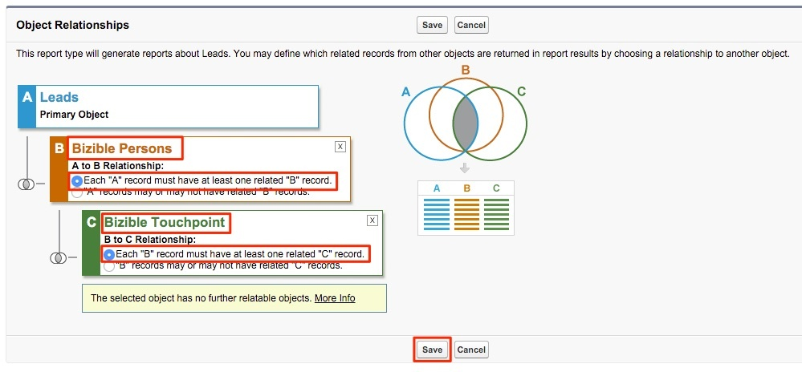

# 購入者タッチポイント付きリードレポート {#leads-with-buyer-touchpoints-report}

>[!NOTE]
>
>&quot;[!DNL Marketo Measure]」を参照してください。ただし、「[!DNL Bizible]」と入力します。 アドビは現在、その更新をおこなっており、ブランディングの変更が CRM に反映される予定です。

すぐに使用できる、多くのレポート機能をすぐに使用できます。 [!DNL Marketo Measure]を作成することをお勧めしますが、追加のレポートタイプをいくつか作成することをお勧めします。 以下の購入者タッチポイントレポートタイプを使用して、包括的なリードを作成する方法について説明します。

1. 内の設定オプションに移動します。 [!DNL Salesforce]. ここから、「作成」グループを展開し、を選択します。 **[!UICONTROL レポートタイプ]**.

   

1. 選択 **[!UICONTROL 新しいカスタムレポートタイプ]**.

   

1. プライマリオブジェクトを「リード」に設定し、「レポートタイプラベル」入力で「購入者タッチポイント — 包括的なリード」を指定します。 「リード」カテゴリ内にレポートを保存し、デプロイメントステータスを「 **[!UICONTROL デプロイ済み]**. 次に、 **[!UICONTROL 次へ]**.

   

1. オブジェクトの関係で、 **[!DNL Marketo Measure]人物** オブジェクトをセカンダリオブジェクトとして指定します。 A と B の関係を「各「A」レコードには少なくとも 1 つの関連する「B」レコードが必要です」として選択します。 ここから、「Buyer Touchpoint」オブジェクトを関連付け、B と C のオブジェクト間の同じ関係を選択します。

   

1. 保存して、レポートの作成を開始します。
