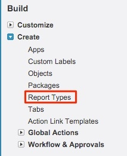
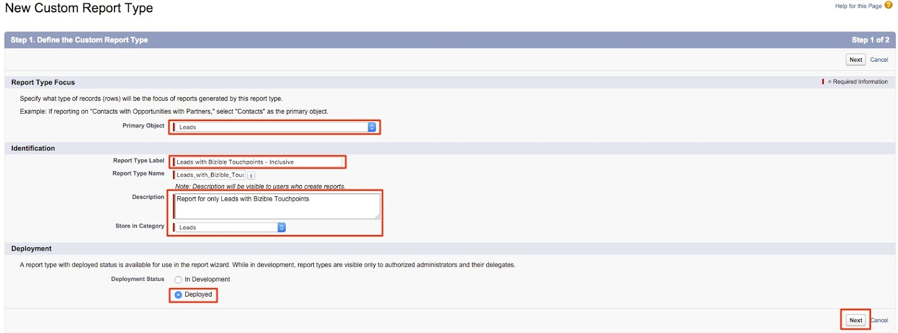
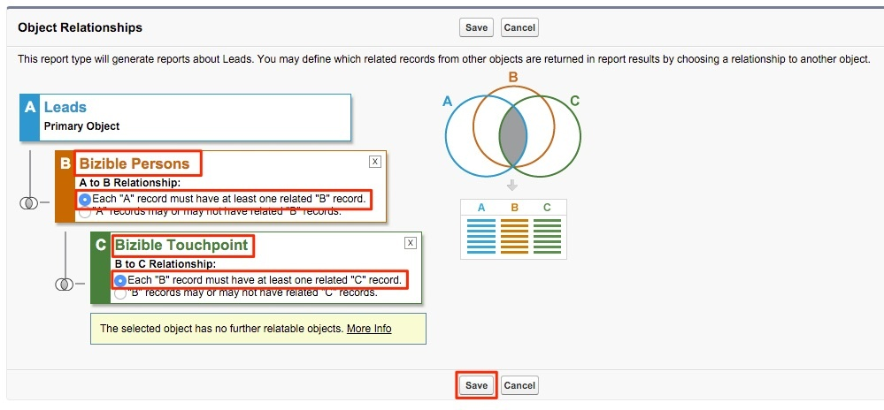

# 「Buyer Touchpointsを使用したリード」レポート {#leads-with-buyer-touchpoints-report}

>[!NOTE]
>
>ドキュメントに「[!DNL Marketo Measure]」を指定する手順が表示される場合がありますが、CRMには「[!DNL Bizible]」が表示されます。 アドビは現在更新に取り組んでおり、ブランディングの変更はまもなく CRM に反映される予定です。

すぐに使える多くのレポート機能が[!DNL Marketo Measure]に関して簡単に利用できますが、作成することをお勧めします。追加のレポートタイプがいくつかあります。 以下のレポートタイプのバイヤータッチポイントを使用して、包括的なリードを作成する方法について説明します。

1. [!DNL Salesforce]内の設定オプションに移動します。 そこから、「作成」グループを展開し、**[!UICONTROL レポートタイプ]**&#x200B;を選択します。

   

1. **[!UICONTROL 新しいカスタムレポートタイプ]**&#x200B;を選択します。

   

1. プライマリオブジェクトを「リード」に設定し、「レポートタイプラベル」入力の「バイヤタッチポイントを持つリード – 含める」内に設定します。 「リード」カテゴリ内にレポートを保存し、デプロイメントステータスを&#x200B;**[!UICONTROL デプロイ]**&#x200B;に変更します。 次に、**[!UICONTROL 次へ]**&#x200B;を選択します。

   

1. オブジェクト関係で、**[!DNL Marketo Measure]Person** オブジェクトをセカンダリオブジェクトとして選択します。 「各「A」レコードには、少なくとも1つの関連「B」レコードが必要です」という名前で、AからBへの関係を選択します。 そこから、「Buyer Touchpoint」オブジェクトを関連付け、BとCのオブジェクト間に同じリレーションシップを選択します。

   

1. レポートを作成しましょう。
