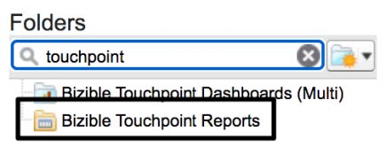
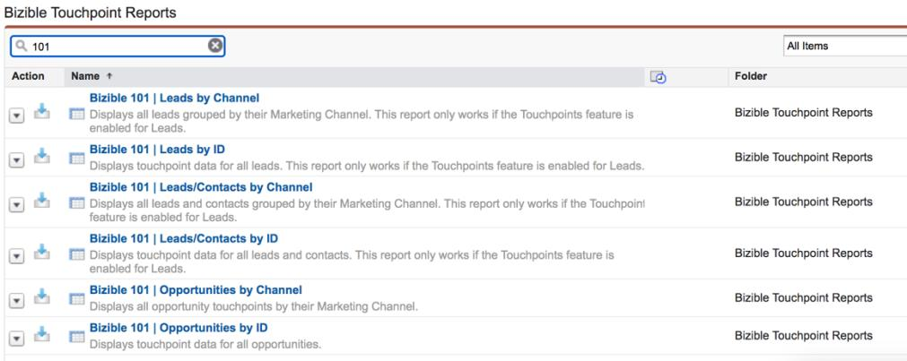

# [!DNL Marketo Measure] 101 レポートの概要 {#marketo-measure-101-reports-overview}

>[!NOTE]
>
>ドキュメント内に「[!DNL Marketo Measure]」を指定する手順が記載されている場合がありますが、CRM には引き続き「Bizible」と表示されます。 アドビは現在更新に取り組んでおり、ブランディングの変更はまもなく CRM に反映される予定です。

[!DNL Marketo Measure]および[!DNL Salesforce]を使用しているすべての[!DNL Marketo Measure]のお客様は、SFDC インスタンス内の「購入者タッチポイントレポート」フォルダーにアクセスできます。 このフォルダーには、Buyer Touchpoint データを使用したレポートの作成に役立つ、多数の事前定義済みレポートが含まれています。

これらのレポートの多くにはすでに特定のレポート目標が設定されていますが、レポートのニーズの大部分をカバーする3つの主要なレポートタイプに代表される6つの「_[!DNL Marketo Measure]101..._」があります。

* 顧客接点を伴うリード
* バイヤーのタッチポイントを持つ[!DNL Marketo Measure]人
* Buyer Attribution Touchpoints with Opportunities

これらのレポートには、作成する[!DNL Marketo Measure]関連レポートに必要な基本的なフィールドとインフラストラクチャが表示されます。 新旧を問わず、あらゆる顧客がマーケティングアトリビューションに関する疑問を探る際には、これらのレポートから始めることを推奨します。 以下に、6つの「_[!DNL Marketo Measure]101..._」レポートの各説明を示します。

_購入者のタッチポイント レポート フォルダーまたはそのフォルダー内の6つの「_[!DNL Marketo Measure] 101..._」レポートが見つからない場合は、サポートに連絡してください。_

**バイヤータッチポイントを持つリード** |次の2つのバリエーション、リードとそのバイヤータッチポイントに関するレポート。 同じ基本レポートタイプを使用しますが、リード IDとマーケティングチャネルという異なる指標によってグループ化され、データに関するふたつの主要なビューを提供します。 このレポートタイプは、funnelの主要なレポート向けに設計されており、リードがマーケティング施策にどのように取り組んでいるかを調べたい場合に最適です。 カスタマイズの前に、以下の2つのレポートに次の内容が表示されます。

**[!DNL Marketo Measure]101: チャネル別リード** | マーケティングチャネルがリードの作成とその追加エンゲージメントにどのように影響しているかを示す概要ビュー。
**[!DNL Marketo Measure]101: ID**&#x200B;によるリード |これは、リードのストーリーを表示し、はるかに詳細なレポートで、個々のリードと関連する購入者のタッチポイントを示します。

**購入者のタッチポイントを持つリード/取引先責任者** |これらのレポートは、一般的に[!DNL Marketo Measure]人のレポートと呼ばれます。 上記のレポートでは、[!DNL Marketo Measure] カスタムオブジェクト _[!DNL Marketo Measure]Person_&#x200B;を使用しますが、Lead オブジェクトは使用しません。

[!DNL Marketo Measure] 担当者オブジェクトは、リードオブジェクトと取引先責任者オブジェクトを関連付けます。 [!DNL Salesforce]には、同じレポート内のリードと取引先責任者オブジェクトを使用してレポートを作成するオプションがありません。 ユーザーの一意のIDである電子メールを使用してリードと取引先責任者オブジェクトに関連づけることで、[!DNL Marketo Measure]のユーザーは、同じレポート内でリードと取引先責任者の両方に関連する購入者接点についてレポートできます。 このレポートタイプは、タッチポイントレポートの最も包括的なレベルであるため、[!DNL Marketo Measure] アカウント設定のいずれかを検証する場合に最適です。

次の2つのレポートバリエーションは、同じレポートタイプを使用しますが、異なる指標、人物ID （メール）とマーケティングチャネルでグループ化されています。 これらは、funnelの上部またはfunnelの中央のレポートで、リードや取引先責任者がどのようにマーケティング活動に関与しているかを調べたい場合に最適です。 カスタマイズの前に、以下の2つのレポートに次の内容が表示されます。

**[!DNL Marketo Measure]101: チャネル別リード/取引先責任者** | マーケティングチャネルがリードまたは取引先責任者の作成とその追加エンゲージメントにどのように影響しているかを示す概要ビュー。 このレポートは、Salesforceインスタンス内で、マーケティングチャネル全体のエンゲージメントの合計を把握し、新しい名前を付けているマーケティングチャネルを特定したい場合に最適です。
**[!DNL Marketo Measure]101: ID**&#x200B;によるリード/コンタクト |これは、各[!DNL Marketo Measure]人のストーリーを表示し、各個人とその購入者のタッチポイントを表示する、より詳細なレポートです。そのタッチポイントがリードまたは取引先責任者であった場合に関係なく表示されます。

**バイヤーアトリビューションタッチポイントを使用した商談** |最後の2つの「_[!DNL Marketo Measure]101..._」レポートは、商談に関連するBuyer Attribution Touchpoint データを表示するfunnel レポートの下部にあります。 これらのレポートの重要な差別化要因は、収益などの商談レベルおよび商談レベルのデータに関連する&#x200B;_バイヤーアトリビューションタッチポイント_&#x200B;から構築されていることです。 商談または売上への貢献度に関するレポートを作成する場合は、このレポートタイプを使用します。 以下の2つのレポートは同じレポートタイプを使用しますが、商談IDとマーケティングチャネルの指標ごとにグループ化されています。 カスタマイズの前に、以下の2つのレポートに次の内容が表示されます。

**[!DNL Marketo Measure]101: チャネル別の商談** | マーケティングチャネルが商談全体でどのように影響し、売上への貢献度を高めているのかを示す概要ビュー。
**[!DNL Marketo Measure]101: ID別の商談** |この詳細なレポートバージョンでは、商談のジャーニー全体が表示されます。 このレポートでは、様々なアトリビューションモデルを通じて、商談に関連付けられたすべてのBuyer Attribution Touchpointとその売上を確認できます。

「_[!DNL Marketo Measure]101..._」レポートをレポートニーズのテンプレートとして扱うことは、ベストプラクティスと見なされます。 上記のいずれかのレポートから開始すると、時間が節約され、[!DNL Marketo Measure] データに関連する正しいフィールドを使用できるようになります。 レポートの元のバリエーションを保持するために、「_[!DNL Marketo Measure]101..._」テンプレートをカスタマイズする場合は、必ず「別名で保存」してください。

「Buyer Touchpoint レポート」フォルダーは、[!DNL Marketo Measure] レポートの作成に役立つように設計されています。実用的なレポートの場合は、レポートのニーズに合わせてカスタマイズするように、これらのレポートをカスタマイズする必要があります。 レポート内のレコード（および関連するタッチポイント）がレポート目標に沿っていることを確認するために、必要なフィルターを追加する必要があります。

「_[!DNL Marketo Measure]101..._」レポートに詳しい場合は、カスタムレポートタイプからレポートを再作成して、より多くのカスタムレポートのニーズに対応させることもできます。 [[!DNL Marketo Measure]  カスタムレポートタイプ &#x200B;](/help/marketo-measure-salesforce-reporting/new-report-types/creating-custom-marketo-measure-report-types.md)を作成すると、他のCRM レポートで一般的に使用するカスタムフィールドを取り込むことができます。 これにより、[!DNL Marketo Measure] レポートを次のレベルに引き上げることができます。
