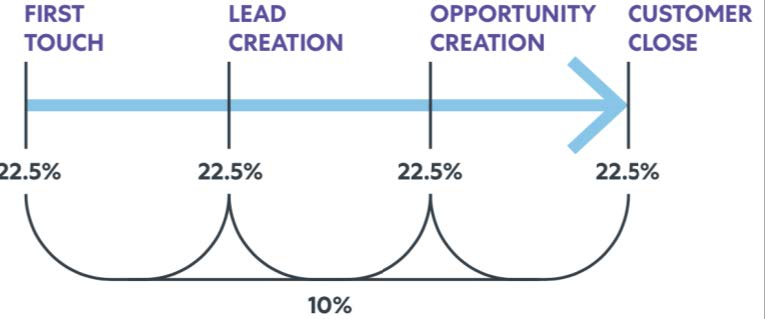
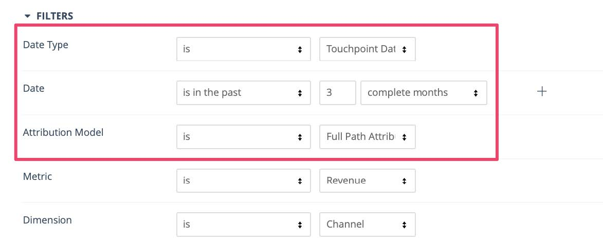

# [!DNL Marketo Measure] レポートガイド {#marketo-measure-reporting-guide}

>[!NOTE]
>
>この場合、[!DNL Marketo Measure]」 （ドキュメント内）が表示されますが、CRM には「Bizible」が表示されます。 アドビは現在、その更新を行っており、ブランディングの変更がまもなく CRM に反映される予定です。

を構築する前に [!DNL Marketo Measure] レポート、 [!DNL Marketo Measure] アカウント設定は、レポート内のデータが正確であり、お客様のビジネスに特有のものであることを確認するために、確認および設定されています。 これに加えて、構造化されたプロセスに従う場合は、レポートプロジェクトが最も効果的です。 ジャスティン・ノリス、 [!DNL Marketo Measure] パワーユーザー、支持者、パートナー [ペルクト](https://perkuto.com/) 専門的に要約された [でのレポートに対するアプローチ [!DNL Marketo Measure]](https://perkuto.com/blog/turning-attribution-data-into-actionable-insights/):

**目標の設定**:「最初に尋ねるべき質問は、「なぜ測定するのか？」です。 ロリ・ウィズド [Forrester Research](https://go.forrester.com/) ～にうまくまとめ上げた [Marketoウェビナー](https://www.marketo.com/webinars/beyond-revenue-performance-real-kpis-of-b2b-marketing/). 「マーケティングの決定や価値を証明または検証するか、改善するか（プロセスの改善）」と、彼女によると。 良い測定からのインサイトも、マーケティング計画プロセスに対する入力とガイダンスを提供することを追加します。

ですから始める前に目標や答えようとしている問題や解決しようとしている問題を明確にすることが不可欠です どんな話をしたいの？ その結果、どのような決定が下されますか？ こうしたファンダメンタルズは、あまりにもよく考えられず、関係者全員に対する不満を招く」と述べた。

**レポートデザイン**:「次に、レポートを設計し、レポートに含める特定のディメンション、指標、データセットを決定する必要があります。 一般的なエクスペリエンスは、ビジネスユーザーに求めるものを正確に提供することです。ただし、そのユーザーは、自分のニーズが満たされていないと感じるだけです。 これは、ビジネスユーザーが実際に探しているインサイトが、要求するレポートに含まれているとは限らないためです。 優れたアナリスト（またはアナリストの MOPS の人）は、明確な質問をし、共通の定義を確立し（「リードとは何を意味するのか」）、最終的なレポートのビジュアルをスケッチして、整合性を確認します。 その後、一連の要件を満たしていることを知って、レポートを作成します。」

**レポートの作成**:「ビルドに行ったら、道路や行き詰まりに遭遇するのも珍しくありません。 例えば、重要なデータポイントがない場合や、オブジェクトが必要な方法でリンクされていない場合があります。 これらの問題を解決するには、レポートの「マシン」で「内部で」何が起こっているかを理解することも重要だと思います。 この機能により、レポートリクエストを迅速にサイズ設定し、達成可能かどうかを評価できます（そうでない場合は、より簡単にクリエイティブなソリューションを考案できます）。」

「内部」を見て、 [!DNL Marketo Measure] attribution reporting マシンの実行

## 購入者タッチポイントオブジェクト (CRM) {#buyer-touchpoint-objects-crm}

最も高いレベルでは、2 つの異なる購入者タッチポイントオブジェクトに基づいて、2 つのレポートカテゴリがあります。これらのカテゴリは、 [!DNL Marketo Measure] レポートするデータ： _個人版_、または _商談_.

1. **購入者タッチポイント** (BT) /個人/総エンゲージメント

   * 「ファネルのトップ」(TOFU) 指標および _個人_ ( リード、連絡先、 [!DNL Marketo Measure] （人）
   * BT は、 **担当者**、各ユーザーのタッチポイント履歴全体を含むからです。 これらのタッチポイントは、匿名のファーストタッチ、リード作成タッチ、およびオフラインのキャンペーンまたはアクティビティから同期するよう選択した後続のフォーム送信またはタッチポイント用に CRM で作成されます。

1. **購入者の属性タッチポイント** (BAT) /商談/アカウントレベル/収益

   * 「ファネルの中間または下部」（MOFU および BOFU）指標および _商談_.
   * BAT は、 **商談** （設定に応じて、商談の連絡先の役割または共有アカウント ID を使用）。 BT は、人にのみ関わるものとは異なり、BAT は、 **売上高**. したがって、BAT を使用して、開封またはクローズしたオポチュニティの数や、パイプライン価値と獲得した売上高など、オポチュニティに関する質問に回答します。

>[!NOTE]
>
>BAT は BT から作成されます。 基本的に、追跡は BT を介して個人レベルで開始されます。 アカウントで商談を作成すると、同じアカウントの連絡先の BT が参照され、商談に関連する BAT を作成する資格が得られます。「人」指標（BT レポート）に関する質問、「商談」指標（BAT レポート）に関する質問

サポート記事： [購入者タッチポイントと購入者属性タッチポイントの違い](/help/configuration-and-setup/getting-started-with-marketo-measure/difference-between-buyer-touchpoints-and-buyer-attribution-touchpoints.md#configuration-and-setup)

## Buyer Touchpoint（BT） {#buyer-touchpoint-bt}

Buyer Touchpoint(BT) は、誰かがマーケティング資料とのあらゆるマーケティングインタラクションを追跡するために使用されるオブジェクトです。 各個人の ( リード/連絡先/[!DNL Marketo Measure] 人物 ) の旅は、関連する BT によって表される。 In [!DNL Marketo Measure]個人のジャーニーは、次の要素で構成されます。

1. この人が当社のブランドと最初にやり取りしたのはどのようですか？ ( ファーストタッチまたは _FT_)
1. この人はどのようにしてリードにコンバージョン/認識/認識を取得しましたか？ ( リードの作成または _LC_)
1. この人物がリードになってから、ブランドやマーケティング資料とどのようにやり取りしたのですか？ (_PostLC_)

購入者タッチポイントは、 _担当者_ （「人」は、商談関連の指標ではなく、リード/連絡先の生成指標や獲得指標など、CRM 内のリードまたは連絡先で表されます）。 例：

* 最も多くのリードを配信しているチャネルはどれですか？
* 新しいリードを作成するためのコストの高いチャネルと低いチャネルはどれですか？
* リード/連絡先が関与するコンテンツは何ですか？
* 特定のタイトル、役割、ペルソナのマーケティングストーリーとは何ですか？
* MQL や、その他のリード/連絡先のステータスを引き起こすチャネルはどれですか？

主に、企業は「リード/連絡先はどこから来たのか」と知る必要があります。 従来、これは 1 次元の値（リードソースなど）で回答されていました。 ただし、上記の#1と#2で概要を説明したように、リードになるジャーニーの間に、リードに複数のタッチポイントが存在する可能性があることがわかります。 購入者タッチポイントを使用すると、リードがどのように生成されたかを表す、ファーストタッチとリード作成タッチの 2 つの最も重要なインタラクションに関するインサイトを得ることができます。 購入者のタッチポイントも _多次元の_ つまり、主に人がどこから来たか（マーケティングチャネル）や、何に関与したか（コンテンツ）に関わる、多数のマーケティングデータを扱います。

The [アトリビューションモデル](/help/introduction-to-marketo-measure/overview-resources/marketo-measure-attribution-models.md) ユーザーベースの指標に関する最適なインサイトを提供するには、次のようにします。

* **ファーストタッチ**  — リードのファーストタッチ (FT) への 100%の属性クレジット
* **リードの作成**  — リードのリード作成タッチ (LC) に対する 100%の属性クレジット
* **U 字形**  — マルチタッチアプローチ。40%のクレジットが FT に、40%のクレジットが LC に

<table> 
 <tbody>
  <tr>
   <td></td> 
   <td>U 字型モデルは、リードがリードになった経緯を要約する任意の購入者タッチポイントにクレジットを与えるように設計されています。 これらのリードからの以降のタッチポイントは、追加のエンゲージメント（投稿の LC）を理解するためにレポートすることもできますが、これらは、 <strong>リード作成ジャーニー</strong> したがって、FT、LC、U 字型のモデルでは属性クレジットを受け取りません。

&#42;最も一般的に、U 字型のアトリビューションは、FT と LC の間の均等な50/50分割を反映します。 リードがファーストタッチと同じセッションでコンバージョンする場合、1 つのタッチポイントが FT と LC の両方のタッチポイント位置を表します。 したがって、アトリビューションの 100%は 1 つのタッチポイントに割り当てられます。</td>
</tr>
 </tbody>
</table>

これらのモデルは、初期段階のインタラクションとファネルエンゲージメントのトップに重点を置いています。 U 字型アトリビューションは、リードの作成に影響を与えたタッチにクレジットが与えられるように、FT タッチポイントと LC タッチポイントの両方を考慮した推奨モデルです。 ただし、リードジャーニーの特定の部分をより詳細に理解したい場合は、ファーストタッチモデルとリード作成タッチモデルから追加のインサイトを得ることができます。

## 購入者タッチポイント (BT) を使用した推奨レポート {#recommended-reports-using-the-buyer-touchpoint-bt}

1. **購入者タッチポイントを持つリード**

**1.1 | マーケティングチャネル別の新規リード**

「マーケティングチャネル」フィールドでリードの購入者タッチポイントデータを要約すると、新しいリードの作成に影響を与えているチャネルや戦術を表す最高レベルのビューが表示されます。 「日付タイプ」 = 「作成日」を基準にこのレポートを構築すると、（CRM でリードが作成された場合）「新規リード」のコホートがレポートに確立されます。

<table> 
 <tbody>
  <tr>
   <td>質問</td> 
   <td>リードを作成に導くのにどのマーケティングチャネルが影響していますか？</td> 
  </tr>
  <tr>
   <td>レポートのタイプ</td> 
   <td>リードと購入者のタッチポイント (CRM) 
   指標：リード ([!DNL Marketo Measure] Discover)</td> 
  </tr>
  <tr>
   <td>日付フィールド/日付タイプ</td> 
   <td>リード作成日 (CRM)/作成日 (Discover)</td> 
  </tr>
  <tr>
   <td>日付範囲</td> 
   <td><i>目的の日付範囲を選択</i></td> 
  </tr>
  <tr>
   <td>グループ/Dimension</td> 
   <td>マーケティングチャネル</td> 
  </tr>
  <tr>
   <td>最適なモデル</td> 
   <td>ファーストタッチ、リード作成、 <strong>U 字形</strong> 
   *CRM レポートの「カウント」フィールドを合計（カウント — ファーストタッチ、カウント — リード作成、カウント — U 字形）</td> 
  </tr>
 </tbody>
</table>

>[!TIP]
>
>「購入者タッチポイントを持つリード」レポートタイプの場合は、まず「 」というタイトルの事前定義済みレポートをカスタマイズします。[!DNL Marketo Measure] 101 | チャネル別のリード`. このレポートは、そのまま使用でき、上の表で説明したように事前に作成された優れたサンドボックスで、より具体的なレポートニーズに合わせてすばやくカスタマイズできます。

**1.2 | キャンペーン別の新規リード（より詳細なインサイト）**

「マーケティングチャネル別の新規リード」レポート (1.1) に要約されたデータに関するより詳細なインサイトを得るには、キャンペーンレベルでさらに概要を追加します。 これにより、新しいリードを創出に導く「マーケティングチャネル」が何かだけでなく、より具体的には、これらのチャネル内のどのキャンペーンが最も効果が高いかを把握できます。

<table> 
 <tbody>
  <tr>
   <td>質問</td> 
   <td>What <i>campaigns</i> リードを作り出すに影響を与えているか。</td> 
  </tr>
  <tr>
   <td>レポートのタイプ</td> 
   <td>リードと購入者のタッチポイント (CRM) 
   指標：リード ([!DNL Marketo Measure] Discover)</td> 
  </tr>
  <tr>
   <td>日付フィールド/日付タイプ</td> 
   <td>リード作成日 (CRM)/作成日 (Discover)</td> 
  </tr>
  <tr>
   <td>日付範囲</td> 
   <td><i>目的の日付範囲を選択</i></td> 
  </tr>
  <tr>
   <td>グループ/Dimension</td> 
   <td>広告キャンペーン名 (CRM)</td> 
  </tr>
  <tr>
   <td>最適なモデル</td> 
   <td>ファーストタッチ、リード作成、 <strong>U 字形</strong> 
   *CRM レポートの「カウント」フィールドを合計（カウント — ファーストタッチ、カウント — リード作成、カウント — U 字形）</td> 
  </tr>
 </tbody>
</table>

>[!TIP]
>
>購入者タッチポイントオブジェクトの他の使用可能なフィールドとレポートを要約することで、より詳細なインサイトを得ます。 追加のグループ化 (CRM) またはディメンション (Discover) を設定して、これをおこないます。 チャネル（ロールを代表する場合もあります）によっては、インサイトを得たいキャンペーンレベル以外に、追加の詳細が存在する場合があります。 「有料検索」について、以下の表などを参照してください。

<table> 
 <tbody>
  <tr>
   <td>質問</td> 
   <td>What <i>キーワード</i> リードを作り出すに影響を与えているか。</td> 
  </tr>
  <tr>
   <td>レポートのタイプ</td> 
   <td>リードと購入者のタッチポイント (CRM) 
   指標：リード ([!DNL Marketo Measure] Discover)</td> 
  </tr>
  <tr>
   <td>フィルター</td> 
   <td>マーケティングチャネル=有料検索</td> 
  </tr>
  <tr>
   <td>日付フィールド/日付タイプ</td> 
   <td>リード作成日 (CRM)/作成日 (Discover)</td> 
  </tr>
  <tr>
   <td>日付範囲</td> 
   <td><i>目的の日付範囲を選択</i></td> 
  </tr>
  <tr>
   <td>グループ/Dimension</td> 
   <td>キーワードテキスト (CRM) /キーワード (Discover)</td> 
  </tr>
  <tr>
   <td>最適なモデル</td> 
   <td>ファーストタッチ、リード作成、 <strong>U 字形</strong> 
   *CRM レポートの「カウント」フィールドを合計（カウント — ファーストタッチ、カウント — リード作成、カウント — U 字形）</td> 
  </tr>
 </tbody>
</table>

精度のレベルは、チャネルごとに異なる場合があります。 推奨されるアプローチは、「「チャネル X については、もっと詳しく理解したいと思っていますか？」と自問することです。 有料検索マネージャーは、次のような追加のディメンションに興味を持つ場合もあります。

* 広告キャンペーン名
* 広告コンテンツ
* 広告グループ

ただし、特定のイベントやイベントのタイプが最もリードの作成に影響を与えたイベントに関心を持つ可能性が高い場合があります。

* 広告キャンペーン名/ Salesforce キャンペーン=特定のイベント
* メディア=キャンペーン「タイプ」

**リマインダー**：上記または下記のレポートバリエーションのいずれかに、追加のフィルターを追加する必要が生じる場合があります。 これらのフィルターは、お客様の組織に固有のもので、マーケティング業務またはセールス業務チームがアドバイスを受けるのに役立ちます。 組織がすべてのレポートで同じフィルターを実行して、レポートができるだけクリーンで正確になるようにするのは珍しくありません。 一般的な例を次に示します。

* テスト（通常は E メールアドレス）から任意の内部レコードを除外する
* ビジネスユニットに固有の特定の「レコードタイプ」に基づくフィルタリング

**1.3 | コンテンツ別の新規リード（CRM レポートのみ）**

<table> 
 <tbody>
  <tr>
   <td>質問</td> 
   <td>What <i>コンテンツ</i> リードを作り出すに影響を与えているか。</td> 
  </tr>
  <tr>
   <td>レポートのタイプ</td> 
   <td>リードと購入者のタッチポイント (CRM)</td> 
  </tr>
  <tr>
   <td>日付フィールド</td> 
   <td>リード作成日</td> 
  </tr>
  <tr>
   <td>日付範囲</td> 
   <td><i>目的の日付範囲を選択</i></td> 
  </tr>
  <tr>
   <td>グループ/Dimension</td> 
   <td>ランディングページ  
   フォーム URL</td> 
  </tr>
  <tr>
   <td>最適なモデル</td> 
   <td>ファーストタッチ、リード作成、 <strong>U 字形</strong> </td> 
  </tr>
 </tbody>
</table>

**リマインダー**：デジタルコンテンツ/アセットのレポートを作成するための 2 つの主なフィールドは、「ランディングページ」と「フォーム URL」です。 リードが「ランディング」（ランディングページ）したページでコンバージョン（フォームを送信）をおこなう場合、これら 2 つの値は同じになる場合があります。 _ただし_&#x200B;に値が異なる場合があります。 例えば、リードがFacebook上のリンクをクリックして Web サイトのページに移動したとします（これは「ランディングページ」の値です）。 その後、リードはそのページから移動し、サイトでのセッションを続行し、最終的に別のページ（フォーム URL）でのフォームを送信することができます。 これは、リードがどこから来たか（マーケティングチャネル）、サイトに導いたコンテンツ（ランディングページ）、最終的にダウンロードされたコンテンツ（フォーム URL）を表す 1 つのタッチポイントにまとめられます。 また、「フォーム URL」は、「お問い合わせ」や「デモリクエスト」フォームなど、ダウンロード可能なコンテンツに関連付けられていない他のフォームに関するレポートを作成するための移動先フィールドです。

>[!TIP]
>
>追加のフィルターを使用して特定の「コンテンツ」を把握する
>
>* 次の項目でフィルター： 「ランディングページ」次を含む（例： ）:
>   * /blog
>   * /ebook
>   * /webinar
>
>* OR: 「フォーム URL」に次を含む（例： ）
>   * /contact
>   * /demo

「コンテンツ」に基づくレポートは、ファネルの任意の部分をレポートする際に大きな価値を提供しますが、最も一般的にファネルの上部で使用され、リードの初期エンゲージメントに関する詳細なインサイトを提供します。 「オーガニック検索」は、初期エンゲージメント (FT) を推進する際に最も強いチャネルになる傾向があるので、「キャンペーン」レベルのデータはあまりありません。

「コンテンツ」ベースのレポートは、上位レベルのマーケティングチャネル（この場合は「オーガニック検索」）内でリードが具体的に何を促しているかを把握するのに最適です。

**1.4 | 指定した日付範囲でのリードエンゲージメントの合計**

<table> 
 <tbody>
  <tr>
   <td>質問</td> 
   <td>最も多くのマーケティングチャネル <i>リードエンゲージメント合計</i> 過去（週、月、四半期）に</td> 
  </tr>
  <tr>
   <td>レポートのタイプ</td> 
   <td>リードと購入者のタッチポイント (CRM)  
   指標：リード ([!DNL Marketo Measure] Discover)</td> 
  </tr>
  <tr>
   <td>日付フィールド/日付タイプ</td> 
   <td>Touchpoint の日付</td> 
  </tr>
  <tr>
   <td>日付範囲</td> 
   <td><i>目的の日付範囲を選択</i></td> 
  </tr>
  <tr>
   <td>グループ/Dimension</td> 
   <td>マーケティングチャネル（より詳細）</td> 
  </tr>
  <tr>
   <td>最適なモデル*</td> 
   <td>*このレポートは、リードがアトリビューションモデルを使用してどこから来たかを測定するよりも、 <i>タッチポイントの合計数（エンゲージメントの量）</i>（リード作成タッチ後のものを含む） タッチポイントの合計レコード数は、どのチャネルが最もリードエンゲージメントを閲覧したかを反映しています。</td> 
  </tr>
 </tbody>
</table>

**リマインダー**:「タッチポイント日」に関するレポートをベースにすると、特定の日付範囲におけるマーケティングパフォーマンスを最も反映した方法で把握できます。 「タッチポイント日」は、チャネル、キャンペーンまたはコンテンツに関連するだけでなく、タッチポイントがいつ発生したかを示す形でレポートを構造化します。 これは、特定の時点でマーケティングエンゲージメントがどのような状況で発生していたかを把握する最も効果的な方法です。また、同時に投資されたマーケティング費用と比較して、マーケティングの影響を測定する推奨される方法です。 マーケティング費用や ROI 分析をおこなう場合にお勧めします（5.1 を参照）。

**2.マーケティング認定リードと購入者タッチポイント**

最も一般的なレポートの 1 つは、新規リードやリードレベルのエンゲージメントに焦点を当てたもので、より具体的には「マーケティング資格を持つリード」(MQL) に焦点を当てています。 MQL のレポートは、MQL のレポートに何が影響するかに応じて、2 つのアプローチが異なります [!DNL Marketo Measure] アクセスできる機能と機能について説明します。

**2.1 | チャネル別マーケティングクオリファイドリード（マルチタッチ）**

MQL に与えるマーケティングの影響を測定するこのアプローチは、基本的に「マーケティングチャネル別の新規リード」(1.1) レポートの継続ですが、測定されるリードがより具体的には MQL であるという追加条件があります。 どのマーケティングチャネルやコンテンツがリードを生成しているかを特定するために、U 字形アトリビューションモデルを引き続きここでお勧めします。 _見込み客_ を MQL にするには：

<table> 
 <tbody>
  <tr>
   <td>質問</td> 
   <td>新しいリードを生成するのに最も適したマーケティングチャネルは、 <i>MQL</i>?</td> 
  </tr>
  <tr>
   <td>レポートのタイプ</td> 
   <td>リードと購入者のタッチポイント (CRM)  
   指標：リード ([!DNL Marketo Measure] Discover)</td> 
  </tr>
  <tr>
   <td>フィルター</td> 
   <td>MQL = true* 
   *<i>MQL の定義は組織ごとに異なる場合があります。 次を確認します。 [!DNL Marketo Measure] レポートは、他の MQL ベースのレポートと同じフィールドを使用して、MQL に対してフィルタリングされます。 セグメントフィルターは、 [!DNL Marketo Measure] 検出。</i></td> 
  </tr>
  <tr>
   <td>日付フィールド/日付タイプ</td> 
   <td>MQL 日（または同等の日付） /作成日 ([!DNL Marketo Measure] Discover)  <i>「MQL 日付」が CRM のオプションではない場合は、リード作成日を CRM レポートでも使用できます。 コホートされたデータセットを定義する日付フィールドを覚えておくことが重要です。</i></td> 
  </tr>
  <tr>
   <td>日付範囲</td> 
   <td><i>目的の日付範囲を選択</i></td> 
  </tr>
  <tr>
   <td>グループ/Dimension</td> 
   <td>マーケティングチャネル</td> 
  </tr>
  <tr>
   <td>最適なモデル</td> 
   <td>ファーストタッチ、リード作成、 <strong>U 字形</strong>  
   CRM レポートの「カウント」フィールドを合計します（カウント — ファーストタッチ、カウント — リード作成、カウント — U 字形）。</td> 
  </tr>
 </tbody>
</table>

**2.2 | チャネル別マーケティング認定リード（シングルタッチ、CRM のみ）**

MQL に影響を与えるマーケティングの影響を測定するこのアプローチは、どの MQL を特定することに重点を置いています。 _単一のタッチポイント_ は、リードが MQL に到達する前のラストタッチでした。

>[!NOTE]
>
>このレポートを実行するには、追跡用に MQL ステージ（ファネルステージ）を定義するために、「リードステータス」値「MQL」が必要です。 「リードステータス」フィールドで MQL が追跡されない場合、 [!DNL Marketo Measure] アカウント設定。

<table> 
 <tbody>
  <tr>
   <td>質問</td> 
   <td>リードを MQL ステータスにプッシュする際に最も強いマーケティングチャネルは何ですか？</td> 
  </tr>
  <tr>
   <td>レポートのタイプ</td> 
   <td>リードと購入者のタッチポイント (CRM) 
   <i>このレポートは、CRM レポート内でのみ可能です。 で特定の「タッチポイントの位置」の値に対してフィルターを適用することはできません。 [!DNL Marketo Measure] Discover</i></td> 
  </tr>
  <tr>
   <td>フィルター</td> 
   <td><strong>タッチポイント位置に「MQL」を含む</strong></td> 
  </tr>
  <tr>
   <td>日付フィールド/日付タイプ</td> 
   <td>MQL 日付（または同等の日付）</td> 
  </tr>
  <tr>
   <td>日付範囲</td> 
   <td><i>目的の日付範囲を選択</i></td> 
  </tr>
  <tr>
   <td>グループ/Dimension</td> 
   <td>マーケティングチャネル</td> 
  </tr>
  <tr>
   <td>最適なモデル</td> 
   <td><i>このレポートは 1 つのタッチポイントに対してフィルタリングされるので、リードレベルのアトリビューションモデルはそれほど関連していません。 「リードエンゲージメントレポート」(1.4) と同様に、タッチポイントレコードの数は、どのチャネルが最も強いかを把握するために使用されます（各リードには 1 つの MQL タッチポイントしかありません）。</i></td> 
  </tr>
 </tbody>
</table>

>[!TIP]
>
>他のグループやディメンションを調べて、MQL に関する詳細なインサイトを得ます。 他の「リードと購入者タッチポイント」レポートで説明したように、購入者タッチポイントは、マーケティングチャネルだけでなく、はるかに精度の高い情報を提供します。 「コンテンツ」ベースのレポートは、上記の MQL レポートのどちらとも組み合わせて、MQL に最も影響を与えたコンテンツをより深く理解することもできます。

**3.[!DNL MARKETO MEASURE] 購入者タッチポイントを持つ担当者**

3 つ目の習慣がある [!DNL Marketo Measure] Salesforce のオブジェクト。人に関連する指標をレポートする際に非常に役立ちます。 **の [!DNL Marketo Measure] 人物 (BP)**. BP は、同じレポート内でリードと連絡先の両方の情報を表す方法という、古い問題を解決します。 これは、「人」( [!DNL Marketo Measure] ユーザーの ID は、そのユーザーの電子メールアドレスです )。 BP は、リードと連絡先のどちらとして存在する場合でも、ブリッジオブジェクトとして機能し、リードと連絡先全体にわたるレポートを支援し、人々に関するより高度なレポートを作成するのに非常に役立ちます。

The [!DNL Marketo Measure] 人物は、タッチポイントオブジェクトの 1 つ ( バイヤータッチポイント (BT)) にのみ関連しています。 つまり、オポチュニティや売上高に関連する指標には使用できません。 A &#39;[!DNL Marketo Measure] 担当者と購入者のタッチポイントのレポートタイプは、 _エンゲージメントの合計_ BT がリードに関連するか、より具体的に連絡先に関連するかに関わらず、すべての BT を表示します。 例えば、Salesforce キャンペーンを使用してイベントを追跡している場合、CRM キャンペーン内にリードまたは連絡先として存在するキャンペーンメンバーが存在する可能性があります。 [!DNL Marketo Measure] は、何に関係なく、キャンペーンメンバー用のタッチポイントを作成します ( ただし、 [!DNL Marketo Measure] 担当者、標準の Salesforce レポートでは、次の数を把握するために 2 つの異なるレポートが必要になります。 _合計_ イベントからのタッチポイント：「リードと購入者タッチポイント」と「購入者タッチポイントとの連絡先」です。 その他の [!DNL Marketo Measure] ユーザーベースのレポートの使用例を次に示します。

**3.1 [!DNL Marketo Measure] 「ebooks」または「ホワイトペーパー」をダウンロードした人（合計ダウンロード数）**

このレポートは、リードレベルでの「コンテンツ」ベースのレポートと同じです。 ただし、 [!DNL Marketo Measure] 担当者レポートは合計を把握するのに役立ちます _ダウンロード数_ アセットがゲートの場合（タッチポイントの合計数は、ダウンロード/フォーム送信の合計数を表します）。

<table> 
 <tbody>
  <tr>
   <td>質問</td> 
   <td>特定のアセットをダウンロードしたユーザーの数は？</td> 
  </tr>
  <tr>
   <td>レポートのタイプ</td> 
   <td>[!DNL Marketo Measure] 人物および購入者タッチポイント (CRM)</td> 
  </tr>
  <tr>
   <td>フィルター</td> 
   <td>「フォーム URL」に次を含む（例： ） 
   <li>/ebook</li>
   <li>/whitepaper</li>
   <i>上記のフィルター値は例です。 実際の値は、各組織の URL 構造に基づきます。</i></td> 
  </tr>
  <tr>
   <td>日付フィールド/日付タイプ</td> 
   <td>タッチポイント日 <i>（アセットがダウンロードされた日時）</i></td> 
  </tr>
  <tr>
   <td>日付範囲</td> 
   <td><i>目的の日付範囲を選択</i></td> 
  </tr>
  <tr>
   <td>グループ/Dimension</td> 
   <td>フォーム/URL</td> 
  </tr>
  <tr>
   <td>最適なモデル</td> 
   <td>このレポートは、属性モデルを使用してリードまたは連絡先がどこから来たかを測定するよりも、 <i>タッチポイントの合計数（エンゲージメントの量）</i>（リード作成タッチ後のものを含む） このレポートでは、 <i>総エンゲージメント量</i>. タッチポイントの合計レコード数は、どのアセットが最もダウンロードされたかを反映しています。</td> 
  </tr>
 </tbody>
</table>

>[!TIP]
>
>次を持つすべての「リード」: [!DNL Marketo Measure] 人物のレポートタイプ。「 」というタイトルの事前定義済みレポートをカスタマイズして開始します。**[!DNL Marketo Measure]101 | チャネル別のリード/連絡先**&#39;. このレポートはすぐに使用でき、非常に便利です [!DNL Marketo Measure] 人物ベースのサンドボックス。 事前に作成されており、迅速にカスタマイズして、より具体的なレポートニーズに対応できます。

>[!TIP]
>
>このレポートを使用すると、例で示すように、コンテンツのダウンロード数だけでなく、購入者タッチポイントオブジェクトから、あらゆるマーケティングディメンションの合計エンゲージメントに関するインサイトを得ることができます。 代わりに、「マーケティングチャネル」や「キャンペーン名を追加」などのディメンションでレポートをグループ化またはフィルタリングして、データベース内のリードと連絡先の合計エンゲージメント数を最もよく把握できます。 レポート内のフィルターまたはグループを変更し、タッチポイントオブジェクトの他のフィールドで表される他のディメンションに焦点を当てます。

**3.2 [!DNL Marketo Measure] イベントに登録した者（CRM のみ）**

_このレポートは、登録フォームが Web サイトでホストされている場合にのみ適用されます。 [!DNL Marketo Measure] はデジタルで追跡できます。_

<table> 
 <tbody>
  <tr>
   <td>質問</td> 
   <td>イベント登録を促進しているのは、どのマーケティングチャネルですか？</td> 
  </tr>
  <tr>
   <td>レポートのタイプ</td> 
   <td>[!DNL Marketo Measure] 人物および購入者タッチポイント (CRM)</td> 
  </tr>
  <tr>
   <td>フィルター</td> 
   <td>「フォーム URL」に次を含む（例： ） 
   <li>/event</li>
   <i>上記のフィルター値は例です。 実際の値は、各組織の URL 構造に基づきます。</i></td> 
  </tr>
  <tr>
   <td>日付フィールド/日付タイプ</td> 
   <td>タッチポイント日 <i>（登録フォームが提出された場合）</i></td> 
  </tr>
  <tr>
   <td>日付範囲</td> 
   <td><i>目的の日付範囲を選択</i></td> 
  </tr>
  <tr>
   <td>グループ/Dimension</td> 
   <td>フォーム URL 
   マーケティングチャネル</td> 
  </tr>
  <tr>
   <td>最適なモデル</td> 
   <td>このレポートは、属性モデルを使用してリードまたは連絡先がどこから来たかを測定するよりも、 <i>タッチポイントの合計数（登録数）</i>（リード作成タッチ後のものを含む） このレポートでは、何がイベント登録を促しているかに関するインサイトを得ることを検討しています。 「マーケティングチャネル」ごとのタッチポイントの合計レコード数は、どのチャネルが最も登録を促したかを反映しています。</td> 
  </tr>
 </tbody>
</table>

このレポートから取り上げる重要な点は、購入者のタッチポイントデータもマーケティングチャネルデータを提供することです。 イベントに登録した人の数に関する情報を既に得ている場合でも、このレポートでは、Web サイトに訪問者を導き、そのイベントに登録したデジタルマーケティングチャネル、ソース、キャンペーンに関する情報も得られます。

>[!TIP]
>
>オンラインセミナの登録、または（ゲーテッドアセットの場合は）オンデマンドの Web セミナダウンロードに関するインサイトを得る場合も、同じアプローチを取ることができます。 唯一の違いは、「フォーム URL」のフィルター値です。これらのフォームが Web サイトの一意のページでホストされている場合です。 しかし、目標は同じです。 これは、「最も登録数/オンデマンドの Web セミナーダウンロードを促進しているマーケティングチャネルの中からどれがあるか」という質問に回答します。

**3.3 [!DNL Marketo Measure] 購入者タッチポイントを持つ担当者（タッチポイント検証）**

以下を考慮すると、 [!DNL Marketo Measure] 担当者を使用すると、1 つのレポートですべてのタッチポイントに関するレポートを作成できます。これは、データの検証を目的とする場合に使用するのに最適なレポートタイプです。 「マーケティングチャネル」の設定に問題がある場合など、タッチポイントを見落とさないようにします（「マーケティングチャネル」の設定について詳しくは、以下のサポート記事を参照してください）。

* [オンラインカスタムチャネル設定](/help/channel-tracking-and-setup/online-channels/online-custom-channel-setup.md)
* [オフラインカスタムチャネル設定](/help/channel-tracking-and-setup/offline-channels/offline-custom-channel-setup.md)

基本的に、タッチポイントデータは、 [!DNL Marketo Measure] とを監査して、UTM パラメーター値、参照ページ、キャンペーンタイプなどに基づいて、設定が入力と一致していることを確認できます。 タッチポイントデータが設定と一致しない場合は、調整が必要な可能性が高くなります。 「マーケティングチャネル」の設定以外に、タッチポイントデータを見て、必要なタッチポイントを判断できます [抑制](/help/advanced-marketo-measure-features/touchpoint-settings/touchpoint-removal-and-touchpoint-suppression.md) または [セグメント化](/help/advanced-marketo-measure-features/segmentation/custom-segmentation.md). 「 」内のタッチポイントデータを監査することをお勧めします[!DNL Marketo Measure] 可能な場合は、各月または四半期の終わりにおけるユーザーおよび購入者のタッチポイントのレポート。 これにより、アトリビューションができる限り正確になります。 &#39;[!DNL Marketo Measure] 101 | すぐに使用できるチャネル別のリード/連絡先レポートは、開始するには最適な場所です。 設定の最も重要な部分を確認するために、次のフィールドがまだ含まれていない場合は含めます。

* **マーケティングチャネル**  — パス= Marketing Channel.Subchannel ( [!DNL Marketo Measure])
* **タッチポイントソース** = utm_source
* **中** = utm_medium（オンラインタッチポイント）または CRM キャンペーンタイプ（オフラインタッチポイント）
* **リファラーページ** （「オンラインチャネル」設定を使用）
* **ランディングページ — Raw** （「オンラインチャネル」設定を使用）また、設定の「タッチポイント設定」タブのタッチポイント抑制に対する一般的な入力です )。
* **フォーム URL** （設定の「タッチポイント設定」タブのタッチポイント抑制に対する共通の入力）

**購入者の属性タッチポイント (BAT)**

購入者属性タッチポイント (BAT) は、商談に関連するすべての連絡先の関連タッチポイントを表します（設定に応じて、商談連絡先の役割または共有アカウント ID を介して）。 BT（主に人とつながる）とは異なり、BAT は収益と関連付けることができます。 したがって、主にオープンなオポチュニティに関する質問に回答するために BAT を使用します。 _オポチュニティ/パイプライン売上高_ クローズド・ウォン _商談/契約/売上高_. 連絡先と同じアカウントで商談が作成されると、連絡先の BT レコードを介して BAT が作成されます（BT は BAT に変換されません）。 BT データは、追加のレコード（オポチュニティに関連する BAT）を作成するために参照されるだけです。

購入者属性タッチポイントを使用すると、ファネルを掘り下げてマーケティングの影響を測定できます。 _測定するファネルの深さは、様々なマルチタッチアトリビューションモデルで表すことができます_.

BAT と商談の主な関係を考えると、次のような質問に答えるために使用されます。

* オポチュニティに最も影響を与えたのは、どのマーケティング活動ですか？
* 各マーケティングチャネルに対して、新しいパイプライン売上高はどれくらいの割合で関連付けることができますか？
* 前四半期に最も ROI を達成したキャンペーンはどれですか？

The [アトリビューションモデル](/help/introduction-to-marketo-measure/overview-resources/marketo-measure-attribution-models.md) オポチュニティベースの指標に関する最良のインサイトを提供するには、次の点に注意してください。

**W 字形** - &#39;_パイプラインモデル_&#39;. W 字型モデルには、3 つのマイルストーンタッチポイントが含まれます。 このモデルでは、FT、LC および OC タッチポイントにそれぞれアトリビューションクレジットの 30％が割り当てられます。残りの 10%は、3 つのマイルストーンタッチポイントの間に発生した任意の中間タッチポイントに等しく関連付けられます。

<table> 
 <tbody>
  <tr>
   <td></td> 
   <td>このモデルは、基本的に、新しいオポチュニティのジャーニーを要約します。これは、通常、新しいパイプライン売上高の生成と同義です。

   

   新しいオポチュニティや、生成された新しいパイプラインに対するマーケティングの影響を測定する場合は、W 字型モデルをお勧めします。</td> 
  </tr>
 </tbody>
</table>

**フルパス** - &#39;_クローズ済み獲得モデル_&#39;. このモデルには、FT、LC、OC および Closed の 4 つのマイルストーンタッチポイントが含まれます。 それぞれ商談のクレジットの 22.5%が与えられ、残りの 10%が仲介者のタッチに均等に配分されます。

<table> 
 <tbody>
  <tr>
   <td></td> 
   <td>このモデルは、基本的に、クローズ済みの獲得契約（通常、クローズ済みの獲得収益/予約）と同義語であるクローズ済みの獲得契約のジャーニーを要約します。

   

   クローズ済みの獲得契約またはクローズ済みの獲得売上高に対するマーケティングの影響を測定する場合は、フルパスモデルをお勧めします。</td> 
  </tr>
 </tbody>
</table>

このモデルは、基本的に、クローズ済みの獲得契約（通常、クローズ済みの獲得収益/予約）と同義語であるクローズ済みの獲得契約のジャーニーを要約します。

クローズ済みの獲得契約またはクローズ済みの獲得売上高に対するマーケティングの影響を測定する場合は、フルパスモデルをお勧めします。

**カスタム** - [!DNL Marketo Measure] また、は、モデルに含めるタッチポイントまたはカスタムステージをユーザーが選択できるカスタムアトリビューションモデルを提供します。 さらに、ユーザーは、これらのタッチポイントおよびステージに関連するアトリビューションクレジットの割合を制御できます。 カスタムモデルの設定に応じて、商談とパイプラインの OR、契約、クローズ済み獲得売上高のいずれかを測定するために最も適切に使用されます。 レポートで使用する場合は、この点に注意してください。

>[!NOTE]
>
>カスタムアトリビューションモデルは、すべてのお客様が利用できるわけではありません。 この機能をAdobeに追加する方法の詳細については、アカウントチーム（担当のアカウントマネージャー）にお問い合わせください。

一般的に、マーケターは「オポチュニティはどこから来たのか」を知る必要があります。 リードレベルのレポートと同様に、この質問には従来、1 次元の値 ( 例：プライマリキャンペーンソース ) で回答していました。 ただし、1 人の連絡先からの 1 つのタッチポイントよりも、オポチュニティの開発に関する情報がはるかに多いことがわかっています。 通常、様々なチャネルや複数の関係者からのタッチポイントがあり、1 つのオポチュニティを作成に影響を与えます。 を使用 [!DNL Marketo Measure]に値を指定しない場合は、アカウントのすべてのタッチポイントを参照して、オポチュニティがどこから来たのかを最もよく把握できます。 ただし、それ以降は、オポチュニティの作成後、商談がクローズされるまで、発生したタッチポイントを引き続き表示できます。 これにより、マルチタッチアプローチで商談がどこから来たのかを把握できるだけでなく、クローズし、最終的にクローズした獲得収益を表すために何がその商談に影響を与えたかも把握できます。 これにより、「契約の締結にマーケティングが与える影響は何ですか？」や「クローズした獲得収益を促進するマーケティングは何ですか？」など、様々な質問に対するインサイトが得られます。 そして最終的に、「最も ROI を見ているのは、どのマーケティング活動の中でですか？」という問題を修正しました。

## 購入者属性タッチポイント (BAT) を使用する推奨レポート {#recommended-reports-using-the-buyer-attribution-touchpoint}

**4.1 | マーケティングチャネル別の新しい商談**

商談のバイヤー属性タッチポイントデータを「マーケティングチャネル」フィールドで要約すると、新しい商談の作成に影響を与えているチャネル/戦術を示す最高レベルのビューが表示されます。 「日付タイプ」 = 「商談作成日」を基準にこのレポートを構造化すると、CRM で商談が実際に作成された日時に基づいてレポートも要約されます。 タッチポイントはいつか前のものかもしれませんが、定義した日付範囲内に作成された商談に関連しているので、商談に影響を与えたと認識されると、アトリビューションクレジットを受け取ります。

<table> 
 <tbody>
  <tr>
   <td>質問</td> 
   <td>What <i>マーケティングチャネル</i> 機会を創造に影響しているか。</td> 
  </tr>
  <tr>
   <td>レポートのタイプ</td> 
   <td>商談に対する購入者属性タッチポイント (CRM)  
   指標：商談 ([!DNL Marketo Measure] Discover)</td> 
  </tr>
  <tr>
   <td>フィルター</td> 
   <td>
   <li>商談のステージ* <i>（レポートに限定する特定の商談に応じてオプション）。 例えば、「オープン」なオポチュニティに関連する BAT についてのみ報告することができます )。</i></li>
   <li>オポチュニティのタイプ (「新規ビジネス」などの特定のオポチュニティに対して、 <i>すべて</i> 商談 )</li> 
   *「商談タイプ」のセグメントフィルターは、 [!DNL Marketo Measure] Discover</td> 
  </tr>
  <tr>
   <td>日付フィールド/日付タイプ</td> 
   <td>商談作成日 (CRM)/作成日 (Discover)</td> 
  </tr>
  <tr>
   <td>日付範囲</td> 
   <td><i>目的の日付範囲を選択</i></td> 
  </tr>
  <tr>
   <td>グループ/Dimension</td> 
   <td>マーケティングチャネル</td> 
  </tr>
  <tr>
   <td>最適なモデル</td> 
   <td><strong>W 字形</strong> 
   CRM レポートの「W 字型」フィールドを合計する（カウント — W 字形、売上高 — W 形）</td> 
  </tr>
 </tbody>
</table>

>[!TIP]
>
>「商談を含む購入者の属性タッチポイント」レポートタイプについては、まず「 」というタイトルの事前定義済みレポートをカスタマイズします。[!DNL Marketo Measure] 101 | チャネル別のオポチュニティ`。 このレポートはそのまま使用でき、上の表で説明したように事前に作成された優れたサンドボックスで、より具体的なレポートニーズに合わせてすばやくカスタマイズできます ( レポートは標準でフルパスモデルを使用するので、他のアトリビューションモデル（W 字型モデル）。

>[!TIP]
>
>上記のレポートは、通貨もどの程度属性付けすべきかを把握する際にも使用されます。 BAT を使用して商談レベルでレポートを作成する場合、2 つの主要な指標 ( 通貨（商談の金額）と商談レコード自体 ) が要約されます。 上記の例では、オープンな商談と新しいパイプラインの売上高をより具体的に測定しています。

>[!TIP]
>
>購入者のアトリビューションタッチポイントオブジェクトから利用可能な他のフィールドとレポートをまとめることで、より詳細なインサイトを得ます。 これは、購入者タッチポイント (1.2) のリードレベルでの場合と同じ方法でおこなわれます。 追加のグループ化 (CRM) またはディメンション (Discover) を追加して追加します。 チャネル（ロールを代表する場合もあります）によっては、キャンペーンレベル以外にも、より多くのインサイトを得たいと考えている詳細が表示される場合があります。 以下の「有料検索」にドリルしてみましょう。

<table> 
 <tbody>
  <tr>
   <td>質問</td> 
   <td>対象 <i>キーワード</i> 有料検索広告から最も多くのパイプライン売上高を生み出しているか。
</td> 
  </tr>
  <tr>
   <td>レポートのタイプ</td> 
   <td>商談に対する購入者属性タッチポイント (CRM)  
   指標：商談 ([!DNL Marketo Measure] Discover)</td> 
  </tr>
  <tr>
   <td>フィルター</td> 
   <td>
   <li>マーケティングチャネル=有料検索</li>
   <li>商談のステージ* <i>（レポートに限定する特定の商談に応じてオプション）。 この例は、 [!DNL Marketo Measure] 「オープン」商談別（潜在的な収益/オープンパイプラインを表す）</i></li>
   <li>オポチュニティのタイプ (「新規ビジネス」などの特定のオポチュニティに対して、 <i>すべて</i> 商談 )</li> 
   *「商談タイプ」のセグメントフィルターは、 [!DNL Marketo Measure] Discover</td> 
  </tr>
  <tr>
   <td>日付フィールド/日付タイプ</td> 
   <td>商談作成日</td> 
  </tr>
  <tr>
   <td>日付範囲</td> 
   <td><i>目的の日付範囲を選択</i></td> 
  </tr>
  <tr>
   <td>グループ/Dimension</td> 
   <td>キーワードテキスト (CRM)  
   キーワード (Discover)</td> 
  </tr>
  <tr>
   <td>最適なモデル</td> 
   <td><strong>W 字形</strong> 
   CRM レポートの「W 字型」フィールドを合計する（カウント — W 字形、売上高 — W 形）</td> 
  </tr>
 </tbody>
</table>

**4.2 | マーケティングチャネル別の契約**

このレポートは、基本的に、最初の購入者属性タッチポイントの例 (4.1) と同じです。ただし、指標がオープンな商談からクローズした契約に変更された点が異なります。 指標は、常に、使用するアトリビューションモデルに関する情報である必要があります。 現在、クローズドウォンの契約とその関連する BAT を検討しているので、購入者の遍歴全体を表すモデル (Deal) を使用する必要があります。 これにより、購入者のジャーニー中に任意のマーケティングタッチトラックがアトリビューションクレジットを受け取ります。

<table> 
 <tbody>
  <tr>
   <td>質問</td> 
   <td>What <i>マーケティングチャネル</i> 取引の成立に影響を及ぼしているか。</td> 
  </tr>
  <tr>
   <td>レポートのタイプ</td> 
   <td>商談に対する購入者属性タッチポイント (CRM)  
   指標：掘り出し物 ([!DNL Marketo Measure] Discover)</td> 
  </tr>
  <tr>
   <td>フィルター</td> 
   <td>
   <li>商談のステージ (<i>クローズした獲得商談のみがレポートに含まれます</i>) または、</li>
   <li>獲得した商談= True</li>
   <li>商談のタイプ ( すべての商談に対して、特定の商談（「新規ビジネス」）に基づいてフィルタリングするのが一般的です ) 
   </td> 
  </tr>
  <tr>
   <td>日付フィールド/日付タイプ</td> 
   <td>商談クローズ日</td> 
  </tr>
  <tr>
   <td>日付範囲</td> 
   <td><i>目的の日付範囲を選択</i></td> 
  </tr>
  <tr>
   <td>グループ/Dimension</td> 
   <td>マーケティングチャネル</td> 
  </tr>
  <tr>
   <td>最適なモデル</td> 
   <td><strong>フルパス</strong> 
   CRM レポートの「フルパス」フィールドを合計（カウント — フルパス、売上高 — フルパス）</td> 
  </tr>
 </tbody>
</table>

**リマインダー**：特に「オープンな商談とパイプラインの売上高」と「契約およびクローズされた獲得売上高」に該当する場合は、BAT ベースのレポートに含める特定の商談を絞り込むことが重要です。 これは通常、「オポチュニティステージ」フィルターを使用しておこないます（「獲得したオポチュニティ」 = true/false フィルターもここで非常に役に立ちます）。

**5.ROI ([!DNL Marketo Measure] Discover のみ )**

The [!DNL Marketo Measure] Discover のダッシュボードでは、 [!DNL Marketo Measure] アトリビューションデータ。 これらの集計ダッシュボードは、CRM レポートでは使用できない主要なマーケティング費用と ROI データを提供します。 この事前に作成された環境では、マーケティングパフォーマンスを ROI データと整合させて表示でき、マーケティングに関して実用的な決定を下すことができます。

>[!TIP]
>
>ROI、費用、コストに関する質問がある場合は常に、 [!DNL Marketo Measure] Discover はレポートに最適な場所になります。

The [!DNL Marketo Measure] Discover のダッシュボードは、購入者タッチポイントと購入者属性タッチポイントのデータ、および主要な CRM データで構成されます。 CRM レポートとの主な違いは、 [!DNL Marketo Measure] Discover のタッチポイントデータは、より「集計」して表示され、ディメンション（マーケティングチャネル、キャンペーンなど）別に要約されるということです。 とは異なり、個々のタッチポイントレコードはその後要約できます。 [!DNL Marketo Measure] Discover は、どの取り組みがリード、商談、契約に最も大きな影響を与えているか、およびどの程度の売上高をリードに起因させるべきかを高レベルで把握するために使用されます。 様々なアトリビューションモデルを通じて、属性売上高を計算したら（クローズド獲得の売上高/予約数のアトリビューションにはフルパスを推奨）、同じディメンション（マーケティングチャネル、サブチャネルまたはキャンペーン）での支出量に対して測定できます。 これにより、 **ROI**.

>[!TIP]
>
>Discover でレポートを作成する際に最も重要な点の 1 つは、フィルタリングに使用するデータタイプです。 日付タイプは、どのデータセットを指定するかを示します [!DNL Marketo Measure] は、様々なタイルでを使用しています。

* **タッチポイント日**：指定された期間に「タッチポイント日」があった関連データを表示します
* **作成日**：指定された期間に「作成日」が含まれている関連データを表示します
* **クローズ日**：指定された期間に「終了日」が含まれていた関連データを表示します

での ROI に関するレポートを作成する場合 [!DNL Marketo Measure] Discover の場合、「日付のタイプ」=「タッチポイントの日付」を使用することをお勧めします。 投資した各ドルのリターンを決定するには、収益を投資した日付に戻す必要があります。 「日付タイプ」 = 「タッチポイント日」では、商談が作成（作成日）またはクローズ（クローズ日）された場合とは異なり、レポートがこの方法で構造化されます。 詳しく見てみましょう。

以下に示すフィルターは、 [!DNL Marketo Measure] （ほとんどの場合、これらのフィルターは「概要」、「CMO」または「ROI」のボードで設定されます）。

**5.1 | 「概要」ボードの ROI**

「日付」範囲は、アトリビューションを受け取るタッチポイントのコホート（タッチポイント日別）を設定するだけでなく、「支出」タイルまたは列が表す範囲も定義します。
[!DNL Marketo Measure] 単に「日付」範囲を調べて、合計、またはマーケティングチャネル、サブチャネル、キャンペーンレベルでの合計滞在時間を判断します。以下を参照してください。

上のスクリーンショットは、過去 3 ヶ月間のマーケティング支出データを示しています。 この例では、すべてのチャネルで$12,970 が費やされていました。 この数は、マーケティング費用データで構成されます [!DNL Marketo Measure] は、連携している広告アカウント (Google AdWords、Bing Ads、Facebook Ads、LinkedIn、DoubleClick) との統合と、アカウント内でアップロードされた、または CRM の Campaign レコードから自動的に取り込まれた追加のマーケティング費用です。 また、この例では、同じ日付範囲（緑のボックス）で発生したタッチポイントにもどの程度のクローズした獲得「売上高」を関連付けることができるかを示しています。 次に、ROI の計算方法を示します。同じ日付範囲の投資元のタッチポイントに起因する売上高です。

**リマインダー**: [!DNL Marketo Measure] 「売上高」をクローズした獲得売上高または予約数として定義し、「パイプライン売上高」を次のように定義します。 _オープン商談からのオープン/潜在的収益_.

上記の ROI レポートから取り除くもう 1 つの重要な点は、赤いボックス内に表示される「パイプライン売上高」です。 つまり、過去 3 か月間に投資された$12,970 USD から、現在はクローズドウォンの$705,199 を「売上高」として配分していますが、同じ投資から得られたタッチポイントに対して$6,905,532 の潜在的な売上高（「パイプライン売上高」）を配分しています。 予想されるのは、「パイプライン売上高」のクローズ時間の一部で、「売上高」の数値を提供しているため、ROI の数値は時間と共に増加することです。 「支出」の数は修正されました。過去 3 ヶ月間に、より多くを費やす時間に戻ることができないからです。 これは、ROI レポート内で「タッチポイント日」の「日付タイプ」を使用することの重要性です。これは、金額を定義します (**I**) に登録され、(**R**)evenue 属性は、投資から提供されたのと同じタッチポイントに帰属します（支出された各ドルに対して、どのくらいの金額が作られますか？）。

>[!TIP]
>
>マーケティング支出データが完全かつ正確であることがわかっているマーケティングチャネル、サブチャネル、キャンペーンに対してフィルタリングをおこなう。 上記の例は、すべてのマーケティングチャネルに関するものですが、一部のチャネルに関連するマーケティング支出データがアップロードされていない場合、ROI レポートが不正確になる可能性があります。 統合を通じて、非常に精度の高いマーケティング支出データを含むチャネル、「有料検索」のマーケティングチャネル内のキャンペーンに焦点を当てた「ROI」ボードの今回の例を参照してください。

