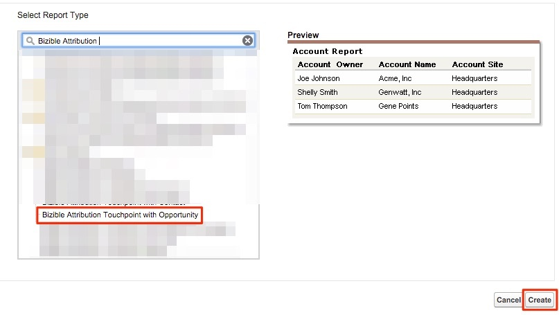
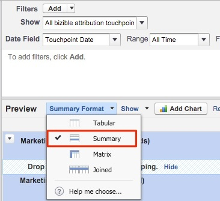
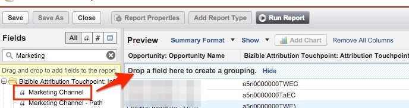

# マーケティングチャネルによる商談 {#opportunities-by-marketing-channel}

このレポートには、マーケティングチャネルによって生成された商談件数が表示されます。この件数には、あらゆる商談が含まれます。 ただし、このレポートをフィルタリングして、特定のタイプの商談を分析できます。

1. Salesforceの「**[!UICONTROL レポート]**」タブをクリックし、**[!UICONTROL 新規レポート]**&#x200B;を選択します。

1. 「Bizible Attribution」のクイック検索タイプで、**[!UICONTROL 商談]** レポートタイプのBizible Attribution Touchpointを選択し、**[!UICONTROL 作成]**&#x200B;を選択します。

   

1. レポートの先頭から、**[!UICONTROL すべてのBizible アトリビューション タッチポイント]**&#x200B;を表示し、レポートを作成する期間に応じて日付フィールドを調整します。 この例では、すべての時間を考慮します。 さらに、レポート形式を[!UICONTROL 表形式]から&#x200B;**[!UICONTROL 概要]**&#x200B;に変更します。

   

1. 次に、レポートにフィールドを追加します。 左側のクイック検索で、「マーケティングチャネル」と入力し、レポートの概要グループに追加します。

   

1. レポートを実行して分析します。

   マーケティングチャネルをまたいで要約したオポチュニティレポートです。 このレポートでは、あらゆる商談に焦点を当てていますが、ステージや機会のタイプに応じて絞り込むことができます。 さらに、レポートを作成するフィールドを自由に追加できます。

>[!MORELIKETHIS]
>
>[[!DNL Marketo Measure]  チュートリアル：Stock SFDC レポート &#x200B;](https://experienceleague.adobe.com/en/docs/marketo-measure-learn/tutorials/onboarding/marketo-measure-102/stock-salesforce-reports){target="_blank"}
