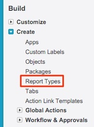

# Buyer Attribution Touchpoints を含む／含まない商談のレポート {#reporting-on-opportunities-with-or-without-buyer-attribution-touchpoints}

>[!NOTE]
>
>ドキュメント内に「[!DNL Marketo Measure]」を指定する手順が記載されている場合がありますが、CRM には引き続き「Bizible」と表示されます。アドビは現在更新に取り組んでおり、ブランディングの変更はまもなく CRM に反映される予定です。

新しいレポートタイプを作成して、バイヤー属性タッチポイントの有無にかかわらずすべての商談を含めます。

1. **[!UICONTROL 設定]**/**[!UICONTROL 作成]**/**[!UICONTROL レポートタイプ]** に移動します。

   

1. **[!UICONTROL 新規カスタムレポートタイプ]** を選択します。

   

1. プライマリオブジェクトを「[!UICONTROL Opportunities]」に設定します。

   * レポート・タイプ・ラベルに「購買担当属性の有無を問わず商談」という名前を付けます。
   * レポートタイプ名にも同じ名前を使用します。 説明入力内に、「バイヤー属性タッチポイントのある商談またはバイヤー属性タッチポイントがない商談」と入力します。
   * 「[!UICONTROL &#x200B; その他 &#x200B;]」内にレポートを保存し、レポートを「[!UICONTROL &#x200B; デプロイ済み &#x200B;]」に設定します。

   

1. そこから、商談オブジェクトをバイヤー属性タッチポイントオブジェクトにリンクします。 ボタン「&#39;A&#39; レコードには関連する&#39;B&#39; レコードがある場合とない場合がある」を選択していることを確認してください。 終了したら「**[!UICONTROL 保存]**」をクリックします。

   

>[!MORELIKETHIS]
>
>[[!DNL Marketo Measure] Tutorials：追加の SFDC レポート ](https://experienceleague.adobe.com/ja/docs/marketo-measure-learn/tutorials/onboarding/marketo-measure-102/addtional-salesforce-reports)
