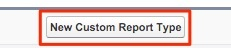

# Buyer Attribution Touchpoints を含む／含まない商談のレポート {#reporting-on-opportunities-with-or-without-buyer-attribution-touchpoints}

>[!NOTE]
>
>ドキュメント内に「[!DNL Marketo Measure]」を指定する手順が記載されている場合がありますが、CRM には引き続き「Bizible」と表示されます。 アドビは現在更新に取り組んでおり、ブランディングの変更はまもなく CRM に反映される予定です。

新しいレポートタイプを作成し、バイヤーアトリビューションタッチポイントの有無にかかわらず、すべての商談を含めます。

1. **[!UICONTROL 設定]** > **[!UICONTROL 作成]** > **[!UICONTROL レポートタイプ]**&#x200B;に移動します。

   

1. **[!UICONTROL 新しいカスタムレポートタイプ]**&#x200B;を選択します。

   

1. プライマリオブジェクトを「[!UICONTROL Opportunities]」に設定します。

   * レポートタイプラベルに「バイヤーアトリビューションの有無に関わらず、商談」という名前を付けます。
   * レポートタイプ名には、同じ名前を使用します。 説明入力内の「バイヤーアトリビューションタッチポイントの有無に関わらず商談」を選択します。
   * 「[!UICONTROL その他]」内にレポートを保存し、レポートを「[!UICONTROL  デプロイ ]」に設定します。

   

1. そこから、商談オブジェクトをBuyer Attribution Touchpoints オブジェクトにリンクします。 「&#39;A&#39; レコードに関連する&#39;B&#39; レコードがある場合とない場合がある」ボタンを選択していることを確認します。 終了したら「**[!UICONTROL 保存]**」をクリックします。

   

>[!MORELIKETHIS]
>
>[[!DNL Marketo Measure]  チュートリアル：その他のSFDC レポート ](https://experienceleague.adobe.com/en/docs/marketo-measure-learn/tutorials/onboarding/marketo-measure-102/addtional-salesforce-reports)
