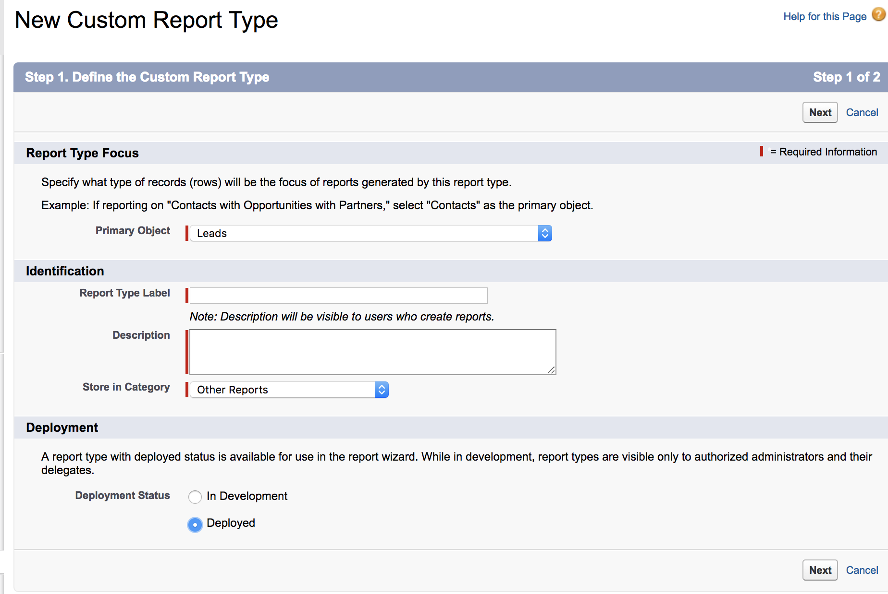
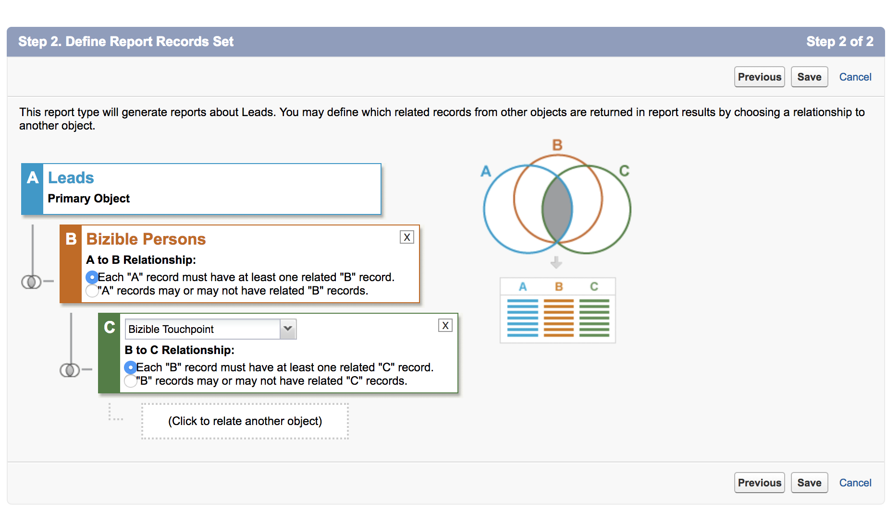
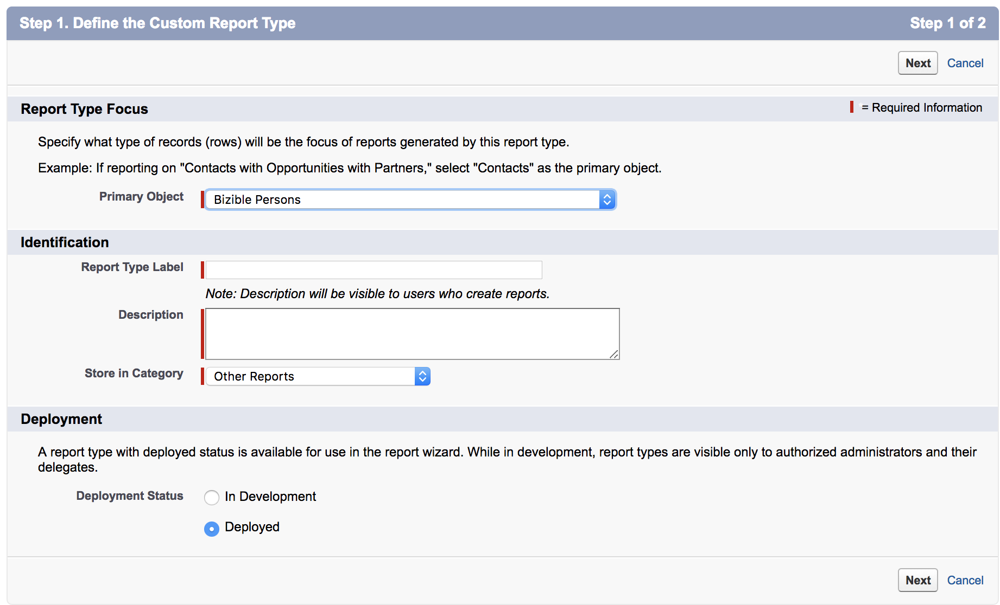
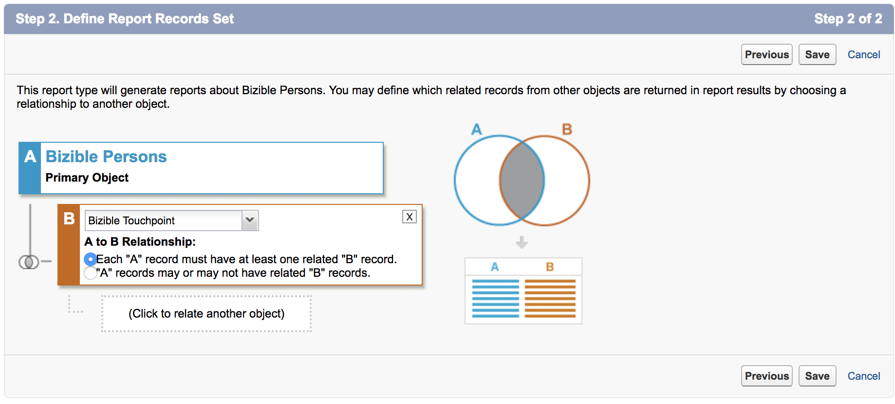
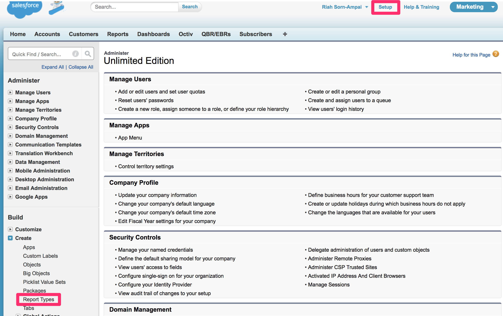
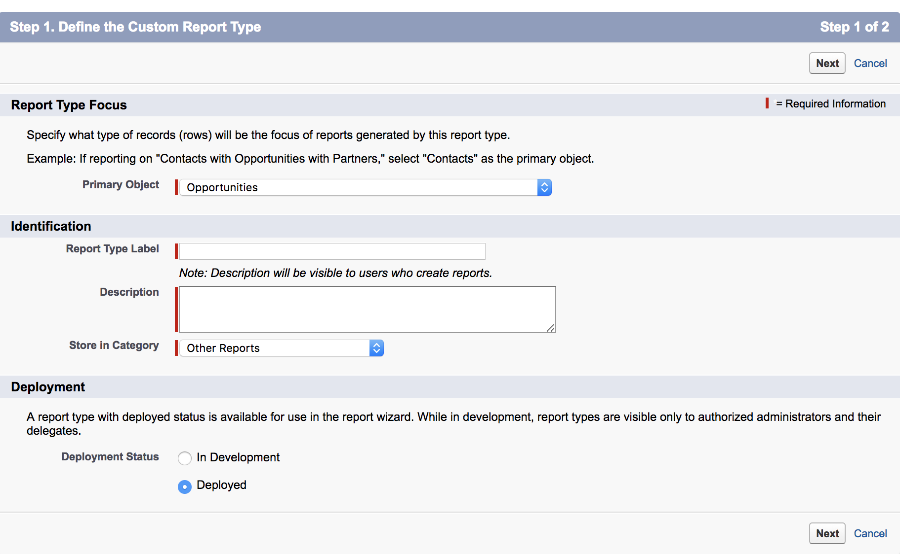
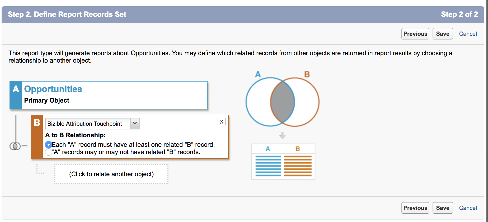
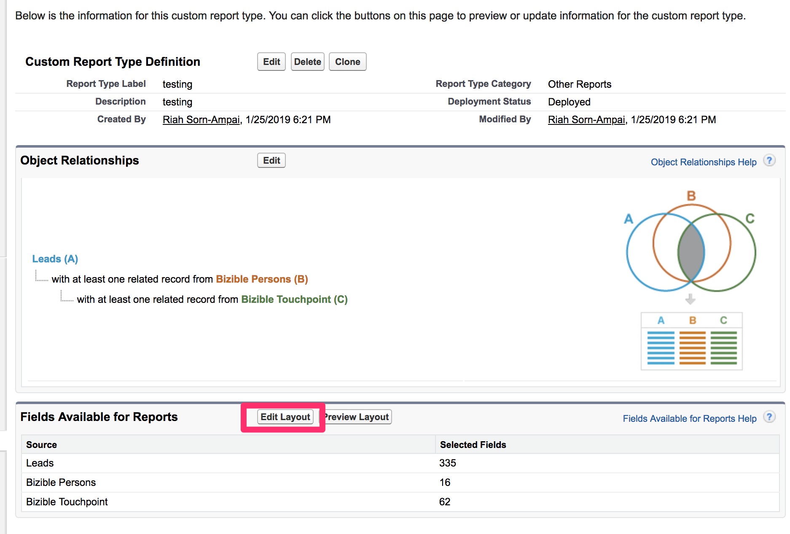
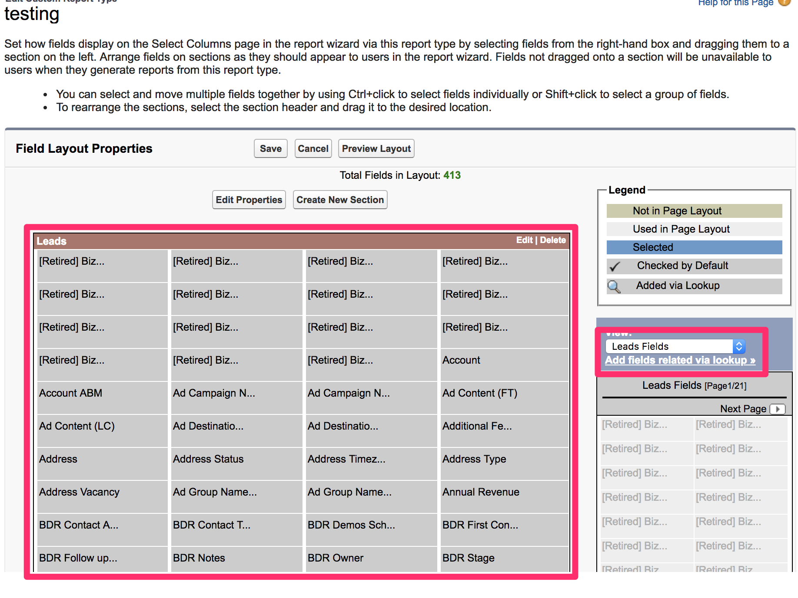

# カスタム [!DNL Marketo Measure] レポートタイプを作成しています {#creating-custom-marketo-measure-report-types}

>[!NOTE]
>
>ドキュメントに「[!DNL Marketo Measure]」を指定する手順が表示される場合がありますが、CRMには「[!DNL Bizible]」が表示されます。 アドビは現在更新に取り組んでおり、ブランディングの変更はまもなく CRM に反映される予定です。

カスタム [!DNL Marketo Measure] [!DNL Salesforce] レポートタイプの作成方法について説明します。 レポートタイプには、購入者の顧客接点を持つリード（カスタム）、購入者の顧客接点を持つ[!DNL Marketo Measure]人（カスタム）、Buyer Attribution Touchpointを使用した商談（カスタム）の3つがあります。

## 顧客接点を持つリード（カスタム） {#leads-with-buyer-touchpoints-custom}

1. **[!UICONTROL 設定]** > **[!UICONTROL ビルド]** > **[!UICONTROL レポートタイプ]** > **[!UICONTROL 新しいカスタムレポートタイプ]**&#x200B;に移動します。

   

1. カスタムレポートタイプを定義します。

   * [!UICONTROL  レポートタイプのフォーカス ] > [!UICONTROL [!UICONTROL プライマリオブジェクト ]]：リード
   * Id > [!UICONTROL  レポートタイプラベル ]：購入者のタッチポイントを持つリード（カスタム）
   * [!UICONTROL  カテゴリーに保存]：その他のレポート
   * [!UICONTROL  デプロイメント ] > [!UICONTROL  デプロイメント状態]：デプロイ済み

   

1. オブジェクトの関係を定義します。

   * リードオブジェクト （A）を[!DNL Marketo Measure]人オブジェクト （B）に関連付け、次にBuyer Touchpoint オブジェクト （C）に関連付けます
   * 「[!UICONTROL 各A/B レコードに少なくとも1つのB/C]」レコードが選択されていることを確認します
   * [!UICONTROL 保存]

   

## バイヤーのタッチポイントを持つ[!DNL Marketo Measure]人（カスタム） {#marketo-measure-person-with-buyer-touchpoints-custom}

1. **[!UICONTROL 設定]** > **[!UICONTROL ビルド]** > **[!UICONTROL レポートタイプ]** > **[!UICONTROL 新しいカスタムレポートタイプ]**&#x200B;に移動します。

   

1. カスタムレポートタイプを定義します。

   * [!UICONTROL  レポートタイプのフォーカス ] > [!UICONTROL プライマリオブジェクト ]: [!DNL Marketo Measure]人
   * [!UICONTROL 識別] > [!UICONTROL  レポートタイプラベル ]: [!DNL Marketo Measure]購入者のタッチポイントを持つ人物（カスタム）
   * [!UICONTROL  カテゴリーに保存]：その他のレポート
   * [!UICONTROL  デプロイメント ] > [!UICONTROL  デプロイメント状態]：デプロイ済み

   

1. オブジェクトの関係を定義します。

   * [!DNL Marketo Measure] Person オブジェクト （A）をBuyer Touchpoint オブジェクト （B）に関連付けます
   * 「[!UICONTROL 各A レコードに少なくとも1つのB]」レコードが選択されていることを確認します
   * [!UICONTROL 保存]

   

## Buyer Attribution Touchpointの活用事例（カスタム） {#opportunities-with-buyer-attribution-touchpoint-custom}

1. **[!UICONTROL 設定]** > **[!UICONTROL ビルド]** > **[!UICONTROL レポートタイプ]** > **[!UICONTROL 新しいカスタムレポートタイプ]**&#x200B;に移動します。

   

1. カスタムレポートタイプを定義します。

   * [!UICONTROL  レポートタイプのフォーカス ] > [!UICONTROL プライマリオブジェクト ]：商談
   * [!UICONTROL Identification] > [!UICONTROL Report Type Label]: Opportunities with Buyer Attribution Touchpoint （カスタム）
   * [!UICONTROL  カテゴリーに保存]：その他のレポート
   * [!UICONTROL  デプロイメント ] > [!UICONTROL  デプロイメント状態]：デプロイ済み

   

1. オブジェクトの関係を定義します。

   * Opportunities オブジェクト（A）とBuyer Attribution Touchpoint オブジェクト（B）の関連付け
   * 「[!UICONTROL 各A レコードに少なくとも1つのB]」レコードが選択されていることを確認します
   * [!UICONTROL 保存]

   

## カスタムレポートタイプへのカスタムフィールドの追加 {#adding-custom-fields-to-custom-report-types}

1. レポートを作成すると、レポートタイプの概要にリダイレクトされます。 「**[!UICONTROL レイアウトを編集]**」をクリックします。

   

1. レポートに追加するカスタムフィールドが、「フィールドレイアウトのプロパティ」セクションに表示されていることを確認します。 追加する他のフィールドがある場合は、「[!UICONTROL  ルックアップを使用して関連するフィールドを追加]」オプションを使用します。

   
