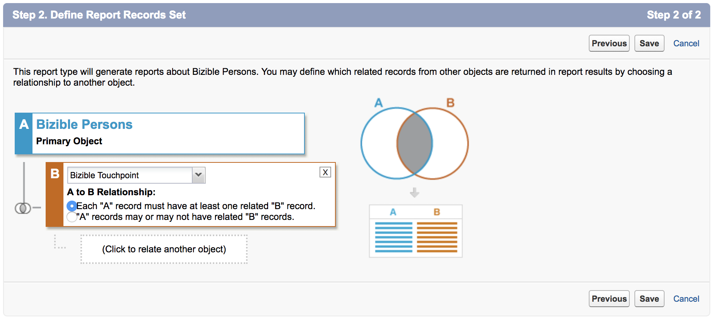

# カスタム [!DNL Marketo Measure] レポートタイプの作成 {#creating-custom-marketo-measure-report-types}

>[!NOTE]
>
>ドキュメントに「[!DNL Marketo Measure]」を指定する手順が表示される場合がありますが、CRM には「[!DNL Bizible]」が表示されます。 アドビは現在更新に取り組んでおり、ブランディングの変更はまもなく CRM に反映される予定です。

カスタム [!DNL Marketo Measure] [!DNL Salesforce] レポートタイプを作成する方法を説明します。 購入者タッチポイントを持つリード（カスタム）、購入者タッチポイントを持つ人物（カスタム）、Buyer Attribution Touchpointを持つ商談（カスタム）の 3 つの異なるレポートタイプを作成することをお勧 [!DNL Marketo Measure] します。

## 買い手タッチポイントを使用したリード （カスタム） {#leads-with-buyer-touchpoints-custom}

1. **[!UICONTROL 設定]**/**[!UICONTROL ビルド]**/**[!UICONTROL レポートタイプ]**/**[!UICONTROL 新規カスタムレポートタイプ]** に移動します。

   

1. カスタムレポートタイプを定義します。

   * [!UICONTROL  レポートタイプのフォーカス ] > [!UICONTROL [!UICONTROL プライマリオブジェクト ]]: リード
   * 識別/[!UICONTROL  レポートタイプラベル ]：購入者タッチポイントを持つリード（カスタム）
   * [!UICONTROL  カテゴリ内に保存 ]：その他のレポート
   * [!UICONTROL  デプロイメント ]/[!UICONTROL  デプロイメントステータス ]：デプロイ済み

   

1. オブジェクトの関係を定義します。

   * リードオブジェクト（A）を [!DNL Marketo Measure] ースユーザーオブジェクト（B）に関連付け、次にBuyer Touchpointオブジェクト（C）に関連付けます
   * 「[!UICONTROL  各 A/B レコードには少なくとも 1 つの B/C] が必要」レコードが選択されていることを確認します
   * [!UICONTROL  保存 ]

   

## 買い手タッチポイントを持つ [!DNL Marketo Measure] Person （カスタム） {#marketo-measure-person-with-buyer-touchpoints-custom}

1. **[!UICONTROL 設定]**/**[!UICONTROL ビルド]**/**[!UICONTROL レポートタイプ]**/**[!UICONTROL 新規カスタムレポートタイプ]** に移動します。

   

1. カスタムレポートタイプを定義します。

   * [!UICONTROL  レポートタイプのフォーカス ] > [!UICONTROL プライマリオブジェクト ]: [!DNL Marketo Measure] 人
   * [!UICONTROL ID]/[!UICONTROL  レポートタイプラベル ]：購入者タッチポイントを持つ [!DNL Marketo Measure] ユーザー（カスタム）
   * [!UICONTROL  カテゴリ内に保存 ]：その他のレポート
   * [!UICONTROL  デプロイメント ]/[!UICONTROL  デプロイメントステータス ]：デプロイ済み

   

1. オブジェクトの関係を定義します。

   * [!DNL Marketo Measure] Person オブジェクト（A）とBuyer Touchpoint オブジェクト（B）の関連付け
   * 「[!UICONTROL  各 A レコードには少なくとも 1 つの B が必要 ]」レコードが選択されていることを確認します
   * [!UICONTROL  保存 ]

   

## Buyer Attribution Touchpointを使用した商談（カスタム） {#opportunities-with-buyer-attribution-touchpoint-custom}

1. **[!UICONTROL 設定]**/**[!UICONTROL ビルド]**/**[!UICONTROL レポートタイプ]**/**[!UICONTROL 新規カスタムレポートタイプ]** に移動します。

   

1. カスタムレポートタイプを定義します。

   * [!UICONTROL  レポートタイプのフォーカス ] > [!UICONTROL プライマリオブジェクト ]：商談
   * [!UICONTROL ID]/[!UICONTROL  レポートタイプラベル ]:Buyer Attribution Touchpointに関する商談（カスタム）
   * [!UICONTROL  カテゴリ内に保存 ]：その他のレポート
   * [!UICONTROL  デプロイメント ]/[!UICONTROL  デプロイメントステータス ]：デプロイ済み

   

1. オブジェクトの関係を定義します。

   * 商談オブジェクト（A）とBuyer Attribution Touchpointオブジェクト（B）の関連付け
   * 「[!UICONTROL  各 A レコードには少なくとも 1 つの B が必要 ]」レコードが選択されていることを確認します
   * [!UICONTROL  保存 ]

   

## カスタムレポートタイプへのカスタムフィールドの追加 {#adding-custom-fields-to-custom-report-types}

1. レポートが作成されると、レポートタイプの概要にリダイレクトされます。 **[!UICONTROL レイアウトを編集]** をクリックします。

   

1. レポートに追加するカスタムフィールドが「フィールドレイアウトのプロパティ」セクションに表示されていることを確認します。 追加したい他のフィールドがある場合は、「[!UICONTROL  ルックアップ経由で関連するフィールドを追加 ]」オプションを使用します。

   
