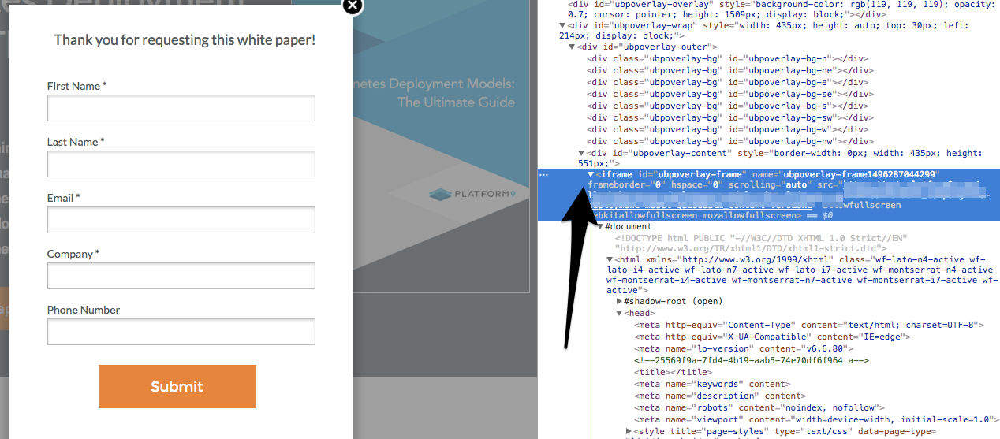

# Lightbox Formsへの[!DNL Marketo Measure] スクリプトの追加 {#adding-marketo-measure-script-to-lightbox-forms}

ライトボックス内のフォームに[!DNL Marketo Measure] JavaScriptを適切に追加する方法について説明します。

ライトボックスは、訪問者が特定のアクション（ページの特定の部分をクリックしたり、ページで特定の時間を過ごしたりなど）を実行すると、コンテンツの前にフォームを開きます。 通常、[!DNL Marketo Measure] JavaScriptをランディングページの先頭に配置することを求めますが、ライトボックス内のフォームの場合は、必要な手順が1つ増えています。

ライトボックス内のフォームは基本的にiFrame内のフォームなので、スクリプトはそのiFrame内に配置されます。

まず、[!UICONTROL lightbox] フォームが存在するiFrameを見つけます。

次に、[!DNL Marketo Measure] JavaScriptをiFrame内に配置します。

最後に、JavaScriptが追加されると、次の手順に従ってフォーム送信を追跡しているかどうかを検証します。

1. [!UICONTROL lightbox] フォームを含むランディングページのURLをコピーします。
1. シークレットブラウザーを開き、URLを貼り付けます。
1. 一意の電子メールアドレスを使用してフォームを送信します。
1. 使用した一意のメールアドレスのCRMを確認して、テストが追跡されたことを確認し、タッチポイントデータが入力されていることを確認します。
