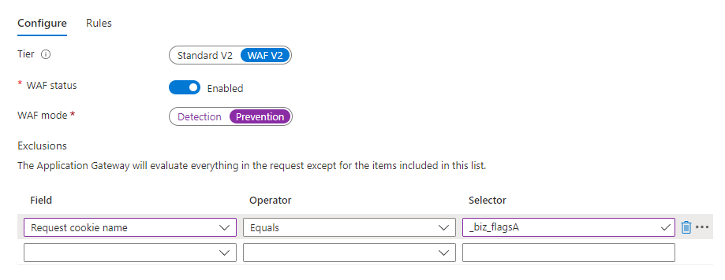

# [!DNL Marketo Measure] スクリプトの追加 {#adding-marketo-measure-script}

[!DNL Marketo Measure] で追跡する [!DNL Marketo Measure] JavaScript は、できるだけ早くすべての web プロパティに追加する必要があります。 JavaScriptがデプロイされると、[!DNL Marketo Measure]はデジタルデータの収集を開始します。 この記事では、[!DNL Marketo Measure] JavaScriptをデプロイする方法とその他の考慮事項について説明します。

>[!NOTE]
>
>[!DNL Marketo Measure] JavaScript のデプロイに加えて、[適切なドメインをすべて  [!DNL Adobe Admin Console]](/help/domain-management.md){target="_blank"} で要求する必要があります。

[!DNL Marketo Measure] の使用を開始する際、[!DNL Marketo Measure] JavaScript を web サイトに追加するには次の 2 つの方法があります。

* ハードコード
* タグ管理システム

## ハードコード {#hard-coding}

ベストプラクティスとして、[!DNL Marketo Measure] JavaScript を web プロパティにハードコードすることを強くお勧めします。 スクリプトをハードコーディングするには、サイトのすべてのページで`</head>`を閉じる前にスクリプトを配置する必要があります。

``

JavaScriptをページの`<head>`にハードコーディングすることで、[!DNL Marketo Measure] スクリプトが最初に読み込まれ、参照情報が見落とされることはありません。 [!DNL Marketo Measure] JavaScript は非同期で読み込まれます。 ハードコードする場合は、JavaScript をマーケティングオートメーションに手動で追加する必要があります。

>[!TIP]
>
>スクリプトがGDPRに準拠していることを確認する方法を説明します。

## タグ管理システム {#tag-management-systems}

ハードコーディングを使用して[!DNL Marketo Measure] JavaScriptを追加できない場合は、[!DNL Google Tag Manager] （GTM）やTealiumなどのTag Management システムを使用して[!DNL Marketo Measure] スクリプトを追加することもできます。

タグ管理システムを使用して[!DNL Marketo Measure] JSをデプロイすると、スクリプトの読み込み時間の遅延により、データが5～10%損失する可能性があります。 基本的に、タグ管理ツールが十分に早く読み込まれない場合、[!DNL Marketo Measure] JS も十分に早く読み込むことができず、最初のリファラー情報が失われる可能性があります。

一般的な方法として、タイミング／リソースがハードコードに移行するのが適切になるまで、タグ管理ツールを通じて [!DNL Marketo Measure] JS をデプロイします。

タグ管理ソリューションを通じて[!DNL Marketo Measure] スクリプトを追加するには、タグを作成し、その中にJavaScriptを追加する必要があります。 このタグを、追跡する web サイト上のすべてのページに適用します。

[!DNL Marketo Measure] では、すべてのページビューでタグが起動されるようにすることをお勧めします。 また、[!DNL Marketo Measure]に起動順序の最優先度を与え、最高のデータ品質を確保するために、[!DNL Marketo Measure] タグの前に同期スクリプトがないことを確認することをお勧めします。

詳しくは、[こちらを参照](/help/marketo-measure-tracking/adding-marketo-measure-script-via-google-tag-manager.md){target="_blank"}してください。

## 追加の考慮事項 {#additional-considerations}

[!DNL Marketo Measure] JavaScript はドメインベースであるので、JavaScript がページ上にあり、ルートドメインが Marketo Measure アカウントの作成に使用されたドメインと同じである限り、任意のサブドメインを自動的に処理できます。

ただし、個別のドメインまたは国際ドメインを使用している場合は、[!DNL Marketo Measure] コンサルタントに必ずお知らせください。 [!DNL Marketo Measure]が追加ドメインのデータをアカウントに結びつけることを認識できるように、[!DNL Marketo Measure]側でドメインをアカウントに手動で追加する必要があります。 したがって、個別のドメインまたは国際別のドメインを[!DNL Marketo Measure] コンサルタントに送信します。

サードパーティのページを使用している場合は、[!DNL Marketo Measure] コンサルタントとユースケースについて話し合います。 一般に、[!DNL Marketo Measure] JavaScriptのカスタムバージョンを追加して、必要に応じてこれらのページをトラッキングできるかどうかを確認する必要があります。 これが不可能な場合は、CRM Campaignのタッチポイントを介したトラッキングが[!DNL Marketo Measure] コンサルタントと共に検索されます。

[!DNL Marketo Measure]がアトリビューションに対して必ずしも意味を持たないため、トラッキングすべきでないフォームはありますか（登録解除フォームや顧客ログインなど）? その場合は、この記事](/help/marketo-measure-tracking/excluding-marketo-measure-from-specific-forms.md){target="_blank"}の除外コード [を各フォームに追加します

セキュリティで保護されていないページはありますか？ 安全なページと安全でないページの間を移動すると、トラッキングセッションが壊れるので、それらを保護する必要があります。

必ず web チームと話し合って、[!DNL Marketo Measure] JavaScript を常に適切な web プロパティに配置する必要があることを理解する必要があります。 新しいページ／フォーム／サイトを導入する場合は、[!DNL Marketo Measure] JavaScript のデプロイがプロトコルの一部であることを確認します。

JavaScriptの設定中に[!DNL Web Application Firewall (WAF)]の警告がトリガーされた場合、次の例に示すように、ユーザーはWAF ルールを無効にするか、Cookieを許可リストに加えるできます。

の間にトリガーされた場合

## 特別な注意を払うべきフォーム {#forms-to-pay-extra-attention-to}

**複数フォームの送信**

* 問題：1回のフォーム送信の一環として複数のリンクされたフォームがある場合、フォーム全体が送信されなくても、最初のフォームがタッチポイントを生成する可能性があります。
* 解決策：キャッシュされたデータに基づいてユーザーを[!DNL Marketo Measure]に報告し、放棄の慣行について話し合うために、いずれかのフォームを強制する必要があります。 一般に、[レポートユーザーコード](/help/marketo-measure-tracking/ajax-form-handling.md){target="_blank"}でこれを解決できます。

**アカウントログイン（未作成）**

* 問題：[!DNL Marketo Measure] では、アトリビューションストーリーが希薄になる傾向があるので、その後のアカウントログインではタッチポイントを作成しないことをお勧めします。
* 解決策：除外コードをアカウント／顧客／パートナーのログインフォームに追加します。

>[!NOTE]
>
>アカウントまたは体験版を作成するためのタッチポイントを作成することをお勧めします。

**アセットのダウンロード**

* 問題：アセットがゲート化されている場合、[!DNL Marketo Measure]はダウンロードをフォーム入力として追跡します。 アセットがゲートされていない場合、カスタマイズせずにレポートできる内容には制限があります。
* 解決策：[!DNL Marketo Measure] JavaScript で追跡する場合は、アセットの出入りを制御します。 それはできないけれど、そのためのタッチポイントは気に入っているという場合は、代わりに CRM キャンペーンを同期することを検討します。

**iFrame**

* 問題：iFrame は、基本的にページ内のページとして機能します。
* 解決策：[!DNL Marketo Measure] JSをフォームに正しく添付するには、iFrame ヘッダー内に直接デプロイする必要があります。

**Lightbox**

* Lightbox は通常、iFrame を含むポップアップです
* 解決策：[!DNL Marketo Measure] JS は、ホストされる iFrame のヘッダー内にデプロイする必要があります。

**ページ上の複数のフォーム**

* 問題：ページ上に複数のフォームがホストされる場合、[!DNL Marketo Measure] フォーム URL フィールドに入力された特定のフォームがわからない場合があります。
* 解決策：入力されたフォームを把握する必要がある場合は、web チームで動的URL ハッシュを設定する方法を確認してください。

**`
` 形式で編成されるフォーム**

* 問題：[!DNL Marketo Measure] JS は、`
` 形式で編成されるフォームを認識するのが難しいので、カスタムコードが必要になる場合があります。
* 解決策：これらの[レポートユーザーテンプレート](/help/marketo-measure-tracking/ajax-form-handling.md){target="_blank"}は、web 開発チームが必要なコードを追加するために使用できます。

**チャット**

* 問題：チャットプロバイダーを使用する場合は、特別な処理が必要になる場合があります。
* 解決策：[!DNL Marketo Measure] は、Drift、Olark、Livechat、LivePerson、SnapEngage と統合されています。 他のすべてのプラットフォームは、CRM キャンペーンメンバーシップを通じて追跡する必要があります。

**2 番目のドメイン**

* 問題：[!DNL Marketo Measure] JavaScriptはドメイン固有であるため、個別または国際的なドメインに対して追加の手順を実行する必要があります。[!DNL Marketo Measure] JSは、同じルートドメインのサブドメインを処理できます。
* 解決策：複数のルートドメインを所有しており、[!DNL Marketo Measure] で追跡する場合は、必ずドメインに JS を追加し、[!DNL Marketo Measure] アカウントに手動で関連付ける必要があるドメインを [!DNL Marketo Measure] コンサルタントにお知らせください。

## [!DNL Marketo Measure] JavaScript のテスト {#testing-marketo-measure-javascript}

[!DNL Marketo Measure] コンサルタントは、すべてのページに[!DNL Marketo Measure] JavaScriptが存在することを確認するために、web サイトのスポット テストを支援します。 このテストの一部では、トラッキングが正しく返されるように、明確に示されたテストの詳細を含む数種類のフォーム入力者を送信します。

ただし、[!DNL Marketo Measure] コンサルタントは、web チームほど web サイトに精通していない可能性があります。 このため、特に上記のような複雑なフォームを使用している場合は、web チームまたはその他の適切なチームが web サイトを徹底的にチェックすることが非常に重要です。 必要なすべての web プロパティが適切に追跡されていることを確認するのは最終的にチームの責任ですが、複雑なフォームや状況を認識している場合は、[!DNL Marketo Measure] コンサルタントにテストのサポートを依頼してください。

自分でフォームをテストするには、次の手順に従います。

1. 各フォーム送信テストの間には、常に匿名ブラウザーを使用するかキャッシュをクリアし、毎回異なるメールアドレスを使用します。

   a. ベストプラクティスは、テストであることを示す何かを含む偽の電子メールを使用し、時間帯を指定することです。 例：testing830am@test.com。

1. フォームを送信するページのURLと、使用したメールを記録します。

1. そのフォーム送信に対して CRM（リードまたは連絡先）で作成されたレコードを見つけて、タッチポイントが適切に作成されたことを確認します。

   a. リードとバイヤーのタッチポイントを含む[!DNL Marketo Measure]件のストックレポートを使用できます。または、[!DNL Marketo Measure]件の詳細でページレイアウトを更新することを選択した場合は、リード/連絡先ページレイアウトを参照してください。

   b. データが処理されるまでに時間がかかることがあります。
