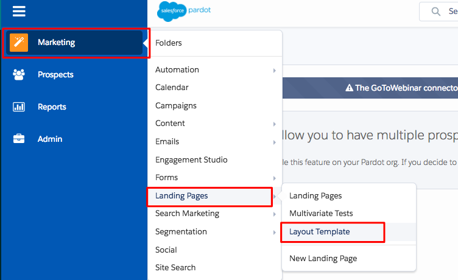
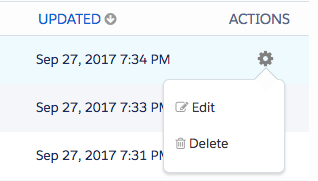

# [!DNL Marketo Measure] JavaScriptを[!DNL Pardot]に追加しています {#adding-marketo-measure-javascript-to-pardot}

[!DNL Pardot]個のフォームでは、フォーム送信を認識するために[!DNL Marketo Measure]がサイト上でスクリプトを実行する以外に、フォームテンプレート内での処理が追加される必要があります。 このプロセスは簡単です。[!DNL Marketo Measure] トラッキングスクリプトを[!DNL Pardot] フォームテンプレートに配置するだけで済みます。

## ステップバイステップ方式のチュートリアル {#step-by-step-instructions}

[!DNL Pardot] アカウントにログインしたら、次の手順に従います。

1. **[!UICONTROL Marketing]**&#x200B;に移動します。

1. 「**[!UICONTROL ランディングページ]**」をクリックします。

1. **[!UICONTROL レイアウトテンプレート]**&#x200B;を選択します。

   

1. 適切なレイアウトテンプレートを決定し、右側の&#x200B;**[!UICONTROL 編集]**&#x200B;をクリックします。

   

1. HTML ページのクローズヘッダータグの直前に[!DNL Marketo Measure] JavaScript コードをコピーして貼り付けます。

   `<script type="text/javascript" src="https://cdn.bizible.com/scripts/bizible.js" async=""></script>`

1. 該当するすべてのランディングページレイアウトテンプレートについて、次の手順に従います。

1. [!DNL Marketo Measure] JavaScriptが一般サイトページにも表示されていることを確認します。

   [!DNL Pardot] レイアウト テンプレート内では、コードは次のようになります。

```text
<script type="text/javascript" src="https://cdn.bizible.com/scripts/bizible.js" async=""></script>
   </head>
   <body>
```

## そのほかの備考 {#additional-notes}

[!DNL Pardot] IFrameに次のHTML タグがある場合：

`<base href="http://go.pardot.com">`

_および_ IFrame自体は、実際には安全でないページ （HTTP）ではなく安全なページ （HTTPS）です。[!DNL Pardot] IFrameでスクリプトを読み込むと、ブラウザーはHTTPS ページにスクリプトのHTTP バージョンを読み込もうとしますが、これは失敗し、トラッキングが失敗します。 解決策は、[!DNL Pardot] IFrameのスクリプトを更新して、スクリプトの安全なバージョンを読み込むことです。

`<script type="text/javascript" src="https://cdn.bizible.com/scripts/bizible.js" async=""></script>`

この領域には、[!DNL Google Analytics] コードなど、他のトラッキングコードスニペットが既に存在する可能性があります。 次の例のように、セミコロン `;`と1つのスペースで区切ってください。

`<script type="text/javascript" src="https://cdn.bizible.com/scripts/bizible.js" async=""></script>; <script async="true" type="othercode_example" src="otherfile_example.js" ></script>`
