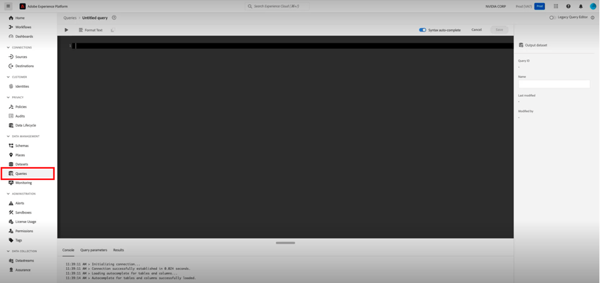

# [!DNL Marketo Measure] Ultimate 実装ガイド {#marketo-measure-ultimate-implementation-guide}

この記事は、Marketo Measure Ultimate の実装ガイドとして機能します。この記事では、統合と利用を確実に成功させるための明確な手順とインサイトについて説明します。

## Ultimate と標準の階層を比較した場合の主な違い {#main-differences-when-using-ultimate-over-standard-tiers}

AEP を使用して B2B データをインポート：マーケターは、AEP を使用して B2B データ（例えば、アカウント、商談、連絡先、リード、キャンペーン、キャンペーンメンバー、アクティビティ）を取り込む必要があります。 ほとんどの任意のデータソースと同じタイプの複数のデータソースから取り込み、すべてのデータを取り込んで属性を設定します。

* Salesforce や Dynamics だけでなく、ほとんどすべての CRM で使用できます。
* 複数の CRM インスタンスや MAP インスタンスを 1 つの Marketo Measure インスタンスに接続します。
* サードパーティのウェビナー登録および参加データを取り込みます。

CRM および Marketo Engage の直接接続は、Ultimate では使用できなくなりました。

* Ultimate では、データは CRM にプッシュされません。お客様は、Data Warehouse のデータを使用できます。
* マーケターは、引き続きMarketo Measure JavaScript を使用した直接接続と追跡 Web アクティビティを通じて Ad Platform データを取り込みます。

Ultimate ユーザーは AEP にプロビジョニングされます。 既に AEP がある場合、新しいインスタンスは再プロビジョニングされません。

* プロビジョニングされた AEP バージョンには、すべてのソースコネクタ、スキーマデータモデリング、データセット、アドホッククエリサービス、Marketo Measure専用の宛先が含まれます。

詳しくは、[Marketo Measure Ultimate](/help/marketo-measure-ultimate/marketo-measure-ultimate-overview.md){target="_blank"}を参照してください。

## スキーマおよびデータセット {#schemas-and-datasets}

>[!NOTE]
>
>スキーマ、クラス、フィールドグループの概要については、[スキーマのビルディングブロック](https://experienceleague.adobe.com/docs/experience-platform/xdm/schema/composition.html?lang=ja#building-blocks-of-a-schema){target="_blank"}を参照してください。

**XDM スキーマ = クラス + スキーマフィールドグループ&#42;**

* 必須フィールドは変更できません。必要に応じて、カスタムフィールドを作成して追加できます。
* 階層に基づくフィールド名の例：accountOrganization.annualRevenue.amount

&#42; _スキーマは、クラスとゼロ以上のスキーマフィールドグループで構成されます。つまり、フィールドグループを使用せずにデータセットのスキーマを作成できます。_

[データセットの概要](https://experienceleague.adobe.com/docs/experience-platform/catalog/datasets/overview.html?lang=ja){target="_blank"}：AEP に正常に取り込まれたすべてのデータは、データレイク内にデータセットとして保持されます。データセットは、スキーマ（列）とフィールド（行）を含むテーブルなど、データの集まりのストレージと管理の構成体です。

## スキーマの作成 {#creating-a-schema}

10 個の標準 B2B スキーマを作成する場合は、自動生成ユーティリティを使用することをお勧めします。

* ユーティリティをダウンロードして設定する手順については、[こちらを参照してください](https://experienceleague.adobe.com/docs/experience-platform/sources/connectors/adobe-applications/marketo/marketo-namespaces.html?lang=ja#set-up-b2b-namespaces-and-schema-auto-generation-utility){target="_blank"}。

_**CDP 資格**_&#x200B;のあるユーザの場合：ソースページに移動してスキーマを作成します。

* ソースから、データを追加／テンプレートを使用を選択します。

* 10 個の標準 B2B スキーマを作成するには、アカウントとすべての B2B テンプレートを選択します。

## データフロー {#dataflows}

>[!IMPORTANT]
>
>新しいデータセットを追加する場合は、既存のデータセットを使用するのではなく、フローを作成することをお勧めします。

[データフローの概要](https://experienceleague.adobe.com/docs/experience-platform/dataflows/home.html?lang=ja){target="_blank"}

**データフローの作成手順を以下に示します。**

1. ソースを選択します。
1. 既存のアカウントを選択するか、アカウントを作成します。
1. ソースから読み込むために使用可能なタイプのリストからデータタイプを選択します。
1. 既存のデータセットを選択するか、データセットを作成します。
1. フィールドをソースからスキーマにマッピングします。

   >[!NOTE]
   >
   >* 1 つのスキーマタイプを別の同一のスキーマタイプにマッピングすると、自動的に実行されます。
   >* また、システム内の別のフローからマッピングを読み込むこともできます。
   >* 1 つのソースフィールドを複数の宛先フィールドにマッピングすることはできますが、その逆はできません。
   >* 計算フィールド（[データ準備マッピング関数](https://experienceleague.adobe.com/docs/experience-platform/data-prep/functions.html?lang=ja){target="_blank"}）を作成できます。

   >[!CAUTION]
   >
   >* データフローは編集できますが、マッピングが変更された場合はデータはバックフィルされません。
   >* 必須フィールドが NULL の場合、フロー全体が拒否されます。

   >[!NOTE]
   >
   >[Marketo Measure Ultimate のデータ整合性要件](/help/marketo-measure-ultimate/data-integrity-requirement.md){target="_blank"}

1. データの読み込みケイデンスを設定します。
1. レビューして完了します。
1. データフローステータスの測定 UI 設定の「アカウントステータス」ページを確認します。

**監視：**

ソース／データフローページで、データフローのステータスを確認します

* データセットのアクティビティの詳細を表示するには、データセットをクリックするだけです。
* データフローエラーを表示するには、データフローを選択し、データフローの実行を選択して、「エラー診断のプレビュー」をクリックします。

## データ検査 {#data-inspection}

オプション 1：UI から直接クエリを実行するには、データ管理の「クエリ」タブにアクセスします。

オプション 2：[PSQL をダウンロードして使用します](https://experienceleague.adobe.com/docs/experience-platform/query/clients/psql.html?lang=ja){target="_blank"}（より高速で信頼性が高くなります）。

## Marketo Measure のデータセットのアクティブ化 {#activate-dataset-for-marketo-measure}

開始する前に、Measure UI 設定の「Experience Platform／サンドボックスマッピング」セクションに移動し、サンドボックスをマッピングします。

>[!CAUTION]
>
>選択した後は変更できません。

1. AEP で、「宛先／Marketo Measure ページ」に移動して、データセットを書き出します。
1. 宛先を設定します。
1. データセットをアクティブ化します。
1. データフローのステータスについては、Measure UI 設定の「アカウントステータス」ページを確認します。

>[!NOTE]
>
>* データフローごとに 1 つのデータセットのみを含めることをお勧めします。
>* 特定のソースの特定のエンティティ（例えば、Account）のデータは、1 つのデータセットにのみ取り込むことができます。 各データセットは、1 つのデータフローにのみ含めることができます。違反は、実行時にデータフローを停止します。
>* AEP で宛先全体を削除して、Measure のデータを削除します。無効にすると、新しいデータのエクスポートが停止し、古いデータが保持されます。
>* Measure 設定はほとんど同じように見えますが、ステージマッピングなどの一部は異なります。
>* 新しいデータフローでフロー実行が生成されるまでに数時間かかり、その後は 1 時間ごとに定期的に実行されます。

「測定」で、デフォルトの通貨を「通貨」セクションで設定する必要があります。

* 複数の通貨を使用する場合、通貨換算レートスキーマを AEP に入力して、アドビが読み取り、換算に使用できるようにする必要があります。

**ステージマッピング：**

ユーザデータからステージは自動的に読み込まれないので、すべてのステージを手動でマッピングする必要があります。

* ユーザーは、様々なソースからステージをマッピングできます。

ステージをマッピングしていない場合、データを処理する場所がないので、システムは機能しません。

Marketo Measure Ultimate のお客様で、デフォルトのダッシュボードオブジェクトを連絡先に設定している場合は、リード ([詳細はこちら](/help/marketo-measure-ultimate/data-integrity-requirement.md){target="_blank"}) をクリックします。

* b2b.personStatus
* b2b.isConverted

**キャンペーンメンバールール：**

データセットを選択し、それぞれにルールを設定します。

**エクスペリエンスイベントルール：**

データセットを選択し、アクティビティのタイプを選択します。

* カスタムアクティビティはまだサポートしていません。
* お客様が使用可能なオプションに該当しないアクティビティを行っている場合は、「注目のアクション」として分類し、カスタムフィールドを使用して区別することをお勧めします。

**オフラインチャネル：**

* データセット固有のチャネルマッピングルールは実行しないので、これはグローバルです。
* 最終的に CRM キャンペーンタイプとチャネルの両方を照合する必要がありますが、現時点では、回避策として両方のフィールドにチャネル名をマッピングできます。
* **チャネルルール：バックフィルしたデータには、ステージ遷移データは含まれません。**

タッチポイントとセグメントの設定は変わりません。
