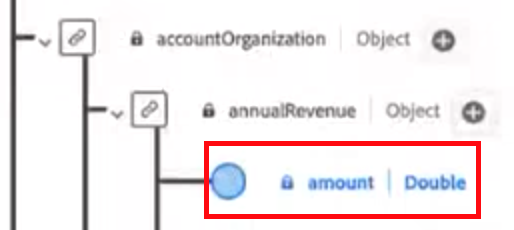
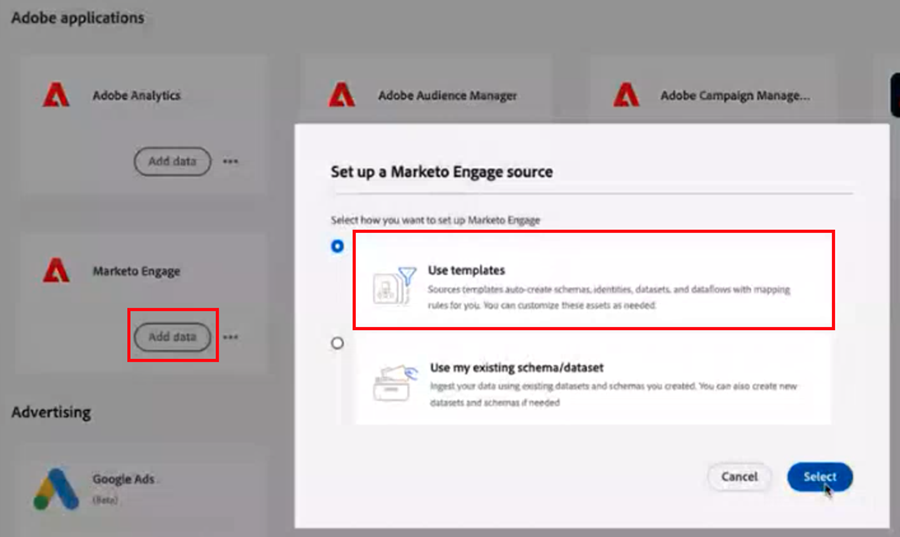
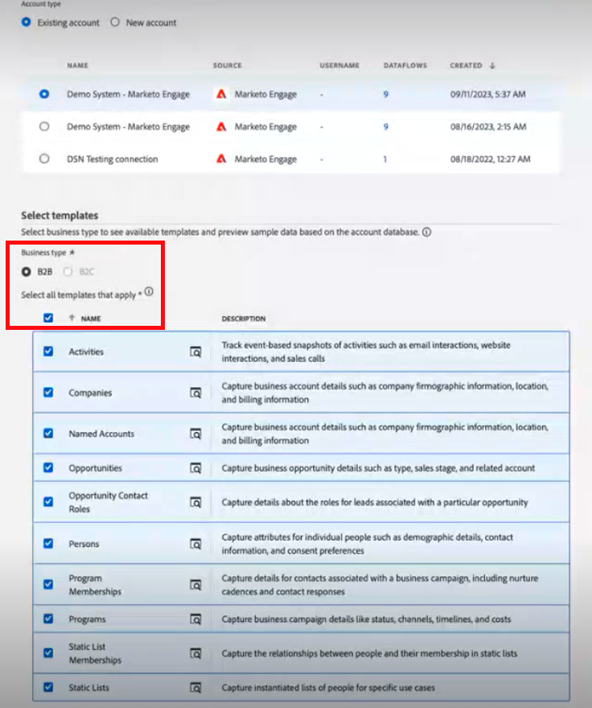
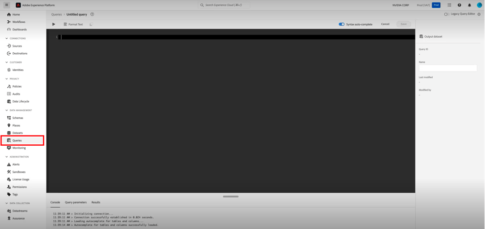
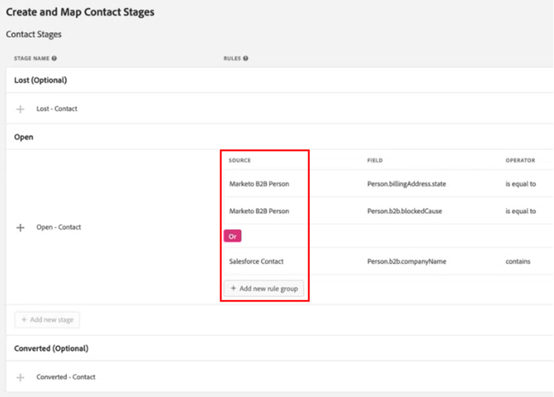

# [!DNL Marketo Measure] Ultimate 実装ガイド {#marketo-measure-ultimate-implementation-guide}

この記事は、Marketo Measure Ultimate の実装ガイドとして機能します。この記事では、統合と利用を確実に成功させるための明確な手順とインサイトについて説明します。

## Ultimate と標準の階層を比較した場合の主な違い {#main-differences-when-using-ultimate-over-standard-tiers}

AEPを使用したB2B データの読み込み：マーケターは、AEPを使用してB2B データ（アカウント、商談、連絡先、リード、キャンペーン、キャンペーンメンバー、アクティビティなど）を取り込む必要があります。 ほとんどすべてのデータソースだけでなく、同じタイプの複数のデータソースからも取り込み、すべてのデータをアトリビューションのために取り込みます。

* Salesforce や Dynamics だけでなく、ほとんどすべての CRM で使用できます。
* 複数の CRM インスタンスや MAP インスタンスを 1 つの Marketo Measure インスタンスに接続します。
* サードパーティのウェビナー登録および参加データを取り込みます。

CRM および Marketo Engage の直接接続は、Ultimate では使用できなくなりました。

* Ultimate では、データは CRM にプッシュされません。 お客様は、Data Warehouse のデータを使用できます。
* マーケターは、Marketo Measure JavaScriptを通じて、直接接続を介してAd Platform データを取り込み、web アクティビティをトラッキングし続けています。

Ultimate ユーザーはAEPでプロビジョニングされます。 AEPを既にお持ちの場合は、新しいインスタンスを再プロビジョニングしません。

* プロビジョニングされたAEP バージョンには、すべてのソースコネクタ、スキーマデータモデリング、データセット、アドホッククエリサービス、およびMarketo Measureの宛先のみが含まれます。

詳しくは、[Marketo Measure Ultimate](/help/marketo-measure-ultimate/marketo-measure-ultimate-overview.md){target="_blank"}を参照してください。

## スキーマおよびデータセット {#schemas-and-datasets}

>[!NOTE]
>
>スキーマ、クラス、フィールドグループの概要については、[&#x200B; スキーマのブロックの構築](https://experienceleague.adobe.com/docs/experience-platform/xdm/schema/composition.html?lang=ja#building-blocks-of-a-schema){target="_blank"}を参照してください。

**XDM スキーマ = クラス + スキーマフィールドグループ&#42;**

* 必須フィールドは変更できません。 必要に応じて、カスタムフィールドを作成して追加できます。
* 階層に基づくフィールド名の例：accountOrganization.annualRevenue.amount

&#42; _スキーマは、クラスとゼロ以上のスキーマフィールドグループで構成されます。 つまり、フィールドグループを使用せずにデータセットのスキーマを作成できます。_

[&#x200B; データセットの概要](https://experienceleague.adobe.com/docs/experience-platform/catalog/datasets/overview.html?lang=ja){target="_blank"}: AEPに正常に取り込まれたすべてのデータは、データセットとしてデータレイク内に保持されます。 データセットは、スキーマ（列）とフィールド（行）を含むテーブルなど、データの集まりのストレージと管理の構成体です。

## スキーマの作成 {#creating-a-schema}

自動生成ユーティリティを使用して、10個の標準B2B スキーマを作成することをお勧めします。

* ユーティリティ [をダウンロードして設定する手順については、こちらを参照してください](https://experienceleague.adobe.com/docs/experience-platform/sources/connectors/adobe-applications/marketo/marketo-namespaces.html?lang=ja#set-up-b2b-namespaces-and-schema-auto-generation-utility){target="_blank"}。

_&#x200B;**CDP 資格**&#x200B;_&#x200B;のあるユーザの場合：ソースページに移動してスキーマを作成します。

* ソースから、データを追加／テンプレートを使用を選択します。

* アカウントとすべてのB2B テンプレートを選択して、10の標準B2B スキーマを作成します。

## データフロー {#dataflows}

>[!IMPORTANT]
>
>新しいデータセットを追加する場合は、既存のデータセットを使用するのではなく、フローを作成することをお勧めします。

[データフローの概要](https://experienceleague.adobe.com/docs/experience-platform/dataflows/home.html?lang=ja){target="_blank"}

**データフローの作成手順を以下に示します。**

1. ソースを選択します。
1. 既存のアカウントを選択するか、アカウントを作成します。
1. ソースから読み込むために使用可能なタイプのリストからデータタイプを選択します。
1. 既存のデータセットを選択するか、データセットを作成します。
1. フィールドをソースからスキーマにマッピングします。

   >[!NOTE]
   >
   >* 1つのスキーマタイプを別の同一のスキーマタイプにマッピングすると、自動的に行われます。
   >* また、システム内の別のフローからマッピングを読み込むこともできます。
   >* 1 つのソースフィールドを複数の宛先フィールドにマッピングすることはできますが、その逆はできません。
   >* 計算フィールド （[&#x200B; データ準備マッピング関数](https://experienceleague.adobe.com/docs/experience-platform/data-prep/functions.html?lang=ja){target="_blank"}）を作成できます。

   >[!CAUTION]
   >
   >* データフローを編集することはできますが、マッピングを変更してもデータがバックフィルされません。
   >* 必須フィールドがNULLの場合、フロー全体が拒否されます。

   >[!NOTE]
   >
   >[Marketo Measure Ultimate のデータ整合性要件](/help/marketo-measure-ultimate/data-integrity-requirement.md){target="_blank"}

1. データの読み込みケイデンスを設定します。
1. レビューして完了します。
1. データフローステータスのMeasure UI設定の「アカウントステータス」ページを確認します。

**モニタリング：**

ソース／データフローページで、データフローのステータスを確認します

* データセットのアクティビティの詳細を表示するには、データセットをクリックするだけです。
* データフローエラーを表示するには、データフローを選択し、データフローの実行を選択して、「エラー診断のプレビュー」をクリックします。

## データ検査 {#data-inspection}

オプション 1：UI から直接クエリを実行するには、データ管理の「クエリ」タブにアクセスします。

オプション 2: [PSQL](https://experienceleague.adobe.com/docs/experience-platform/query/clients/psql.html?lang=ja){target="_blank"}をダウンロードして使用する（より高速で信頼性が高い）。

## Marketo Measure のデータセットのアクティブ化 {#activate-dataset-for-marketo-measure}

開始する前に、Measure UI 設定の「Experience Platform／サンドボックスマッピング」セクションに移動し、サンドボックスをマッピングします。

>[!CAUTION]
>
>選択した後は変更できません。

1. AEP で、「宛先／Marketo Measure ページ」に移動して、データセットを書き出します。
1. 宛先を設定します。
1. データセットをアクティブ化します。
1. データフローのステータスについては、Measure UI 設定の「アカウントステータス」ページを確認します。

>[!NOTE]
>
>* データフローごとに1つのデータセットのみを含めることをお勧めします。
>* 特定のソースからの特定のエンティティ（アカウントなど）のデータは、1つのデータセットにのみ格納できます。 各データセットは、1 つのデータフローにのみ含めることができます。 違反すると、実行時にデータフローが停止します。
>* AEP で宛先全体を削除して、Measure のデータを削除します。 無効にすると、新しいデータの書き出しが停止し、古いデータが保持されます。
>* Measure 設定はほとんど同じように見えますが、ステージマッピングなどの一部は異なります。
>* 新しいデータフローでフロー実行が生成されるまでに数時間かかり、その後は 1 時間ごとに定期的に実行されます。

Measureでは、デフォルトの通貨は「通貨」セクションで設定する必要があります。

* 複数の通貨を使用する場合、通貨換算レートスキーマを AEP に入力して、アドビが読み取り、換算に使用できるようにする必要があります。

**ステージマッピング：**

ユーザデータからステージは自動的に読み込まれないので、すべてのステージを手動でマッピングする必要があります。

* ユーザーは、様々なソースからステージをマッピングできます。

ステージをマッピングしていない場合、データを処理する場所がないので、システムは機能しません。

Marketo Measure Ultimate のお客様で、デフォルトのダッシュボードオブジェクトを取引先責任者として設定している場合は、リードに固有の以下の 2 つのフィールドを使用しないでください（[詳しくは、こちらを参照してください](/help/marketo-measure-ultimate/data-integrity-requirement.md){target="_blank"}）。

* b2b.personStatus
* b2b.isConverted

**キャンペーンメンバールール：**

データセットを選択し、それぞれにルールを設定します。

**エクスペリエンスイベントルール：**

データセットを選択し、アクティビティタイプを選択します。

* カスタムアクティビティはまだサポートしていません。
* お客様が使用可能なオプションに該当しないアクティビティを行っている場合は、「注目のアクション」として分類し、カスタムフィールドを使用して区別することをお勧めします。

**オフラインチャネル：**

* データセットに特化したチャネルマッピングルールはないので、これはグローバルになります。
* 最終的にはCRM キャンペーンタイプとチャネルの両方を一致させる必要がありますが、今のところ、回避策として、チャネル名を両方のフィールドにマッピングできます。
* **チャネルルール：バックフィルしたデータには、ステージ遷移データは含まれません。**

タッチポイントとセグメントの設定は変わりません。
