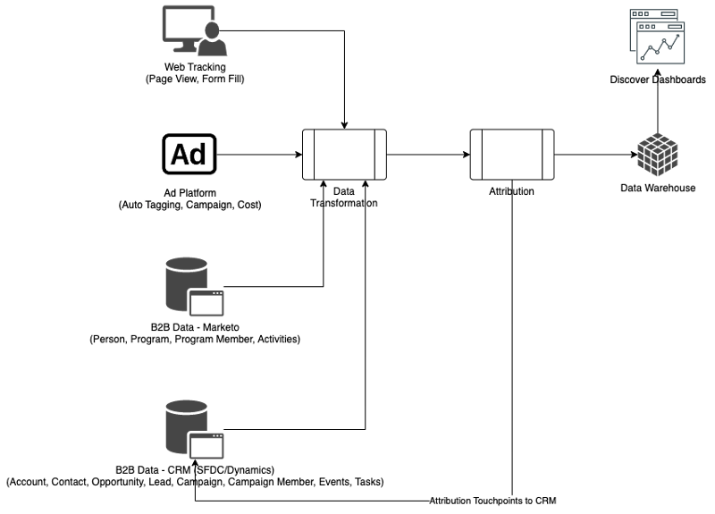

# [!DNL Marketo Measure] Ultimate の概要 {#marketo-measure-ultimate-overview}

[!DNL Marketo Measure]（以前の Bizible）は、マーケターに、収益の促進と、会社の投資回収率の最大化に最も効果的なマーケティング活動に関するインサイトを提供します。[!DNL Marketo Measure] は、チャネルパフォーマンスを自動的にトラッキングしてレポートする、マーケティングアトリビューションソリューションです。顧客エンゲージメントを最も推進しているチャネルを可視化し、それに応じてマーケティング費用を最適化できます。

[!DNL Marketo Measure Ultimate] には、次の追加機能が含まれています。

* ほとんどすべてのデータソースだけでなく、同じタイプの複数のデータソースからも取り込み、すべてのデータをアトリビューションのために取り込みます。
   * Salesforce や Dynamics だけでなく、ほとんどすべての CRM で使用できます。
   * 複数の CRM インスタンスや MAP インスタンスを 1 つの [!DNL Marketo Measure] インスタンスに接続します。
   * サードパーティのウェビナー登録および参加データを取り込みます。

* フィールドマッピングと変換機能を通じて、優れた柔軟性でデータを変換し、適切なデータ形状を確保します。

* 付属の Data Warehouse を通じて、外部アプリケーションでアトリビューションのインサイトを使用できるようにし、インサイトをワークフローに統合します。結果データと BI ベースのレポートを強化します（詳細な結果データへのアクセスと、分析とレポートに任意の BI ツールを使用できる機能を提供する Snowflake Data Warehouse を含む）。

* RTCDP（B2B または B2P エディション）との統合により、RTCDP と [!DNL Marketo Measure] は両方とも一元化された Adobe Experience Platform（AEP）データから機能するので、RTCDP のお客様向けに統合された B2B アトリビューションソリューションを提供できます。

**[!DNL Marketo Measure]の階層 1～3**

**[!DNL Marketo Measure Ultimate]**

## [!DNL Marketo Measure Ultimate] の新機能 {#whats-new-in-marketo-measure-ultimate}

**AEP を通じた B2B データの読み込み**

マーケターは、AEP を通じて B2B データ（アカウント、商談、取引先責任者、リード、キャンペーン、キャンペーンメンバー、アクティビティなど）を取り込む必要があります。CRM および Marketo Engage の直接接続は、Ultimate には使用できなくなりました。マーケターは、引き続き、直接接続を通じて広告プラットフォームデータを取り込み、[!DNL Marketo Measure] JavaScript を通じて web アクティビティをトラッキングします。

**デフォルトの通貨設定**

[!DNL Marketo Measure Ultimate] では、ユーザが変更するまでデフォルトの通貨を USD に設定します。新しいデフォルト通貨を設定すると、再処理せずにデータが更新されます。選択した通貨がターゲット ISO コードとして存在する限り、コンバージョン率を送信する必要はありません。

**[!DNL Marketo Measure Ultimate]サンドボックス**

AEP で [!DNL Marketo Measure] 宛先データフローを作成する前に、[!DNL Marketo Measure Ultimate] インスタンスを AEP サンドボックスにマッピングする必要があります。

>[!NOTE]
>
>[!DNL Marketo Measure Ultimate] 実稼動インスタンスは AEP 実稼動サンドボックスにマッピングする必要があり、[!DNL Marketo Measure Ultimate] 開発者インスタンスは AEP 開発者サンドボックスにマッピングする必要があります。

サンドボックスへのマッピングの選択を保存すると、アプリケーションで変更できません。変更については、[Marketo サポート ](https://nation.marketo.com/t5/support/ct-p/Support){target="_blank"} にお問い合わせください。

特定のデータソースからの特定のエンティティ（アカウントなど）のデータは、1 つのデータセットにのみ入力できます。各データセットは、1 つのデータフローにのみ含めることができます。違反すると、実行時にデータフローが停止します。

**ステージマッピング**

すべての [!DNL Marketo Measure Ultimate] ルールは、データセットに固有です。ステージマッピングルールは、すべてのデータセットと選択したすべてのステージに対して作成する必要があります。

次の 6 つのビルトインのステージがあります。

* 不成立となったリード
* オープンなリード
* コンバージョン済みリード
* 不成立となった商談
* オープンな商談
* 成立した商談

「不成立」、「成立」および「コンバージョン済み」の各セクションでは、カスタムステージを使用できません。ただし、マッピングルールを更新することで、ソースデータをビルトインの不成立／成立／コンバージョン済みステージにマッピングできます。

カスタムステージは、「オープン」セクションに対してのみ定義できます。
ステージマッピングに CRM ステージが自動的に含まれなくなりました。

次の 4 つのビルトインのステージは、ルールを使用してマッピングする必要があります（他の 2 つのマッピングルールである、不成立となったリードとコンバージョン済みリードはオプションです）。

* オープンなリード
* 不成立となった商談
* オープンな商談
* 成立した商談

ルール条件は、データセットに固有です。ステージマッピングルールは、不成立となったリードとコンバージョン済みリードを除くすべてのデータセットとすべてのステージに対して作成する必要があります。

ファネル、ブーメラン、カスタムモデルでは、選択はありません。ファネル、ブーメラン、カスタムモデルでは、すべてのステージが選択されます。サポートするステージの数については、カスタムステージでは 15 個、ビルトインのステージでは 6 個の制限があります。

キャンペーンメンバーのタッチポイントルールとアクティビティのタッチポイントルールは、データセットに固有です。

Ultimate には CRM の直接接続がないので、アトリビューションのタッチポイントは CRM に書き込まれません。

[!DNL Marketo Measure] ABM ML サービス（リードとアカウントのマッチングおよび予測エンゲージメントスコア）は、[!DNL Marketo Measure Ultimate] では使用できません。RT-CDP B2B エディションには、このようなサービスが無料で含まれています。

## 制限事項 {#limitations}

* データ変換ルールで使用できるフィールドは制限されています。
* 既存の階層 1／2／3 ユーザには移行パスはありません。新しい実装が必要ですが、アドビでは、トラッキング対象の web アクティビティデータを既存のインスタンスから移行するお手伝いをします。

>[!MORELIKETHIS]
>
>* [Marketo Measure Ultimateの宛先 ](https://experienceleague.adobe.com/docs/experience-platform/destinations/catalog/adobe/marketo-measure-ultimate.html?lang=ja){target="_blank"}
>
>* [ ビデオ：Marketo Measure Ultimateの概要 ](https://experienceleague.adobe.com/ja/docs/marketo-measure-learn/tutorials/marketo-measure-ultimate/overview){target="_blank"}
