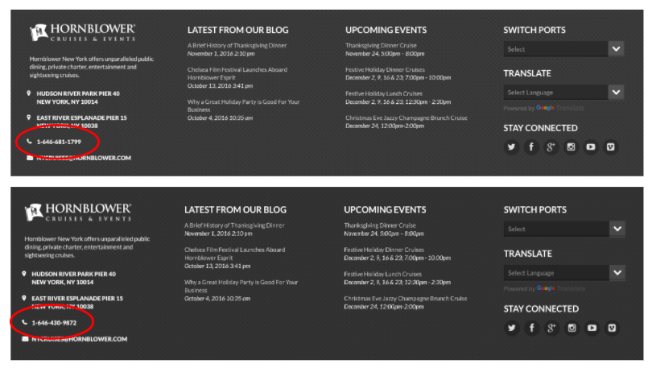
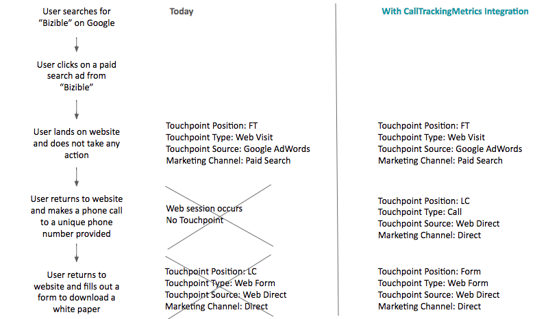
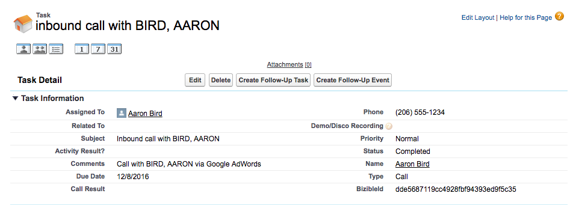
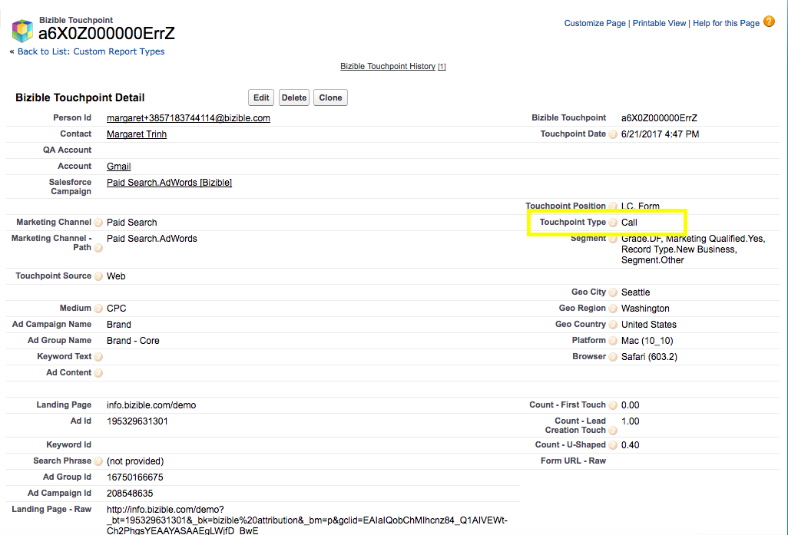
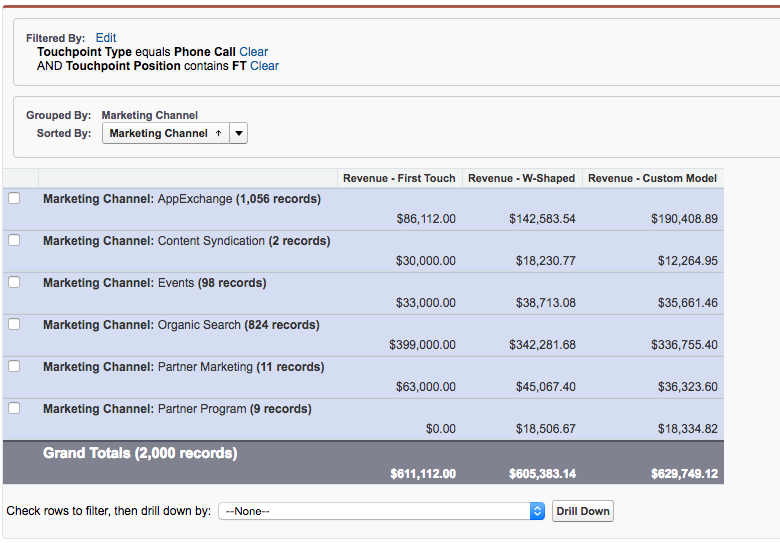
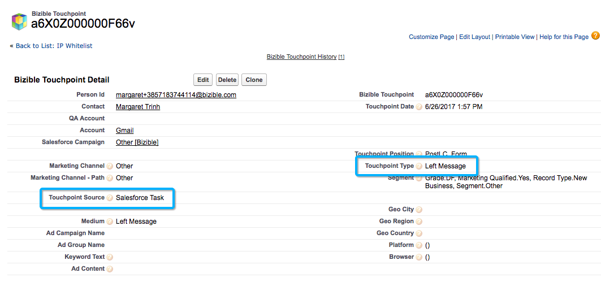

# コールトラッキングの統合 {#call-tracking-integration}

[!DNL CallTrackingMetrics]との統合は、Web セッションと電話を統合することを目的としています。 電話は[!DNL Marketo Measure]へのフォーム送信として扱われます。 実際のフォーム送信がないため、web訪問としか見なされなかったweb セッションにクレジットを与えます。

## コールトラッキングの説明 {#call-tracking-explained}

一般的な意味での「コールトラッキング」は、例えば[!DNL CallTrackingMetrics]、[!DNL DiaglogTech]、[!DNL Invoca]、または[!DNL CallRail]などの企業の製品です。 ユーザーの属するマーケティングチャネルや施策にもとづいて、独自の電話番号が表示されます。 これにより、マーケターはチャネルやキャンペーンのパフォーマンスを確認できます。

## 前後 {#before-and-after}

以下のフローチャートを見て、[!DNL Marketo Measure]がCallTrackingMetricsとの統合なしで電話を処理するために使用された方法を確認してください。 発生した電話は未追跡だったため、web セッションと見なされ、タッチポイントが作成されませんでした。 顧客が次にフォームに入力してから、ようやく顧客接点の情報が入力されました。

統合により、web セッションが実際に電話に結びついていたことがわかります。 次のフォームへの入力はPostLC タッチになり、ジャーニーの一部として追跡されます。

## 仕組み {#how-it-works}

CallTrackingMetricsは、これを機能させるためにいくつかの開発作業を行う必要があります。 サイトに配置されたJavaScriptを使用すると、CallTrackingMetricsは[!DNL Marketo Measure] Cookieから_biz_uidを取得できます。 この「[!DNL BizibleId]」は、CallTrackingMetricsによって保存されます。

訪問者がサイトにアクセスして電話をかけたとき、そのデータを[!DNL Salesforce]にプッシュするのはCallTrackingMetricsの役割です。  通常、[!DNL Salesforce Task]が作成され、電話番号、件名、種類、現在の[!DNL BizibleId]などのデータが入力されます

[!DNL BizibleId]は、[!DNL Marketo Measure] マーケティングアトリビューションパッケージのバージョン 6.7以降でインストールされているフィールドです。

以下は、[!DNL BizibleId]が入力されたタスクレコードの例です。

[!DNL Marketo Measure]が既知の[!DNL BizibleId]値が入力されたタスクレコードを見つけると、[!DNL Marketo Measure]はそのユーザーを同じ[!DNL BizibleId]のweb セッションにマッピングし、そのセッションをweb訪問ではなく電話に属性することができます。

## The Touchpoint {#the-touchpoint}

[!DNL Marketo Measure]がタスクをインポートまたはダウンロードできる場合、その詳細をweb セッションと共に処理します。 通常、リファラーや広告と組み合わせることができます。 下の例では、訪問者が有料のGoogle広告からビジネスを見つけ、電話をかけています。

[!UICONTROL &#x200B; タッチポイント &#x200B;] タイプの「Call」は、上のスクリーンショットのタスクから取得されます。これは、タスクの作成時にCallTrackingMetricsでも設定されます。

## レポート {#reporting}

[!DNL Marketo Measure]が通常プッシュするタッチポイントタイプの値は、Web訪問、Web フォーム、またはWeb チャットですが、CallTrackingMetrics タッチポイントの場合、タッチポイントタイプは電話です。 これにより、マーケターは、どのチャネルが最も多くの電話をかけているかを把握し、売上につなげることができます。

## よくある質問 {#faq}

**タッチポイントタイプのweb訪問が表示されるのはなぜですか？**

タッチポイントタイプは、Task.Type フィールドから入力されます。 Task.Type フィールドが空白の場合、[!DNL Marketo Measure]はタッチポイントタイプをWeb訪問として自動的に設定します。 Task.Type フィールドが入力されると、[!DNL Marketo Measure]はその値を読み取り、それに応じてタッチポイントタイプを入力します。

**電話からタッチポイントに入力されるその他のフィールドは何ですか？**

タッチポイントタイプとMediumの両方に、Task.Typeから取得したデータが含まれます。 それ以外のデータポイントはすべて、web トラッキングとJavaScript データから取得されます。

**この電話がWeb セッションに関連付けられていないのはなぜですか？**

まず、タスクを確認して、[!DNL BizibleId]が入力されていることを確認します。 価値がない場合は、その接点を作成することはできません。 これはCallTrackingMetricsでエスカレーションする必要があります。

値がある場合は、すべてのweb セッションが30分のみとみなされることに注意してください。 Google広告が12:17pm （web サイト上のセッションの開始）にクリックされたが、電話が1:05pmまで発生しなかった場合、web セッションと電話は統合されません。 代わりに、[!DNL Marketo Measure]は、電話を追跡するために別の[!DNL Salesforce Task] タッチポイントを作成しますが、web セッションデータはありません。

## パートナーシップ {#partnerships}

[!DNL Marketo Measure]には現在、共同マーケティングと製品トレーニングを含む「公式」統合プロセスを経た公式コールトラッキングパートナーが1人います。 このパートナーは、CallTrackingMetricsです。
