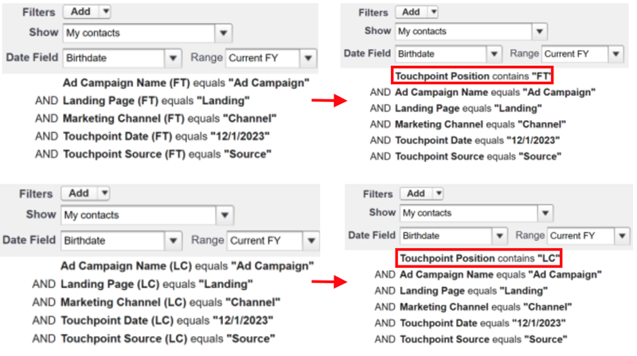

# リリースノート：2023年 {#release-notes-2023}

2023年リリースのすべての新機能と更新された機能を以下に示します。

## 第 4 四半期リリース {#q4-release}

**Web トラフィックダッシュボード**

新しく再設計された [web トラフィックダッシュボード](/help/marketo-measure-discover-ui/dashboards/web-traffic-dashboard.md){target="_blank"}には、すべてのお客様がアクセスできるようになりました。このダッシュボードは、web サイトの訪問者とのインタラクションの完全な概要を提供します。特定のフォーム URL やランディングページから、URL ごとのユニーク訪問者数、全体の訪問数、ページビュー数、フォーム送信回数などの指標を分析できます。また、月別のトラフィック傾向を追跡し、パフォーマンスの高い有料メディアを特定することもできるので、最適な収益生成のために戦略を絞り込むのに役立ちます。

新しい事前定義済みダッシュボードのセットは、年末までに段階的に導入される予定です。

>[!NOTE]
>
>現在のダッシュボードは 2024年3月に廃止されますが、それまでは両方のバージョンを利用して、スムーズな移行を実現できます。

**IP アドレスデータの削除**

データプライバシーのコンプライアンスを確保するために、アドビでは長期ストレージから IP アドレスデータを削除しています。現在、次の Snowflake テーブルとビューには IP アドレスが含まれています。このデータを削除し、新しい位置情報を追加する予定です。

<table style="width:400px">
<thead>
  <tr>
    <th style="width:50%">テーブル</th>
    <th>ビュー</th>
  </tr>
</thead>
<tbody>
  <tr>
    <td>CUSTOMER_AB_TESTS</td>
    <td>BIZ_CUSTOMER_AB_TESTS</td>
  </tr>
  <tr>
    <td>CUSTOMER_EVENTS</td>
    <td>BIZ_CUSTOMER_EVENTS</td>
  </tr>
  <tr>
    <td>FORM_SUBMITS</td>
    <td>BIZ_FORM_SUBMITS</td>
  </tr>
  <tr>
    <td>IMPRESSIONS</td>
    <td>BIZ_IMPRESSIONS</td>
  </tr>
  <tr>
    <td>PAGE_VIEWS</td>
    <td>BIZ_PAGE_VIEWS</td>
  </tr>
  <tr>
    <td>SESSIONS</td>
    <td>BIZ_SESSIONS</td>
  </tr>
  <tr>
    <td>WEB_HOST_MAPPINGS</td>
    <td>BIZ_WEB_HOST_MAPPINGS</td>
  </tr>
</tbody>
</table>

* 今後は、国名、市区町村名、地域名の代わりに、国コード、市区町村コード、地域コードをダウンロードします。
* すべての履歴 web アクティビティの処理中に、レコード間で位置情報の不一致が発生する場合があります。これらの不一致には、位置情報の詳細がない IP アドレスの存在、IP アドレスがない更新された位置情報、国名や地域の名前とコードの混在などが含まれる場合があります。
* _**この混在データ期間は、2024 年 1 月 4 日 ～ 2024 年 2 月 29 日（PT）まで発生すると予想されます。**_

**URL テーブルのページタイトルデータ**

[データウェアハウス](/help/marketo-measure-data-warehouse/data-warehouse-schema.md){target="_blank"}の URL テーブルには、web データテーブルに加えて、ページタイトルフィールドが含まれるようになります。

URL テーブルのページタイトルは、他の web テーブルのページタイトルと必ずしも一致しない場合があることに注意してください。URL テーブルには、最新のページタイトルが含まれます。Web アクティビティの実行後に URL のタイトルを変更した場合、URL テーブルの内容と一致しなくなります。

**Discover ダッシュボードの刷新**

すべての Marketo Measure ユーザは、より優れた操作性と付加価値を組み合わせ、刷新されたアプリ内ダッシュボードを体験できます。また、B2G GTM 戦略においてマーケティング投資と購入の間に発生する一般的な遅れを考慮に入れた「実質 ROI」などの新しい指標を導入しています。

新しい事前定義済みダッシュボードのセットは、10月の第 1 週から年末までに段階的に導入される予定です。これらの新しいダッシュボードは、製品内情報やドキュメントへのリンクと共に、インスタンスに自動的に表示されます。

* [新しい Discover ダッシュボードガイド](/help/marketo-measure-discover-ui/dashboards/new-discover-dashboard-guide.md){target="_blank"}
* [Discover ダッシュボードの基本](/help/marketo-measure-discover-ui/dashboards/discover-dashboard-basics.md){target="_blank"}
* [収益の概要ダッシュボード](/help/marketo-measure-discover-ui/dashboards/revenue-overview-dashboard.md){target="_blank"}
* [起因する収益ダッシュボード](/help/marketo-measure-discover-ui/dashboards/attributed-revenue-dashboard.md){target="_blank"}
* [ROI ダッシュボード](/help/marketo-measure-discover-ui/dashboards/roi-dashboard.md){target="_blank"}
* [パスポートダッシュボード](/help/marketo-measure-discover-ui/dashboards/passport-dashboard.md){target="_blank"}

>[!NOTE]
>
>現在のダッシュボードは 2024年3月に廃止されますが、それまでは両方のバージョンを利用して、スムーズな移行を実現できます。

### 廃止予定機能 {#deprecations}

* **Salesforce フィールドの廃止予定**

アドビでは、統合を簡素化し、Salesforce 標準オブジェクトに書き出す必要性をなくすために、リード／取引先責任者オブジェクトへの書き出しジョブを段階的に廃止する予定です。お客様は Touchpoint オブジェクトから同じデータを取得できるので、以下にリストされている非正規化フィールドも廃止予定となります。_**廃止予定のタイムラインは 2024 年 6 月です。**_

<table style="width:350px">
<tbody>
  <tr>
    <td>bizible2__Ad_Campaign_Name_FT__c</td>
  </tr>
  <tr>
    <td>bizible2__Ad_Campaign_Name_LC__c</td>
  </tr>
  <tr>
    <td>bizible2__Landing_Page_FT__c</td>
  </tr>
  <tr>
    <td>bizible2__Landing_Page_LC__c</td>
  </tr>
  <tr>
    <td>bizible2__Touchpoint_Date_FT__c</td>
  </tr>
  <tr>
    <td>bizible2__Touchpoint_Date_LC__c</td>
  </tr>
  <tr>
    <td>bizible2__Touchpoint_Source_FT__c</td>
  </tr>
  <tr>
    <td>bizible2__Touchpoint_Source_LC__c</td>
  </tr>
  <tr>
    <td>bizible2__Marketing_Channel_FT__c</td>
  </tr>
  <tr>
    <td>bizible2__Marketing_Channel_LC__c</td>
  </tr>
</tbody>
</table>

タッチポイントオブジェクトとアトリビューションタッチポイントオブジェクトに関する同じ情報が含まれるフィールドは、次のとおりです。

* bizible2__Ad_Campaign_Name__c
* bizible2__Landing_Page__c
* bizible2__Marketing_Channel__c
* bizible2__Touchpoint_Date__c
* bizible2__Touchpoint_Source__c

**必要なアクション**

* タッチポイントの有無に関わらず、リードおよび連絡先に対して新しいレポートタイプを作成します。

* 削除されたフィールドを利用する既存のレポートの機能をキャプチャするレポートを作成します。 この処理の一環として、次に示すように、レポートのフィールドを変更します。

   * リード/連絡先 FT/LC フィールドを削除：

* タッチポイントフィールドを追加：

* タッチポイント位置フィルターおよび FT/LC フィールドを使用するフィルター（日付フィールドを含む）は、次のように更新する必要があります。

* リード/連絡先オブジェクトから削除したフィールドを使用して、それらのフィールドを参照しなくした既存のレポートを削除します。

* **Dynamics パッケージ関連**

   * Dynamics との接続を維持するには、最新のパッケージバージョン v6.12 をインストールしてください。古いバージョン `(<v6.12)` はサポートされなくなります。この更新により、履歴レコードの作成が最適化され、ストレージの使用量が削減されます。

   * RefreshToken を使用した古い OAuth メソッドは非推奨（廃止予定）となります。ClientSecret の使用に関する Microsoft のベストプラクティスに従った資格情報の更新について詳しくは、[このガイド](/help/marketo-measure-and-dynamics/getting-started-with-marketo-measure-and-dynamics/oauth-with-azure-active-directory-for-dynamics-crm.md){target="_blank"}を参照してください。

* **「custom_properties」フィールド**

データウェアハウスでは、「custom_properties」フィールドは、固定スキーマでカバーされない追加のデータポイントのストレージとして機能していました。JSON 形式で格納される場合、このフィールドの使用は制限され、SQL クエリとの統合は複雑になり、パフォーマンスに影響を与える可能性があります。これらの要因から、このフィールドは廃止することにしました。この変更は、主に Azure テーブルストレージ内のデータ処理レイヤーおよびデータウェアハウスに書き出されたデータに影響を与えます。

### 今後の予定 {#q4-whats-coming}

**アプリ内カスタムレポート**

Marketo Measure を初めてご利用のお客様は、アプリ内で独自のレポートを作成し、保存できます。続いて 2024年初頭に事前定義済みダッシュボードのリリースが予定されています。

 

## 第 2 四半期リリース {#q2-release}

* **Salesforce パッケージの統合**

ユーザーエクスペリエンスを向上させ、使用をシンプル化するために、すべての Salesforce パッケージを単一の包括的なパッケージに統合しています。V1、V2_EXT およびレポートパッケージは、次の四半期に廃止される予定です。新しいパッケージは、以前のすべての機能を組み合わせたもので、より効率的な追跡とより深い顧客インサイトを可能にします。

既に V2 パッケージをインストールしているお客様は、新しい統合バージョンに更新する必要があります。

レポート機能を強化するために、次の 2 つの新しいフィールドを追加しました。

* form_name：BT/BAT オブジェクトで使用できるようになったこのフィールドにより、ユーザーはフォーム名に基づいてレポートを作成できます。
* user_touchpoint_id：このフィールドを使用すると、ユーザーは固有のユーザータッチポイント数を含むレポートを作成できます。

[この記事](/help/configuration-and-setup/marketo-measure-and-salesforce/salesforce-package-consolidation.md){target="_blank"}には、レガシーレポートパッケージからレポートとダッシュボードを再作成する方法に関するガイドが含まれています。

* **Salesforce API バージョンのアップデート**

UserActivityContext クラスを含む、Apex クラスのすべての Salesforce API バージョンが、次のサポート対象のバージョンに更新されます。（31.0～57.0）

* **新しいパッケージのインストール**

新しい統合パッケージのインストールリンクは、[こちらを参照してください](https://login.salesforce.com/packaging/installPackage.apexp?p0=04t1P000000VY6Z){target="_blank"}

### 次回の予定？ {#q2-whats-coming}

**IP アドレスストレージの変更**

アドビでは、プライバシーに関する考慮事項に従い、今後はアドビのシステムに IP アドレスを保存しません。IP アドレスの位置情報の識別と保存は引き続き行いますが、形式は変更される予定です（例：「米国」から「US」）。
