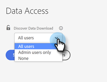

# [!UICONTROL データのダウンロードを検出] アクセス制御 {#discover-data-download-access-control}

[!UICONTROL データのダウンロードを検出] 有効にする [!DNL Marketo Measure] 管理者：ユーザーの役割に基づいて、Discover ダッシュボードのデータダウンロードポリシーを設定します。 このコントロールは、Discover ダッシュボードでのすべてのデータダウンロードアクションを対象としています。

1. クリック **[!UICONTROL データアクセス]** under [!UICONTROL セキュリティ].

   

1. ドロップダウンをクリックし、コンソールに適したオプションを選択します。

   

   <table>
    <tr>
     <td><strong>すべてのユーザー</strong></td>
     <td>すべてのユーザーがデータをダウンロードできます (PDF形式と CSV 形式の両方を含む )。</td>
    </tr>
    <tr>
     <td><strong>管理者ユーザーのみ</strong></td>
     <td>管理者ユーザーのみが、データ形式と CSV 形式の両方を含むPDFをダウンロードできます。</td>
    </tr>
    <tr>
     <td><strong>None</strong></td>
     <td>PDF形式と CSV 形式の両方を含むデータをダウンロードできません。</td>
    </tr>
   </table>

1. 終了したら「**[!UICONTROL 保存]**」をクリックします。

   

>[!NOTE]
>
>この設定は、ユーザーがログアウトしてから再度ログインするまで有効にならない場合があります。
