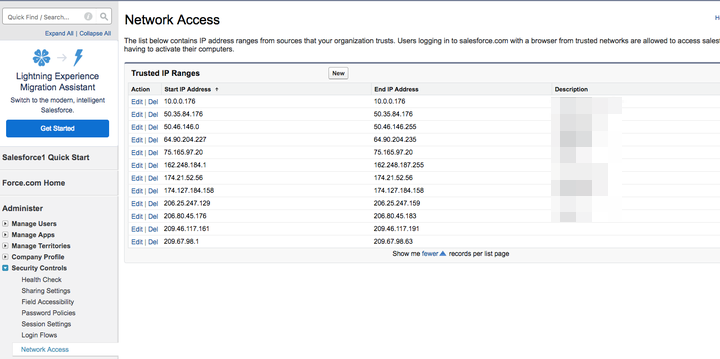

# セキュリティセッションの制限：許可リストに追加する IP アドレス {#security-session-restrictions-ip-addresses-to-allowlist}

[Session Security Settings](https://help.salesforce.com/articleView?id=admin_sessions.htm&amp;type=0){target="_blank"} が設定され、特定の IP アドレスによる [!DNL Salesforce] インスタンスへのデータのプッシュ/プルが防止されている場合は、[!DNL Marketo Measure] ーザーがデータを [!DNL Salesforce] にプッシュできるように、次の IP 範囲を許可リストに加えるする必要があります。

* 52.162.84.192 - 52.162.84.207
* 23.100.229.112 - 23.100.229.127
* 20.186.163.0 - 20.186.163.15

Salesforce で「信頼できる IP 範囲」に [!DNL Marketo Measure] の IP を追加するには、**[!UICONTROL 設定]**/**[!UICONTROL 管理設定]**/**[!UICONTROL セキュリティ制御]**/**[!UICONTROL ネットワークアクセス]**/**[!UICONTROL 新規]** をクリックします。

