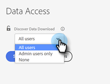

# シングルサインオン {#single-sign-on}

SSO（シングルサインオン）の SAML（Security Assertion Markup Language）により、ユーザは [!DNL Marketo Measure] アプリにログインする際に会社の ID プロバイダーを通じて認証できます。 SSO を使用すると、ユーザは一度認証するだけで、個別のアプリを認証する必要がなくなります。 すべてのユーザが組織内に [!DNL Salesforce] または [!DNL Google] アカウントを持っているとは限りません。そのため、SAML はエンタープライズのお客様にとって必須です。 規模を拡大するために、[!DNL Marketo Measure] は会社 ID プロバイダーをサポートできる SAML ソリューションを開発しました。

>[!CAUTION]
>
>この記事では、シングルサインオン（SSO）と高度な CRM ユーザ管理について説明します。 アカウントを **2020年9月10日（PT）以降**&#x200B;にプロビジョニングした場合は、SSO と ID 管理が [ [!DNL Marketo Measure]  統合のために Adobe Admin Console](/help/implementation-guide.md) 内で設定されるので、この記事は無視してください。

>[!NOTE]
>
>会社は様々な ID プロバイダー（Ping Identity、Okta など）を使用している可能性があります。 以下の設定手順および UI で使用される用語は、ID プロバイダーで使用される用語と直接一致しない場合があります。

## 要件 {#requirements}

* [!DNL Marketo Measure] アプリの AccountAdmin 権限を持つユーザ
* お客様の ID プロバイダーへの管理アクセス権を持つユーザ

## はじめに {#getting-started}

はじめに、[!DNL Marketo Measure] アプリケーションの設定／セキュリティ／認証ページに移動します。 次に、ログインタイプをカスタム SSO に切り替えて、設定オプションを確認します。 認証をテストし、ページの下部にある「**[!UICONTROL 保存]**」ボタンをクリックするまで、変更は有効になりません。

## 処理 {#process}

[!DNL Marketo Measure] シングルサインオンでは、[!DNL Marketo Measure] アカウントからロックアウトされる危険を回避するために、一連の手順で認証設定を行う必要があります。

ID プロバイダーで [!DNL Marketo Measure] アプリケーションを設定します。 手順については、以下にリストされている外部ドキュメントを参照してください。

    a. シングルサインオン URL、受信者 URL、宛先 URL、SAML アサーションカスタマーサービス（ACS） URL の入力を求められたら、[https://apps.bizible.com/BizibleSAML2/ReceiveSSORequest] （https://apps.bizible.com/BizibleSAML2/ReceiveSSORequest） 
    
    b を使用します。 オーディエンス制限 URL またはアプリケーション定義の一意の ID の入力を求められたら、[https://BizibleLPM] （https://biziblelpm/）を使用し 
 す。
[!DNL Marketo Measure] アプリケーションでカスタム SSO に切り替えます

    a. アカウントの請求グループが有効になったら、[!UICONTROL  設定 ]/[!UICONTROL  セキュリティ ]/[!UICONTROL  認証 ]
    
    b に移動できます。 デフォルトでは、ログインタイプは「CRM ユーザー」に設定されます。
    
    c. ログインタイプを「カスタム SSO」に切り替えて、設定プロセスを開始します。

ID プロバイダー設定の接続設定を入力します

    a. ID プロバイダーは、必要な設定フィールドを取り出す IdP メタデータ .xml ドキュメントを提供する場合があります。 .xml ドキュメントのコンテンツを読み込むか、ID プロバイダーの設定プロセス中に取得した出力から以下の 3 つのフィールドに入力します。 **両方を完了する必要はありません。**
    
    i. IdP URL: ユーザーを  [!DNL Marketo Measure]  アプリケーションで認証するためにポイントする必要があ  [!DNL Marketo Measure] URL です。 「リダイレクト URL」と呼ばれることもあります。
    ii. IdP 発行者：ID プロバイダーの一意の ID。 「外部キー」 
    iii とも呼ばれます。 IdP 証明書： [!DNL Marketo Measure]  がすべての ID プロバイダーの応答の署名を検証および検証できる公開鍵。

ユーザのトークンの有効期限を分単位で設定します。

    a.  [!DNL Marketo Measure]  には、1～1440 分の整数を指定できます。 ユーザのセッション時間が経過すると、新しいページに移動したユーザはログオフされます。

ユーザ属性設定を行って、それぞれの名、姓、メールアドレスにマッピングします。

    a. SAML 属性を入力すると、 [!DNL Marketo Measure]  は渡された情報でユーザーを認識できます。
    
    i. メール属性：ID プロバイダーがユーザーのメールアドレスに使用する属性名を指定します。
    ii. 名属性：ID プロバイダーがユーザーの名に使用する属性名を指定します。
    iii. 姓属性：ID プロバイダーがユーザーの姓に使用する属性名を指定します。
    
    b. ヒント：今すぐ SAML 設定をテストする場合は、このセクションで使用できる Email、First Name、Last Name 属性が解析されます。

 の内容が解析されます。

ユーザロール設定を行って、IdP から分類されたそれぞれのロールまたはグループにマッピングします。

    a. お客様は、ID プロバイダで定義されたグループに基づいてユーザーの役割を割り当てるオプションが  [!DNL Marketo Measure]  ります。 SAML 属性を入力すると、 [!DNL Marketo Measure]  はユーザのロールとグループを  [!DNL Marketo Measure]  のユーザ権限にマッピングできます。 管理者がアカウント。
    
    b を更新するのに十分な権限を持つように、これらの役割を設定することを強くお勧めします  [!DNL Marketo Measure]  役割またはグループがマッピングされない場合、デフォルト設定では、ID プロバイダーのすべての従業員が標準のユーザーアクセスを持ちます。
    
    i. [!DNL Marketo Measure]  標準ユーザー： [!DNL Marketo Measure] application.
    ii. [!DNL Marketo Measure]  アカウント管理者ユーザーへの読み取り専用アクセスが必要なユーザーに（SSO プロバイダーの）役割またはグループの値を提供します。 [!DNL Marketo Measure]  アプリケーションへの管理アクセスが必要なユーザーに（SSO プロバイダーの）役割またはグループの値を提供します。 これは、役割がお客様のアカウントに関連する設定および設定を変更するアクセス権を持っていることを意味します。
    iii. IdP には正確な名前の「グループ」の属性が必要です。この名前には、「Bizible Standard ユーザー」または「Bizible アカウント管理者ユーザー」属性に入力した値が含まれています。
    
    c. 複数の役割またはグループを 1 つの役割にマッピングする必要がある場合は、各値をコンマで区切って入力します。

シングルサインオン設定をテストします

    a. 「保存」をクリックする前に、「[!UICONTROL SAML 認証をテスト ]」ボタンをクリックして、設定が正しく設定されていることを確認する必要があります。
    
    b。 「失敗」エラーが表示された場合は、メッセージに従って再試行してください。

 の操作を試みます。

設定を保存し、新しいカスタムサインイン URL で[!UICONTROL シングルサインオン]を使用するよう同僚に指示します。

    a. 重要：新しい認証設定を保存すると、CRM ユーザーによるログインを無効にし、カスタム SSO を有効にしたため、新しいページに移動したらセッションが終了する可能性があります。

 のことが可能になります。

お試しください。

    a. 新しいカスタムログイン URL を使用して、ID プロバイダーの資格情報で  [!DNL Marketo Measure]  アプリケーションにログインし直します。
    
    b 形式は「https://apps.adobe.com/business/[accountName]」 
    
    c のようになります。 これで完了です。 アカウントの  [!DNL Marketo Measure]  アプリケーションでシングルサインオンが正常に設定されました。

>[!NOTE]
>
>SSO を設定した後は、[!DNL Marketo Measure] アプリケーション内にユーザを追加する必要はなくなります。 ユーザプロビジョニングは、ID プロバイダー内で直接処理する必要があります。

## CRM ユーザ（詳細設定） {#crm-users-advanced-setup}

デフォルトでは、すべてのアカウントは CRM 資格情報を使用して [!DNL Marketo Measure] アプリケーションにアクセスできます。 場合によっては、アカウント所有者はアクセスを特定のロールに制限し、アクティブな CRM ライセンスを持つすべてのユーザにはアクセスを公開しない必要があります。 詳細設定を使用すると、CRM のロールとグループを [!DNL Marketo Measure] ユーザー権限にマッピングできます。

ロールまたはグループをマッピングしていない場合、デフォルト設定では、CRM 内のすべてのアクティブなライセンスに標準ユーザアクセス権が付与されます。

* [!DNL Marketo Measure] 標準ユーザ：[!DNL Marketo Measure] アプリケーションへの読み取り専用アクセス権が必要なユーザにロールまたはグループの値を指定します。
* [!DNL Marketo Measure] アカウント管理ユーザ：[!DNL Marketo Measure] アプリケーションへの管理アクセス権が必要なユーザにロールまたはグループの値を指定します。 つまり、ロールには、アカウントに関連する設定を変更するアクセス権があります。

複数のロールまたはグループを 1 つのロールにマッピングする必要がある場合は、各値をコンマで区切って入力します。

**Salesforce ロール**

[!DNL Salesforce] ロールには、各ロールの名前を使用します。 すべてのロールは、[!UICONTROL 設定]／[!UICONTROL ユーザを管理]／[!UICONTROL ロール]メニューにあります。

**Dynamics ロール**

[!DNL Dynamics] ロールには、各セキュリティロールの名前を使用します。 すべてのセキュリティロールは、[!UICONTROL 設定]／[!UICONTROL セキュリティ]／[!UICONTROL セキュリティロール]メニューにあります。

**Google ユーザ**

カスタム SSO を設定すると、[!UICONTROL ユーザ]ページが更新され、Google ログインで追加した外部ユーザのみが表示されます。 アクセス権を持つすべてのユーザは SSO 設定を通じて定義されるので、追加の外部ユーザがここにリストされます。

有効な [!DNL Google] アカウントのみを追加でき、ユーザロールを定義する必要があります。

## 外部リンク {#external-links}

* [オクタ](https://developer.okta.com/standards/SAML/setting_up_a_saml_application_in_okta)
* [Ping Identity](https://docs.pingidentity.com:443/bundle/p1_enterpriseConfigSsoSaml_cas/page/enableAppWithoutURL.html)
* [OneLogin](https://onelogin.service-now.com/support?id=kb_article&sys_id=b2c91143db109700d5505eea4b9619d5)
* [Active Directory](https://docs.microsoft.com/ja-jp/azure/active-directory/active-directory-saas-custom-apps)
